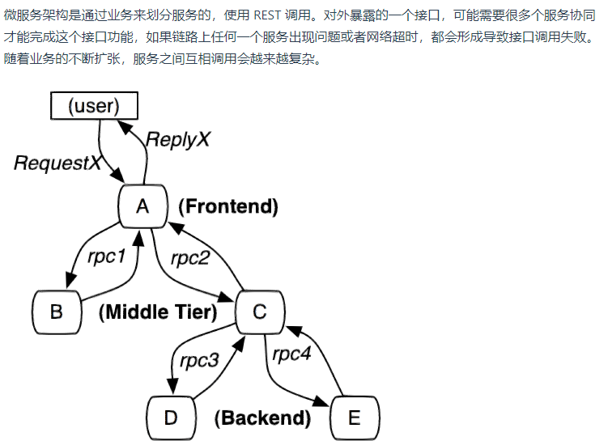
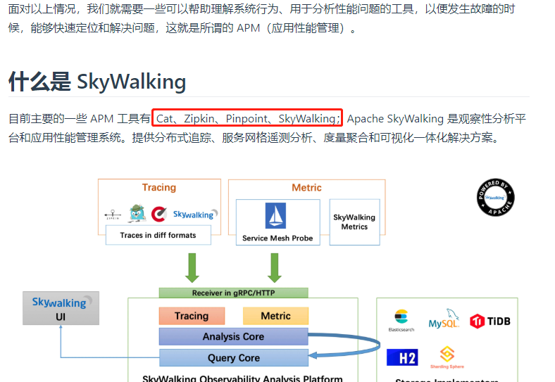
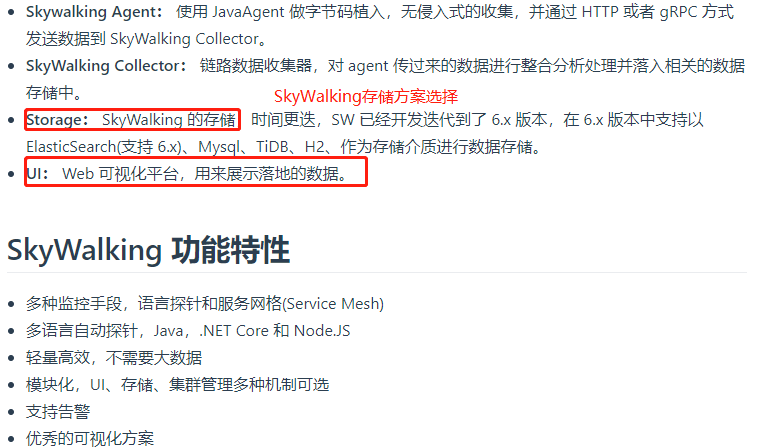
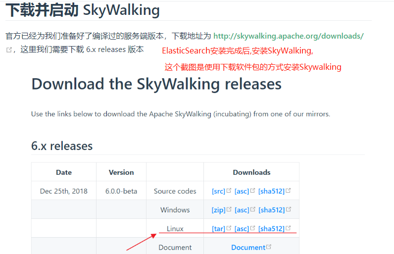
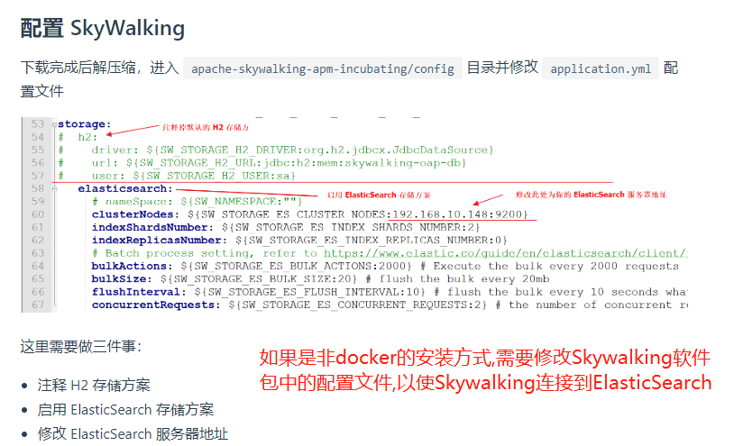
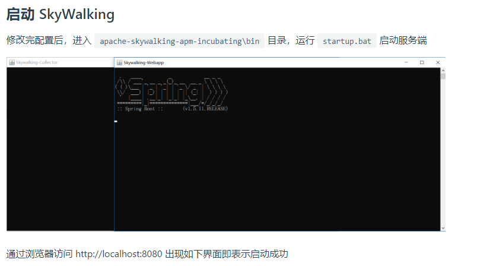
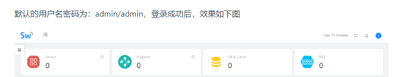
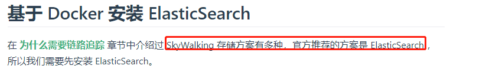

# SkyWalking 服务端配置

安装SkyWalking有2种方式,直接下载软件包,或者Docker的方式.

## 1. 直接下载软件包的方式安装

SkyWalking推荐的存储引擎为ES,所以要先安装ES

ES的安装可以是docker,也可以是软件包的方式.安装完ES后,安装SkyWalking,

## 2. Docker的方式安装

>可以到github上SkyWalking的源码下的docker中看docker-compose.yml,由于里面有些镜像无法下载,所以就暂且不使用官网的yml,

[可以参考这个进行docker方式的安装](https://github.com/JaredTan95/skywalking-docker)

>注意: 如果docker安装不稳定有问题,可以直接使用软件包的方式安装.