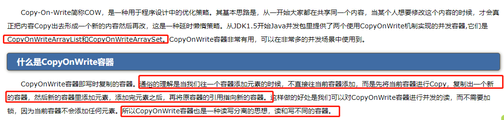

# CopyOnWrite

## 原理

当我们往一个容器添加元素的时候，不直接往当前容器添加，而是先将当前容器进行Copy，复制出一个新的容器，然后新的容器里添加元素，添加完元素之后，再将原容器的引用指向新的容器。也就是CopyOnWrite-在写操作的时候去复制当前容器.也就是读写分离.

这种思想在数据库用的非常多，在高并发下为了缓解数据库的压力，即使做了缓存也要对数据库做读写分离，读的时候使用读库，写的时候使用写库，然后读库、写库之间进行一定的同步，这样就避免同一个库上读、写的IO操作太多。

## 使用场景

读操作远多于修改操作

## 缺陷

CopyOnWrite容器只能保证数据的最终一致性，不能保证数据的实时一致性。所以如果你希望写入的的数据，马上能读到，请不要使用CopyOnWrite容器。
 
## 详解

## 来源

[https://www.cnblogs.com/dolphin0520/p/3938914.html](https://www.cnblogs.com/dolphin0520/p/3938914.html)