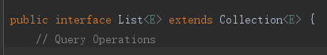
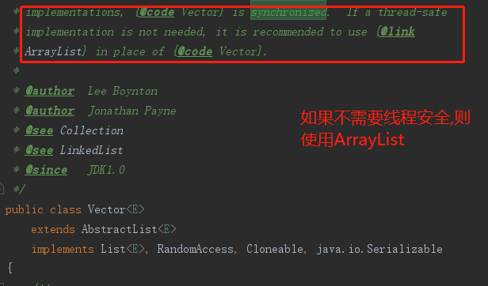

# List

## 重要的实现类

- ArrayList：存储有序可重复的元素的集合,支持通过下标索引来访问元素.内部维护了一个动态数组.当数组满了，再次插入数据到ArrayList当中的时候，ArrayList会自动扩容.使用ArrayList能够精确的控制每一个元素插入的位置.(线程不安全)

- Vector：一种古老的实现类,和 ArrayList 类似，内部方法使用了synchronized关键字，是线程安全的

- LinkedList：基于双向链表实现，只能顺序一个个的访问,不能通过下标索引访问元素，但可以高效的插入和删除元素。LinkedList还可以用作栈、队列和双向队列。

## 在合适的场景使用合适类型的List

如果一堆对象,可以按照索引下标0,1,2这样的形式来组织的话,可以考虑使用ArrayList,此时通过索引查找元素的速度极快,O(1)的时间复杂度.

如果一堆对象不可以通过下标的形式组织的话,就没必要使用ArrayList,因为查找效率比较低,也是需要一个个比对,而且更重要的是,插入和删除效率也低,而且内存分配的时候需要分配连续的内存(因为ArrayList是基于数组的),这个时候可以考虑LinkedList.

