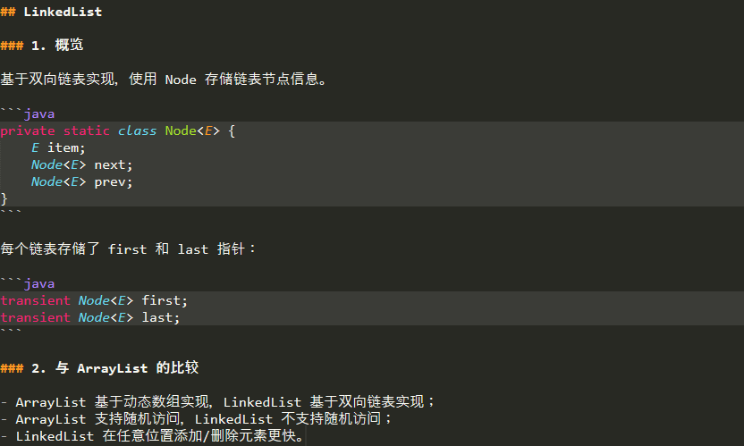

# LinkedList

添加和删除元素的效率要高于ArrayList，更适用于频繁的插入和实现操作。

# 类继承结构

    注意: 通过看java.util.Queue的方法可以得出结论,Queue在Java中的语义就是一个单端队列/单向队列.
    也就是只能从一头入队,另一头出队.而java.util.Deque在Java中的语义是双端队列/双向队列.
    也就是可以从一头入队,也可以从这头出队.(虽然Deque的英文意思是队列/顺序/排队的意思,和它的java语义不太一样)
    LinkList实现了Deque接口，表明可以使用双向队列相关的操作,可以把它用作栈或队列.

除了正向迭代器，还可以使用反向迭代器: `descendingIterator()`方法

## LinkedList的特点

内部是使用双向链表实现.它是一个有序集合(以插入顺序存储来维护保持顺序性)，支持重复元素。可以添加任意数量的null元素, 不是线程安全.

## LinkedList的接口Deque的方法

LinkedList实现了Deque,使得LinkedList类也具有队列(双端队列)的特性:

