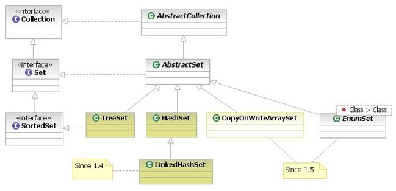

# Set

## 重要的实现类

- HashSet：基于哈希表实现，支持快速查找，但不支持有序性操作。并且失去了元素的插入顺序信息(可以想想下基于哈希表,插入一个元素的流程就可以理解了)，也就是说使用 Iterator 遍历 HashSet 得到的结果是不确定的(所谓的不确定就是和插入顺序没有关系)。元素无序,且元素不可重复.不能通过索引访问元素.

- TreeSet：基于红黑树实现，支持有序性操作，例如根据一个范围查找元素的操作。但是查找效率不如 HashSet，HashSet 查找的时间复杂度为 O(1)，TreeSet 则为 O(logN)。

- LinkedHashSet：具有 HashSet 的查找效率，且内部使用双向链表维护元素的插入顺序。

>可以使用Set接口实现来维护唯一元素。

    AbstractSet提供了Set接口的骨干实现，以减少实现Set的工作量。
