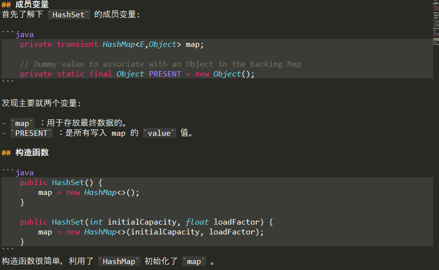
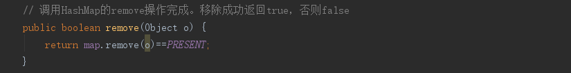
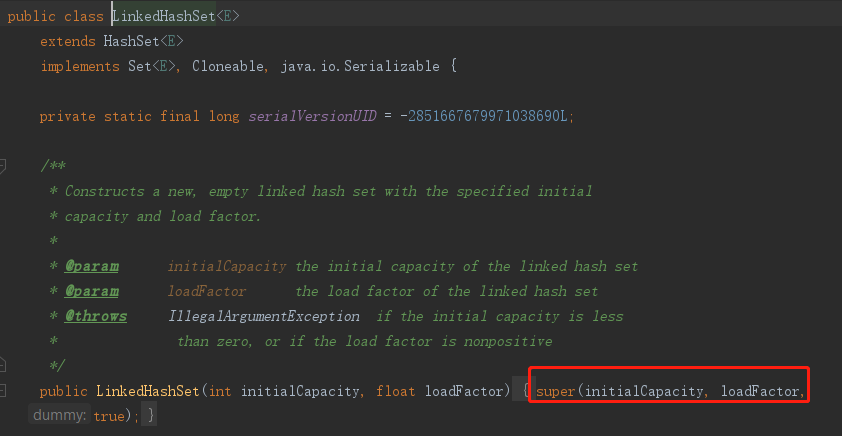
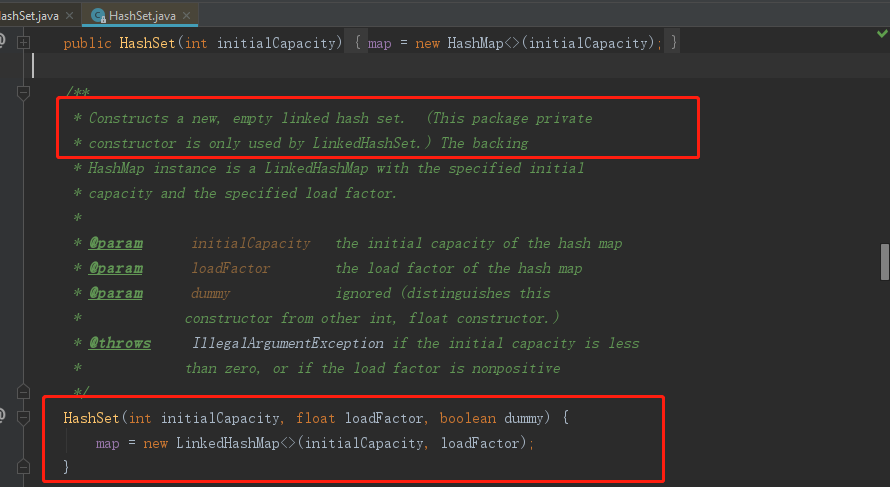

# HashSet

    AbstractSet提供了Set接口的骨干实现，以减少实现Set的工作量。

## HashSet特点

- 不允许存储重复元素,元素是无序的(因为HashMap存放键值对是无序的),允许为null值,不能通过索引访问元素.
- HashSet内部使用HashMap，HashSet集合内部所有的操作都是基于HashMap完成的
- 不是线程安全的,可以使用Collections.synchronizedSet方法以性能为代价获取线程安全的HashSet
- HashSet使用HashMap存储元素，因此对象应该提供hashCode(）和equals(）方法的良好实现
- 不支持有序性操作。并且失去了元素的插入顺序信息，也就是说使用 Iterator 遍历 HashSet 得到的结果不是插入顺序。

## HashSet内部实现 

## LinkedHashSet

LinkedHashSet继自HashSet，但是内部的map是使用LinkedHashMap构造的，并且accessOrder为false(也就是不使用访问顺序,使用插入顺序)。所以LinkedHashSet遍历的顺序就是插入顺序。

