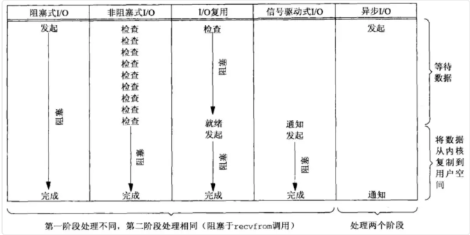

# IO模型

## Java中的IO模型和操作系统的IO模型

Java中提供的IO有关的API，其实依赖操作系统层面的IO操作实现的。Java中的IO模型和操作系统层面的IO模型是两个不同层面的IO模型.

可以把Java中的BIO、NIO和AIO理解为是Java语言对操作系统的各种IO模型的封装。程序员在使用这些API的时候，不需要关心操作系统层面的知识，`也不需要根据不同操作系统编写不同的代码`。只需要使用Java的API就可以了。

比如在Linux 2.6以后，Java中NIO和AIO都是通过epoll来实现的.而在Windows上，AIO是通过IOCP来实现的。

## Linux中的5中IO模型

在Linux(UNIX)操作系统中，共有五种IO模型，分别是：阻塞IO模型、非阻塞IO模型、IO复用模型、信号驱动IO模型以及异步IO模型。

## 到底什么是IO

在操作系统层面到底什么样的过程可以叫做是一次IO呢？

拿读取磁盘文件为例，我们要读取的文件是存储在磁盘上的，我们的目的是把它读取到内存中。文件会先被读取到内核空间的缓存区，
然后从内核空间的缓存区拷贝到用户空间。

## 阻塞IO模型

 阻塞 I/O表现为进程或线程等待某个条件，如果条件不满足，则一直等下去。条件满足，则进行下一步操作。
 

应用进程通过系统调用 recvfrom 接收数据，但由于内核还未准备好数据报，应用进程就会阻塞住，直到内核准备好数据报，recvfrom 完成数据报复制工作，应用进程才能结束阻塞状态。

## 非阻塞IO模型

应用进程与内核交互，目的未达到之前，不再一味的等着，而是直接返回。然后通过轮询的方式，不停的去问内核数据准备有没有准备好。如果某一次轮询发现数据已经准备好了，那就把数据拷贝到用户空间中。

应用进程通过 recvfrom 调用不停的去和内核交互，直到内核准备好数据。如果没有准备好，内核会返回error，应用进程在得到error后，过一段时间再发送recvfrom请求。在两次发送请求的时间段，进程可以先做别的事情。(也就是应用进程需要不时的关注内核数据是否准备好，这样就延申出了我们可以信号驱动IO，也就是不用我们不断的检查，而是内核准备好后主动通知用户进程)

和阻塞IO比，进程在等待内核数据的时候，可以做些其他事情，增加时间的利用率。

## 信号驱动IO模型

应用进程在读取文件时通知内核，如果某个 socket 的某个事件发生时，请向我发一个信号。在收到信号后，信号对应的处理函数会进行后续处理。

应用进程预先向内核注册一个信号处理函数，然后用户进程返回，并且不阻塞，当内核数据准备就绪时会发送一个信号给进程，`用户进程便在信号处理函数中开始把数据拷贝的用户空间中。`

相比于非阻塞IO，再次提高了时间利用率，不用去不断的检查内核数据是否准备好了.

## IO复用模型

多个进程的IO可以注册到同一个管道上，这个管道会统一和内核进行交互。当管道中的某一个请求需要的数据准备好之后，进程再把对应的数据拷贝到用户空间中。

IO多路转接是多了一个select函数，多个进程的IO可以注册到同一个select上，当用户进程调用该select，select会监听所有注册好的IO，如果所有被监听的IO需要的数据都没有准备好时，select调用进程会阻塞。当任意一个IO所需的数据准备好之后，select调用就会返回，然后进程在通过recvfrom来进行数据拷贝。

这里的IO复用模型，并没有向内核注册信号处理函数，所以，他并不是非阻塞的。进程在发出select后，要等到select监听的所有IO操作中至少有一个需要的数据准备好，才会有返回，并且也需要再次发送请求去进行文件的拷贝。

## 为什么以上四种都是同步的

我们说阻塞IO模型、非阻塞IO模型、IO复用模型和信号驱动IO模型都是同步的IO模型。原因是因为，无论以上那种模型，真正的数据拷贝过程，都是同步进行的。

信号驱动难道不是异步的么？ 信号驱动，内核是在数据准备好之后通知进程，然后进程再通过recvfrom操作进行数据拷贝。`可以认为数据准备阶段是异步的，但是，数据拷贝操作是同步的。`所以，整个IO过程也不能认为是异步的。

>钓鱼的报警器一响，只能说明鱼儿已经咬钩了，但是还没有真正的钓上来。使用带有报警器的鱼竿钓鱼，往上拉鱼竿的过程是同步的，钓鱼等待的过程是异步的。

## 异步IO模型

我们钓鱼的时候，采用一种高科技钓鱼竿，即全自动钓鱼竿。可以自动感应鱼上钩，自动收竿，更厉害的可以自动把鱼放进鱼篓里。然后，通知我们鱼已经钓到了，他就继续去钓下一条鱼去了。

应用进程把IO请求传给内核后，完全由内核去操作文件拷贝。内核完成相关操作后，会发信号告诉应用进程本次IO已经完成。

用户进程发起aio_read操作之后，给内核传递描述符、缓冲区指针、缓冲区大小等，告诉内核当整个操作完成时，如何通知进程，然后就立刻去做其他事情了。当内核收到aio_read后，会立刻返回，然后内核开始等待数据准备，数据准备好以后，直接把数据拷贝到用户控件，然后再通知进程本次IO已经完成。

这种方式的钓鱼，无疑是最省事儿的。啥都不需要管，只需要交给鱼竿就可以了。这个才叫做整个过程都是异步。

[来源](https://mp.weixin.qq.com/s?__biz=Mzg3MjA4MTExMw==&mid=2247484746&amp;idx=1&amp;sn=c0a7f9129d780786cabfcac0a8aa6bb7&source=41#wechat_redirect)