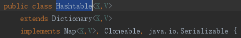
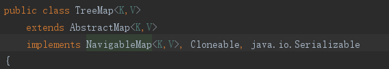

# 容器

Java中的容器包括 Collection 和 Map 两类，Collection 存储着对象的集合，而 Map 存储着键值对（两个对象）的映射表。这里主要讨论Map.

# Map为什么会出现

因为List这种数据结构，获取元素简单,可以直接通过索引下标，但是插入和删除操作复杂，需要移动内部的元素；链表这种数据结构，插入和删除操作简单，但是查找麻烦，只能一个一个地遍历。

有没有一种新的数据结构，插入数据简单，同时查找也简单？ 这个时候就出现了哈希表这种数据结构。 这是一种折中的方式，插入没链表快，查询没数组快。

# Map

# Map特点

Map这种容器存储的是键值对的映射,一个键值对被称为一个Entry(条目).

Map提供了三个集合视图: 键集，键值映射集(entry) 和 值集合

Map不保证key的顺序，但它取决于实现(这里是不能保证,不是一定没有顺序,要取决于具体的实现)。例如，HashMap不保证映射的顺序，但TreeMap就可以保证.

# 常用实现类

- HashMap：基于哈希表实现的散列结构,使用拉链法(1.8达到阈值后使用红黑树解决冲突)解决冲突,底层采用数组+链表实现(线程不安全)
- HashTable：和 HashMap 类似(内部也是数组+链表)，只不过它是线程安全的.它是遗留类,比较老了，不应该再去使用它,jdk早就不更新了,现在可以使用 ConcurrentHashMap 来支持线程安全，并且 ConcurrentHashMap 的效率会更高.
- TreeMap：有序Map，底层通过红黑树实现。(注意不是基于哈希表)
- LinkedHashMap：使用双向链表来维护元素的顺序，顺序为插入顺序或者最近最少使用（LRU）顺序。
- ConcurrentHashMap: 线程安全的HashMap.

>AbstractMap类提供了Map接口的骨架实现，大多数Map具体类扩展了AbstractMap类并实现了所需的方法
