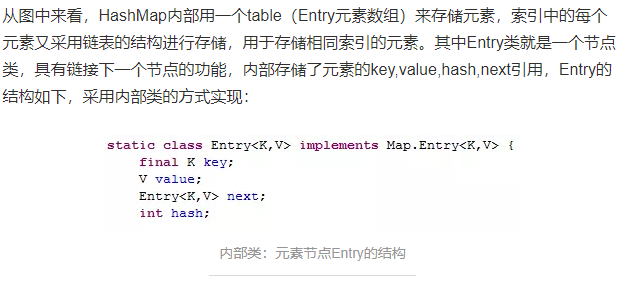
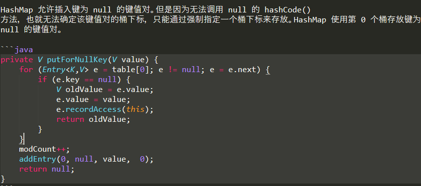
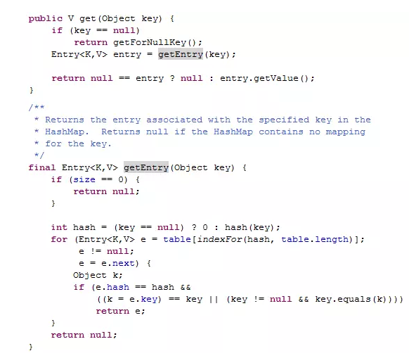
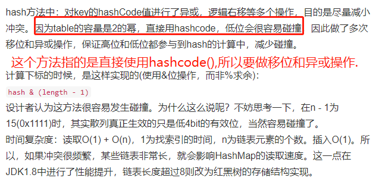
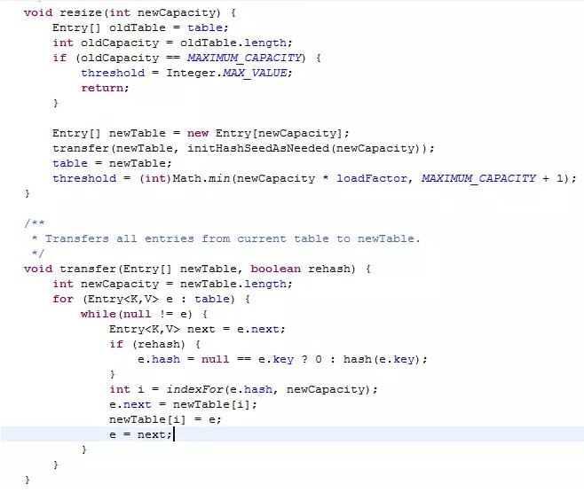
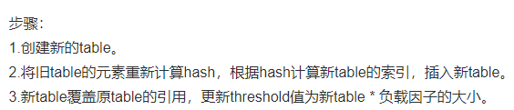
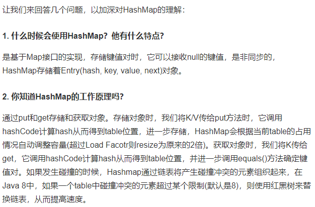

# HashMap概述

    一开始创建完HashMap后,比如传了初始容量为32,并不会马上初始化一个大小为32的数组,而是等到要put的时候,
    判断是否已经初始化了,如果没有初始化,这个时候才会初始化数组.

HashMap继承了AbstractMap，实现了Map接口,一个key-value对，就是一个Entry,所有的Entry都是不可重复.key不允许重复(相同的key,即equals方法返回true的key，要插入的key对应的value会覆盖旧的value)，value是可重复.

如果key用自定义的类，那么自定义的类就必须重写equals方法和hashCode方法

HashMap 判断两个 key 相等的标准是：两个 key 通过 equals() 方法返回 true，hashCode 值也相等,注意两个方法必须同时满足要求,想一下自定义Student作为key.HashMap在Key上操作.所以key需要良好的hashCode实现和equals方法以避免发生错误.

>基于哈希表(哈希函数/散列函数)实现(注意TreeMap不是基于哈希表,所以你现在明白为什么叫HashMap了,因为是基于哈希表实现的map)

# HashMap的特性

HashMap 只能在单线程中使用.

负载因子用来控制数组存放数据的疏密程度,Map 在使用过程中不断的往里面存放数据，当数量达到了"桶容量*负载因子"的时候，
就需要扩容，而扩容这个过程涉及到 rehash、复制数据等操作，所以非常消耗性能。因此尽量的预设容量，尽可能的减少扩容带来的性能损耗

- load Factor太大(loadFactor接近于1)，空间利用率高，但是与此同时冲突的几率也会增高,导致查找元素效率低.
- load factor太小导致数组的利用率低,空间利用率低，存放的数据会很分散

# put方法的实现 JDK1.7

    key为null的元素永远放到下标为0的桶中.

# get方法实现 JDK1.7

# hash方法的实现-JDK1.7

# resize扩容实现-1.7

# 总结-1.7

