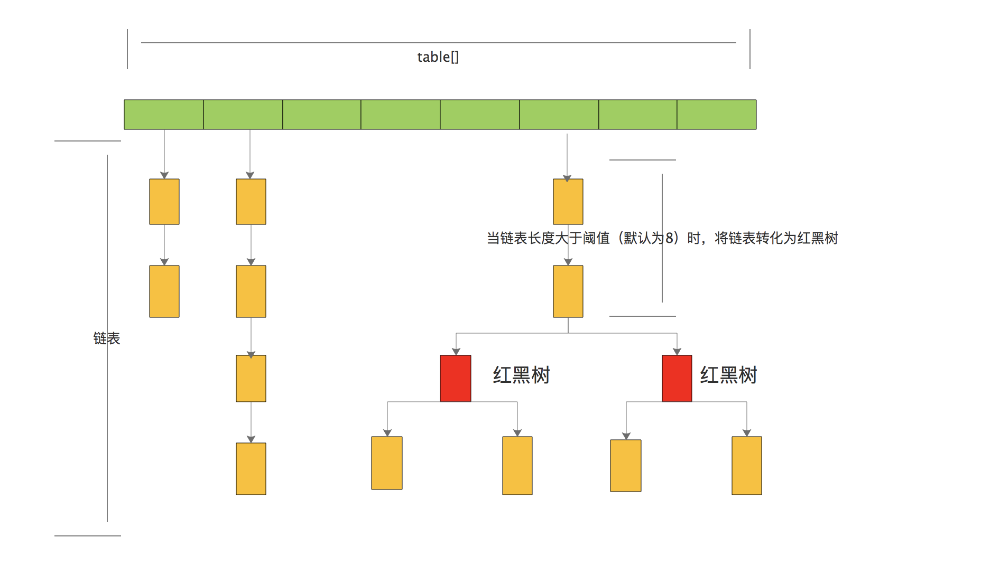
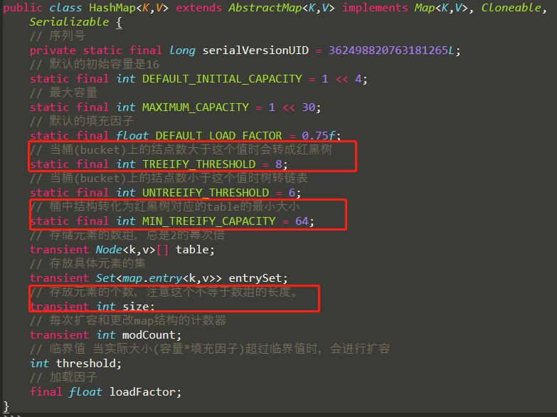
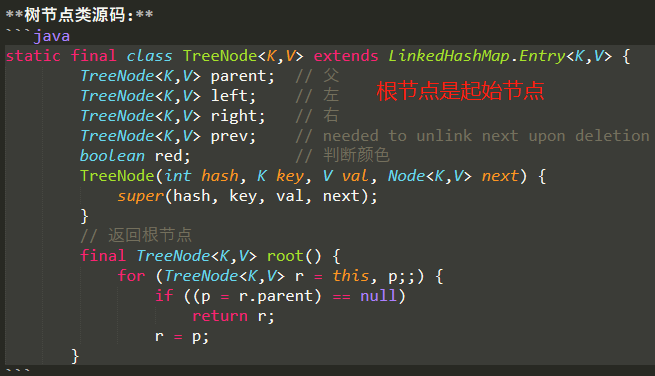
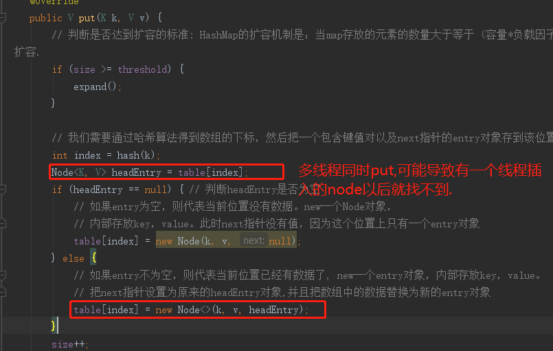
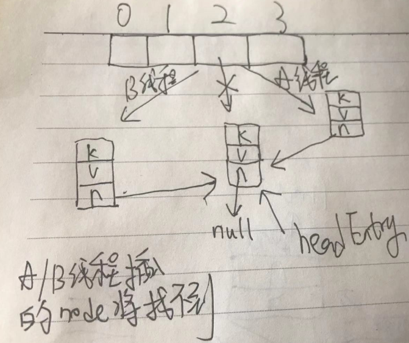

# HashMap概述

HashMap继承了AbstractMap，实现了Map接口,一个key-value对，就是一个Entry,所有的Entry都是不可重复.key不允许重复(相同的key,即equals方法返回true的key，要插入的key对应的value会覆盖旧的value)，value是可重复.

如果key用自定义的类，那么自定义的类就必须重写equals方法和hashCode方法

HashMap 判断两个 key 相等的标准是：两个 key 通过 equals() 方法返回 true，hashCode 值也相等,注意两个方法必须同时满足要求,想一下自定义Student作为key.HashMap在Key上操作.所以key需要良好的hashCode实现和equals方法以避免发生错误.

>基于哈希表(哈希函数/散列函数)实现(注意TreeMap不是基于哈希表,所以你现在明白为什么叫HashMap了,因为是基于哈希表实现的map)

# HashMap的特性

HashMap 只能在单线程中使用.

负载因子用来控制数组存放数据的疏密程度,Map 在使用过程中不断的往里面存放数据，当数量达到了"桶容量*负载因子"的时候，
就需要扩容，而扩容这个过程涉及到 rehash、复制数据等操作，所以非常消耗性能。因此尽量的预设容量，尽可能的减少扩容带来的性能损耗

- load Factor太大(loadFactor接近于1)，空间利用率高，但是与此同时冲突的几率也会增高,导致查找元素效率低.
- load factor太小导致数组的利用率低,空间利用率低，存放的数据会很分散

# put方法的实现 JDK1.7

# get方法实现 JDK1.7

# hash方法的实现-JDK1.7

# resize扩容实现-1.7

# 总结-1.7

# 什么样的类适合做Map的Key

Map使用hashCode和equals方法来实现get和put操作。所以可变类不适合Map做Map的key。因为如果hashCode或equals的值在put之后发生更改，则在get操作中将无法获得正确的值。因为Map是根据key的hashCode来计算value的位置的，如果key的hashCode变化了，将计算错误的位置.

# 以下基于 JDK1.7 分析

>HashMap是基于数组(数组需要连续内存)和链表实现的,数组是主体，链表实则是为了解决哈希(hash)冲突而存在的（拉链法解决哈希冲突）.拉链法采用头插法将数据插入到链表中.

# 以下基于 JDK1.8 分析

jdk1.7中，当 Hash 冲突严重时，在桶上形成的链表会变的越来越长，这样在查询时的效率就会越来越低。因此 1.8 使用链表+红黑树优化了查询效率.

当 `hash` 碰撞之后写入链表的长度超过了阈值(默认为8)并且 `table` 的长度不小于64(如果小于64，先进行扩容一次)时，链表将会转换为**红黑树**。以减少查找时间.如果是红黑树，查询的时间复杂度就是 `O(logn)` 。大大提高了查询效率。

>但是，jdk1.8并未有修改HashMap之前的线程安全问题，我们都知道HashMap是线程不安全的，涉及到线程安全的时候，我们应该使用ConcurrentHashMap，

## 并发问题-1.7/1.8都有

