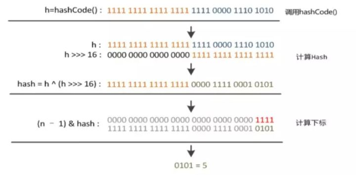
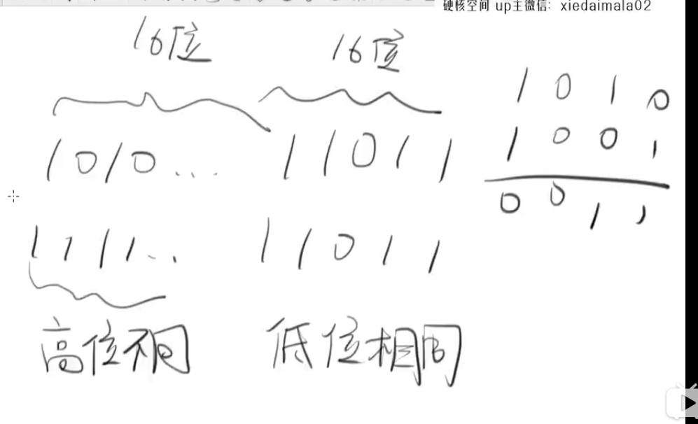

# HashMap 中 hash 函数怎么是实现的?(jdk1.8)

    hash函数,也可以称为散列函数,把key散列到不同的桶中的函数.

    我们希望hashmap的元素尽量分布均匀,这样链表就会短,查询效率比较高.

```java
static final int hash(Object key) {
    int h;
    // 为什么要右移?
    // 因为想让高位和低位都参与运算.否则的话,只有低位起作用,容易发生hash碰撞.
    // 设想一下,假如有2个key的hashcode,高16位不同,低16位相同,如果不进行移位,那么有很大的可能
    // 最后会被散列到同一个桶中,发生碰撞,如果让高16位和低16位都参与运算,可以降低发生碰撞的机会.
    return (key == null) ? 0 : (h = key.hashCode()) ^ (h >>> 16);
}
```

    低16 bit 和高16 bit 做了一个异或（得到的 hashcode 转化为32位二进制，
    前16位和后16位低16 bit和高16 bit做了一个异或）
    
    通过上面的hash函数获取到哈希值hash后,然后通过 hash & (length - 1) 来计算桶的位置.
    



