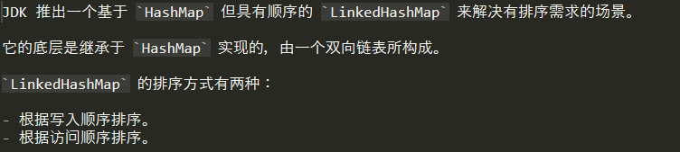
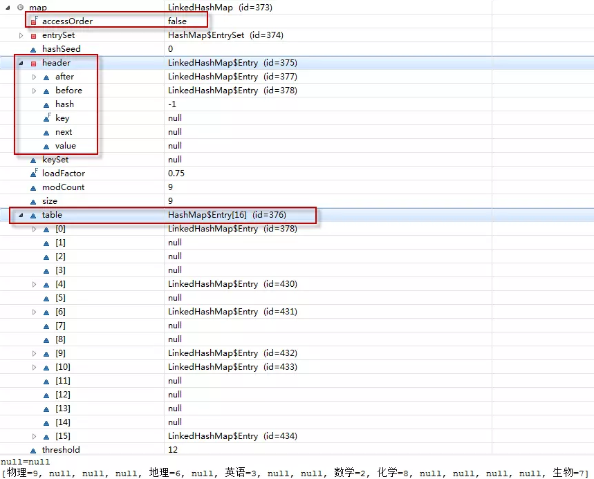
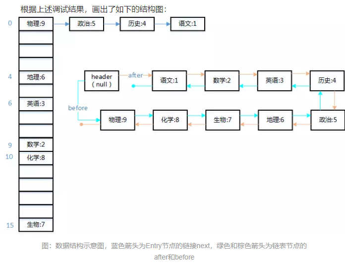
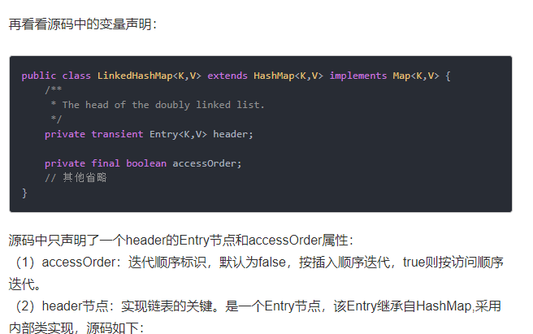
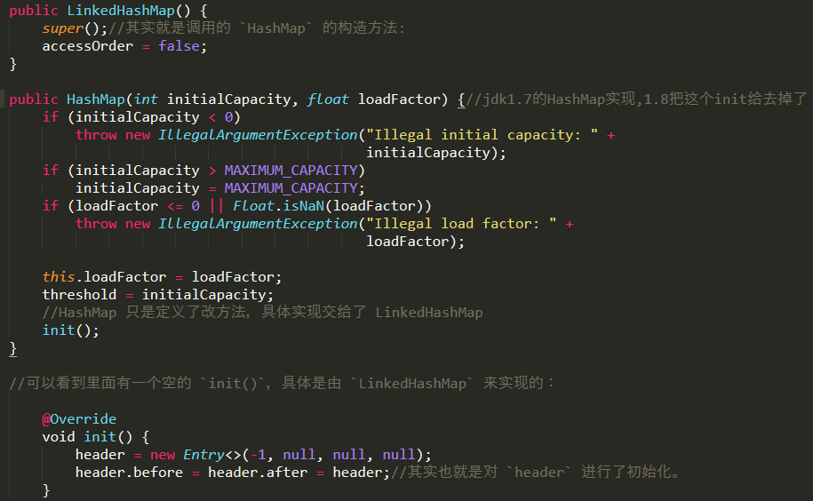
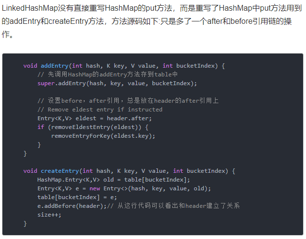

# 概述-基于1.7

>注意,这里都是基于1.7的.

# LinkedHashMap 是如何保证它的顺序的？(面试题)

LinkedHashMap 是通过插入排序（就是你 put 的时候的顺序是什么，取出来的时候就是什么样子）和访问排序（改变排序把访问过的放到末端）让键值有序。

# 数据结构

>注意,1.7没有tail,但是1.8有了,1.8对1.7改动挺大.

# put方法原理-1.7

>主体的实现都是借助于 `HashMap` 来完成的，只是对其中的 `recordAccess(), addEntry(), createEntry()` 进行了重写。`LinkedHashMap` 的实现：

>图里面的话有误,addBefore()应该是把链表末尾的元素的after指向新元素,header的before也指向新元素.

# get方法原理-1.7

    按访问顺序排序时，每次 `get` 都会将访问的值移动到链表末尾

# 总结

