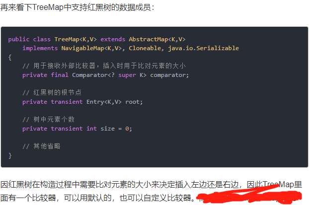
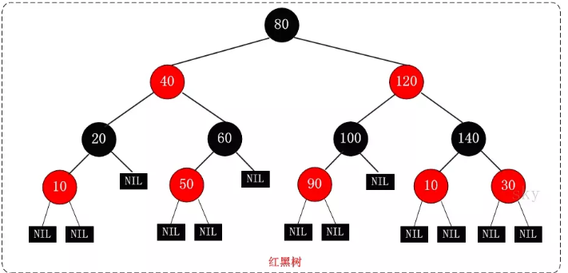
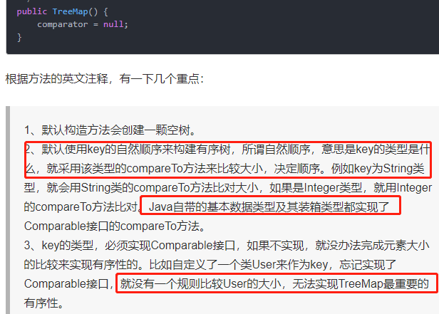
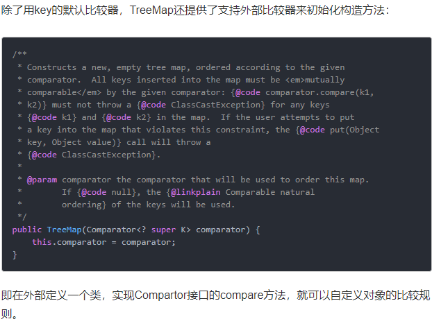

# TreeMap继承关系

# TreeMap的数据结构

# TreeMap的初始化与比较器

要么key实现Comparable,要么构造函数提供Comparator,否则提示`java.lang.ClassCastException: org.java.core.base.map.core.HashMapAndTreeMapDiff$Student cannot be cast to java.lang.Comparable`

# get方法分析

# 何时在Java中使用TreeMap?

大多数情况下，HashMap足以在程序中用作Map实现。但是如果你有一些与排序相关的特殊要求，那么你可以使用TreeMap。

# 区别TreeMap和LinkedHashMap的顺序

TreeMap是可以按照我们的意愿来对键值对排序(比如学生的score),因为我们可以提供比较器,LinkedHashMap只能是按照插入顺序或者是访问顺序来遍历,比较适合于用作LRU.要区别二者.

# 红黑树特性

红黑树是一棵平衡二叉查找树，同时还需要满足以下5个规则：

每个节点只能是红色或者黑点
根节点是黑点
叶子节点(Nil节点，空节点)是黑色节点
如果一个节点是红色节点，那么它的两个子节点必须是黑色节点(一条路径上不能出现相邻的两个红色节点)
从任一节点到其每个叶子节点的所有路径都包含相同数目的黑色节点
红黑树的这些特性决定了它的查询、插入、删除操作的时间复杂度均为O(log n)。

