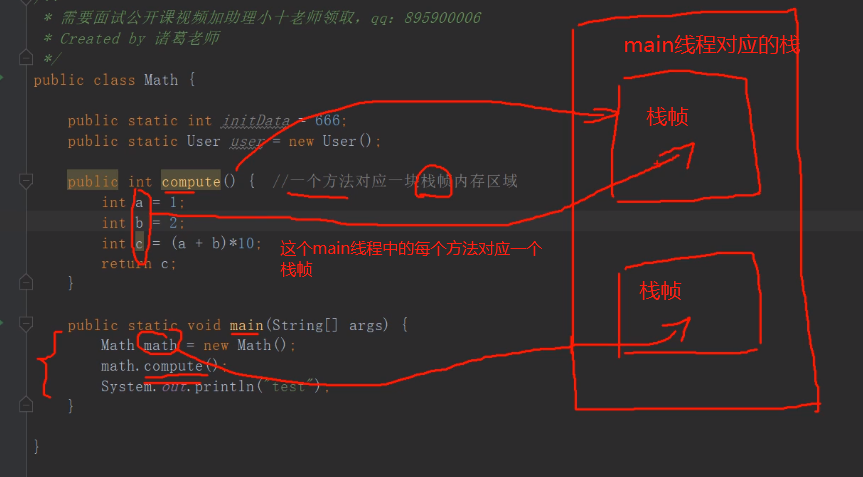
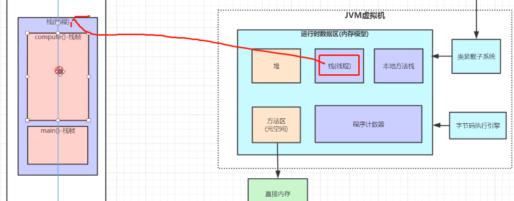
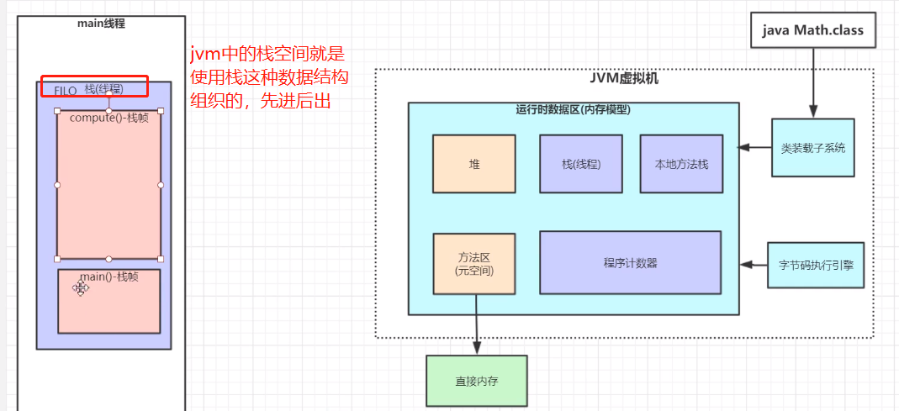
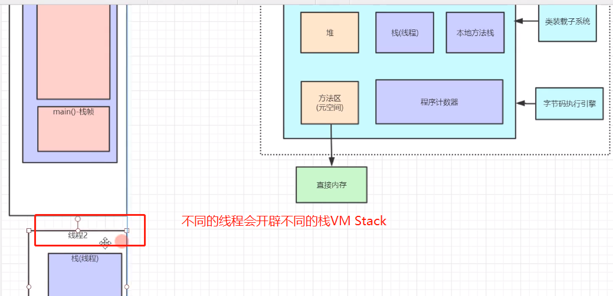

# 程序计数器

程序计数器是一块较小的内存空间,每个线程都有自己的程序计数器,标识的就是这个线程运行过程中，运行到哪一行代码了，也就是存放线程执行到哪一条指令了.

# 虚拟机栈(VM Stack)

---
    当一个线程开始运行的时候，jvm会给这个线程分配一块栈空间，
    我们把这块栈空间称为VM Stack,用来存放这个线程运行的数据。
    
    线程中的每个方法对应一个栈帧，局部变量存放在栈帧中。
---

>虚拟机栈由栈帧组成，线程中的每个方法都会有自己的栈帧。栈帧中包括局部变量表，操作数栈，方法出口等信息.

- "操作数栈" 就是计算过程中，"操作数" 临时存放的一块内存区域。
- "方法出口" 记录了当前栈帧对应的方法应该return到调用者的哪一行代码

# 本地方法栈

c语言的局部变量就是存放在本地方法栈中，每个线程都有自己的本地方法栈，这个也是线程独享的，如果调到native方法，jvm就会给这个线程分配一块本地方法栈。供你的本地变量的存放。
