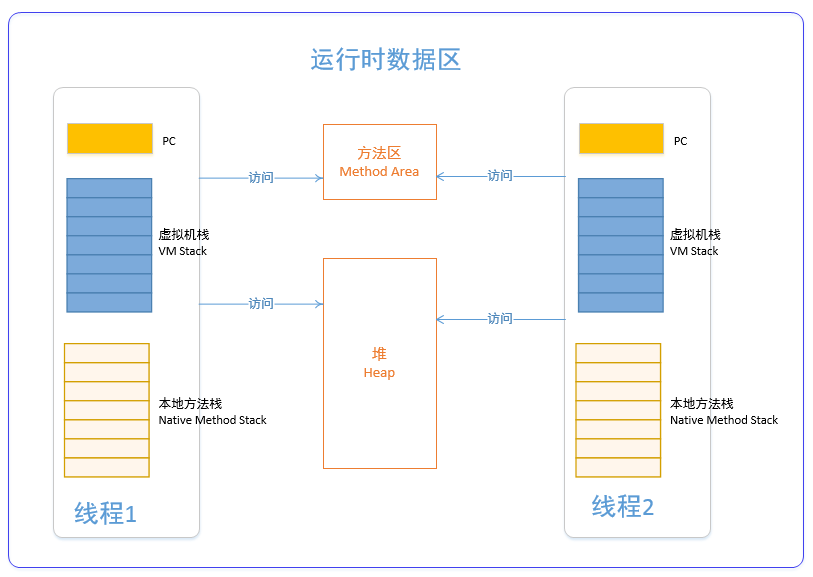

# Java虚拟机运行时数据区

经常有人把Java内存区分为堆内存(Heap)和栈内存(Stack)，这种区分方法比较粗糙，Java内存区域的划分实际上远比这复杂。

Java虚拟机执行Java代码的过程中会把它所管理的内存划分为若干个不同的数据区域(运行时数据区域)，主要包括:

* 虚拟机栈(VM Stack)
* 本地方法栈(Native Method Stack)
* PC寄存器(Program counter register)
* 方法区(Method  Area)
* 堆区(Heap)

这些数据区域中大致可以划分为2类，线程独享和线程共享:

1. 线程独享数据区:虚拟机栈、本地方法栈、PC寄存器。这些数据区与线程一一对应的，这些与线程对应的数据区域会随着线程开始和结束而创建和销毁,每个线程都有自己私有的虚拟机栈、本地方法栈、PC寄存器
2. 线程共享数据区:方法区、堆区。随着虚拟机启动而创建，随着虚拟机退出而销毁，并且被进程中的所有线程共享.

下图显示了两个线程的情况下，JVM中的运行时数据区：

## 一、线程独享数据区(PC寄存器,虚拟机栈,本地方法栈)

### PC寄存器

程序计数器是一块较小的内存空间.Java 虚拟机可以支持多个线程同时执行，每个线程都有自己的 PC（ Program Counter）寄存器。在任意时刻，一个线程只会执行一个方法的代码，这个正在被线程执行的方法称为该线程的当前方法（ Current Method）。

PC寄存器中存储的就是`当前线程所执行的当前方法的字节码指令的地址.`,为了线程切换后能恢复到正确的执行位置，每条线程都需要有一个独立的程序计数器，各线程之间计数器互不影响，独立存储.

### 虚拟机栈(VM Stack)

虚拟机栈中的元素叫做栈帧（Stack Frame），线程在调用java方法时，会为每个方法创建一个栈帧，
来存储局部变量表、操作数栈、动态链接、方法出口等信息。每个方法被调用和完成的过程，
都对应着一个栈帧从虚拟机栈上入栈和出栈的过程。虚拟机栈的生命周期和线程相同.

栈帧(Frame)随着方法调用而创建，随着方法结束而销毁——无论方法是正常完成还是异常完成
（抛出了在方法内未被捕获的异常）都算作方法结束。

栈帧的存储空间分配在 Java 虚拟机栈之中，每一个栈帧都有自己的局部变量表（ Local Variables）、操作数栈（OperandStack）和指向当前方法所属的类的运行时常量池的引用。局部变量表和操作数栈的容量是在编译期确定，并通过方法的 Code 属性保存及提供给栈帧使用.

在一个线程之中，只有目前正在执行的那个方法的栈帧是活动的。
这个栈帧就被称为是当前栈帧（ Current Frame），这个栈帧对应的方法就被称为是当前方法（ Current Method），
定义这个方法的类就称作当前类（ Current Class）.

>栈帧是线程本地私有的数据，不可能在一个栈帧之中引用另外一条线程的栈帧。

### 本地方法栈

Java虚拟机实现可能会使用到传统的栈（通常称之为“ C Stacks”）来支持 native 方法的执行，
这个栈就是本地方法栈（ Native Method Stack）。这个栈一般会在线程创建的时候按线程分配，
用来存储线程调用本地方法时，本地方法的局部变量表等信息。
本地方法栈和虚拟机栈所发挥的作用是非常相似的，区别是虚拟机栈执行Java方法,而本地方法栈则为Native方法服务，

Java 虚拟机规范允许Java虚拟机栈和本地方法栈被实现成固定大小的或者是根据计算动态扩展和收缩的。

>在sun hotspot 虚拟机中已经把两者合二为一了.本地方法栈区也会抛出StackOverFlowError和OutOfMemeoryError异常。

## 二、线程共享数据区(堆,方法区)

### 堆(Heap)

Java堆是被所有线程共享的一块内存区域，是Java虚拟机所管理的内存中最大的一块，在虚拟机启动时创建。 此区域的唯一目的就是存放对象实例，
几乎所有对象的实例都在这分配内存。 Java堆是垃圾收集器管理的主要区域，因此很多时候也被称为GC堆。
Java 堆在虚拟机启动的时候就被创建，它存储了被自动内存管理系统（ 也即是常说的“ Garbage Collector（垃圾收集器）”）
所管理的各种对象，这些受管理的对象无需，也无法显式地被销毁。 Java 堆的容量可以是固定大小的，
也可以随着程序执行的需求动态扩展，并在不需要过多空间时自动收缩.

从垃圾回收的角度，由于现在收集器基本都采用分代垃圾收集算法，所以Java堆还可以细分为：新生代和老年代：在细致一点有：Eden空间、From Survivor、To Survivor空间等。进一步划分的目的是更好地回收内存，或者更快地分配内存。

### 方法区

在Java虚拟机中，方法区（Method Area）是可供各个线程共享的运行时内存区域。

它用于存储已被虚拟机加载的类信息，例如`运行时常量池（ Runtime Constant Pool）`、字段和方法数据、构造函数和普通方法的字节码内容。

方法区在虚拟机启动的时候被创建，虽然方法区是堆的逻辑组成部分，方法区的容量可以是固定大小的，也可以随着程序执行的需求动态扩展，并在不需要过多空间时自动收缩。动态扩展失败一样会抛出 OutOfMemoryError 异常。

运行时常量池是方法区的一部分。Class 文件中的常量池（编译器生成的字面量和符号引用）会在类加载后被放入这个区域。

对这块区域进行垃圾回收的主要目标是对常量池的回收和对类的卸载.HotSpot 虚拟机把它当成永久代来进行垃圾回收。为了更容易管理方法区，从 JDK 1.8 开始，移除永久代，并把方法区移至元空间(MetaSpace)，它不再位于虚拟机内存中。

#### 方法区的回收

因为方法区主要存放永久代对象，而永久代对象的回收率比新生代低很多，所以在方法区上进行回收性价比不高。

主要是对常量池的回收和对类的卸载。

为了避免内存溢出，在大量使用反射和动态代理的场景都需要虚拟机具备类卸载功能。

类的卸载条件很多，需要满足以下三个条件，并且满足了条件也不一定会被卸载：

- 该类所有的实例都已经被回收，此时堆中不存在该类的任何实例。
- 加载该类的 ClassLoader 已经被回收。
- 该类对应的 Class 对象没有在任何地方被引用，也就无法在任何地方通过反射访问该类方法。

---

## 附: 直接内存

`直接内存并不是虚拟机运行时数据区的一部分，也不是虚拟机规范中定义的内存区域`，但是这部分内存也被频繁地使用。而且也可能导致OutOfMemoryError异常出现。

JDK1.4中新加入的NIO类,它可以直接使用Native函数库直接分配堆外内存，然后通过一个存储在java堆中的DirectByteBuffer对象作为`对这块内存的引用进行操作`。这样就能在一些场景中显著提高性能，因为避免了在堆内存和堆外内存来回拷贝数据。

直接内存的分配不会受到Java堆的限制，但是，既然是内存就会受到本机总内存大小以及处理器寻址空间的限制。

---