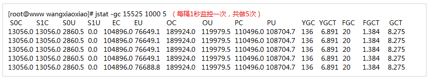

# jstat

    jstat主要是用来查看堆内存的使用状况以及gc的回收状况

```shell script
jstat -gcutil pid interval
# 每秒打印一次gc的状况
jstat -gcutil 193100 1000
# 每秒打印一次,一共打印5次
jstat -gcutil 193100 1000 5
```

---
    注意: 这里内存值是百分比,是占堆的百分比(-Xms/-Xmx)
    S0     S1     E      O      M     CCS    YGC     YGCT    FGC    FGCT     GCT
    0.00  18.75  31.51  54.28  93.53  88.99     61    0.160     0    0.000    0.160
    
    S0: survivor0区
    S1: survivor1区
    E: Eden区
    O: Old区
    M: 元空间
    CCS: Compressed Class Space
    YGC: young gc的次数
    YGCT: young gc的时间
    FGC: full gc的次数
    FGCT: full gc的时间
    GCT: 总的gc的时间
        
---

```shell script
jstat -gc pid
# -gcutil打印的是百分比
# -gc打印的是堆内存各个区具体的占用值

# 之查看young区的信息
jstat -gcnew pid
# 之查看old区的信息
jstat -gcold pid
```

---
     S0C  S1C S0U S1U   EC  EU  OC  OU   MC   MU  CCSC   CCSU   YGC     YGCT    FGC    FGCT     GCT
    512.0 512.0 0.0 96.0 2048.0 704.0 7168.0 3891.0 10496.0 9817.3  1280.0 1139.1  61  0.160  0    0.000  0.160

    S0C    survivor0 的总容量 (KB).
    S1C    survivor1 的总容量 (KB).
    S0U    survivor0 已使用的容量 (KB).
    S1U    survivor1 已使用的容量 (KB).
    EC     当前 eden space 总容量 (KB).
    EU     当前eden space已经使用的容量 (KB).
    OC     当前 old space 总容量 (KB).
    OU     当前old space 已使用容量(KB).
    PC     当前 permanent space 总容量(KB).
    PU     当前 permanent space 已使用容量 (KB).
    YGC    从应用启动时到现在，年轻代young generation 发生GC Events的总次数.
    YGCT   从应用启动时到现在， 年轻代Young generation 垃圾回收的总耗时.
    FGC    从应用启动时到现在， full GC事件总次数.
    FGCT   从应用启动时到现在， Full sc总耗时.
    GCT    从应用启动时到现在， 垃圾回收总时间. GCT=YGCT+FGCT
---

jstat支持的option通过jstat -optioins进行查看

```
# jstat -options

-class                      统计class loader行为信息 ，例如当前总共加载了多少个类

-compile                     统计HotSpot Just-in-Time compiler的行为

-gc                        统计jdk gc时heap信息 

-gccapacity                   统计不同的generations相应的heap容量情况 

-gccause                     统计gc的情况，（同-gcutil）和引起gc的事件 

-gcnew                      统计gc时，新生代的情况 

-gcnewcapacity                 统计gc时，新生代heap容量 

-gcold                      统计gc时，老年区的情况 

-gcoldcapacity                 统计gc时，老年区heap容量 

-gcpermcapacity                统计gc时，permanent区heap容量 

-gcutil                      统计gc时，heap情况 

-printcompilation               hotspot编译方法统计 
```

其中：

* -gc综合了-gcnew、-gcold的输出；
* -gccapacity综合了-gcnewcapacity、-gcoldcapacity、-gcpermcapacity的输出

## 统计JVM gc状况



```
参数说明：

S0C    当前survivor space 0 的总容量 (KB).

S1C    当前survivor space 1 的总容量 (KB).

S0U    当前survivor space 0 已使用的容量 (KB).

S1U    当前survivor space 1 已使用的容量 (KB).

EC      当前 eden space 总容量 (KB).

EU     当前eden space已经使用的容量 (KB).

OC    当前 old space 总容量 (KB).

OU    当前old space 已使用容量(KB).

PC     当前 permanent space 总容量(KB).

PU     当前 permanent space 已使用容量 (KB).

YGC    从应用启动时到现在，年轻代young generation 发生GC Events的总次数.

YGCT    从应用启动时到现在， 年轻代Young generation 垃圾回收的总耗时.

FGC      从应用启动时到现在， full GC事件总次数.

FGCT     从应用启动时到现在， Full sc总耗时.

GCT     从应用启动时到现在， 垃圾回收总时间. GCT=YGCT+FGCT
```

* 上图说明了，总应用启动到现在，YGC总共发生了136次,总耗时YGCT=6.891秒，FGC发生了20次，总耗时FGCT=1.384秒，FGC+YGC总耗时GCT=8.275秒。
* 可以发现五条记录YGC、YGCT、YGC、YGCT、GCT值都是相同的，说明在我们统计的这段时间(每1秒统计1次，共5次)，所以这5秒内没有发生gc事件。

此外，这里显示的S0C、S1C、EC、OC、PC显示的值，与jmap中都有相对应的条目，为了进行说明，我们通过jmap命令与这里的参数进行对比：

```
jmap -heap 15525

...

Heap Usage:

New Generation (Eden + 1 Survivor Space):

   capacity = 120782848 (115.1875MB)

   used     = 54471592 (51.948158264160156MB)

   free     = 66311256 (63.239341735839844MB)

   45.09878091299851% used

Eden Space:

   capacity = 107413504 (102.4375MB)   #对应EC

   used     = 51631152 (49.23930358886719MB) #对应EU

   free     = 55782352 (53.19819641113281MB)

   48.06765451018151% used

From Space:

   capacity = 13369344 (12.75MB)  #对应S0C

   used     = 2840440 (2.7088546752929688MB) #对应S0U

   free     = 10528904 (10.041145324707031MB)

   21.24591902190564% used

To Space:

   capacity = 13369344 (12.75MB) #对应S1C

   used     = 0 (0.0MB) #对应S1U

   free     = 13369344 (12.75MB)

   0.0% used

concurrent mark-sweep generation: #老年代使用了cms收集器

   capacity = 194482176 (185.47265625MB) #对应OC

   used     = 123681224 (117.95160675048828MB) #对应OU

   free     = 70800952 (67.52104949951172MB)

   63.59514611765759% used

```

>注意在jstat中显示的值以kb为单位，乘以1024之后，就是通过jmap -heap命令显示对应的字节数。

