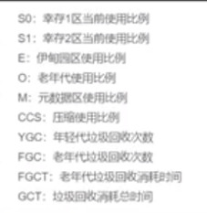
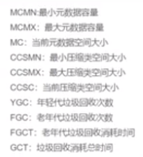
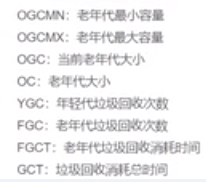

# jstat

    jstat是用来查看堆内存各部分的使用量以及类加载统计以及gc的回收状况

```shell script
jstat -gcutil pid interval count
# 每秒打印一次gc的状况(垃圾回收统计)
jstat -gcutil 193100 1000
# 每秒打印一次,一共打印5次
jstat -gcutil 193100 1000 5
# 类加载统计
jstat -class pid 
```

---
    注意: 这里的值是各个区的 已经使用的比例
    S0     S1     E      O      M     CCS    YGC     YGCT    FGC    FGCT     GCT
    0.00  18.75  31.51  54.28  93.53  88.99     61    0.160     0    0.000    0.160
    
    S0: survivor0区
    S1: survivor1区
    E: Eden区
    O: Old区
    M: 元空间
    CCS: Compressed Class Space
    YGC: young gc的次数
    YGCT: young gc的时间
    FGC: full gc的次数
    FGCT: full gc的时间
    GCT: 总的gc的时间

        
---

```shell script
jstat -gc pid
# -gcutil打印的是百分比
# -gc打印的是堆内存各个区具体的占用值

# 之查看young区的信息
jstat -gcnew pid
# 之查看old区的信息
jstat -gcold pid
```

---
     S0C  S1C S0U S1U   EC  EU  OC  OU   MC   MU  CCSC   CCSU   YGC     YGCT    FGC    FGCT     GCT
    512.0 512.0 0.0 96.0 2048.0 704.0 7168.0 3891.0 10496.0 9817.3  1280.0 1139.1  61  0.160  0    0.000  0.160

    S0C    survivor0 的总容量 (KB).
    S1C    survivor1 的总容量 (KB).
    S0U    survivor0 已使用的容量 (KB).
    S1U    survivor1 已使用的容量 (KB).
    EC     当前 eden space 总容量 (KB).
    EU     当前eden space已经使用的容量 (KB).
    OC     当前 old space 总容量 (KB).
    OU     当前old space 已使用容量(KB).
    PC     当前 permanent space 总容量(KB).
    PU     当前 permanent space 已使用容量 (KB).
    YGC    从应用启动时到现在，年轻代young generation 发生GC的次数.
    YGCT   从应用启动时到现在， 年轻代Young generation 垃圾回收的总耗时.(秒)
    FGC    从应用启动时到现在， full GC总次数.
    FGCT   从应用启动时到现在， Full gc总耗时.
    GCT    从应用启动时到现在， 垃圾回收总时间. GCT=YGCT+FGCT
---

# 其他jstat参数

```shell script
jstat -gcmetacapacity pid
# 统计gc时，permanent区heap容量 
jstat -gcpermcapacity pid
jstat -class     # 统计class loader行为信息 ，例如当前总共加载了多少个类
jstat -compile           # 统计HotSpot Just-in-Time compiler的行为
jstat -gc                # 统计jdk gc时heap信息 ,-gc综合了-gcnew、-gcold的输出
# 统计不同的generations相应的heap容量情况, -gccapacity综合了-gcnewcapacity、-gcoldcapacity、-gcpermcapacity的输出
jstat -gccapacity        
jstat -gccause           # 统计gc的情况，（同-gcutil）和引起gc的事件 
jstat -gcnew             # 统计gc时，新生代的情况 
jstat -gcnewcapacity     # 统计gc时，新生代heap容量 
jstat -gcold             # 统计gc时，老年区的情况 
jstat -gcoldcapacity     # 统计gc时，老年区heap容量 
jstat -gcutil            # 统计gc时，heap情况 
jstat -printcompilation  # hotspot编译方法统计 
```

    jstat -gcmetacapacity pid
    
       MCMN       MCMX        MC       CCSMN      CCSMX       CCSC     YGC   FGC    FGCT     GCT
           0.0  1056768.0     4864.0        0.0  1048576.0      512.0     2     1    0.012    0.015

       

       OGCMN       OGCMX        OGC         OC       YGC   FGC    FGCT     GCT
         7168.0      7168.0      7168.0      7168.0     2     1    0.012    0.015

             