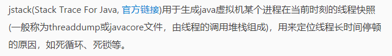
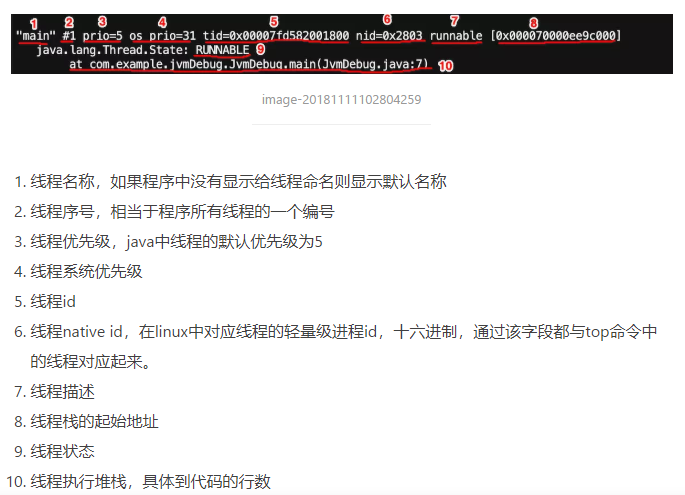

# jstack

    堆栈异常跟踪工具,是用来分析线程的调用堆栈的. 





```shell
# -F  强制dump线程堆栈信息. 用于当jstack <pid>命令没有响应的情况(process is hung-悬挂)
jstack -F <pid>

# -m  同时打印java和本地(native)线程栈信息，m是mixed mode的简写
jstack -m <pid>

# -l  打印锁的额外信息
jstack [-l] <pid>
```
