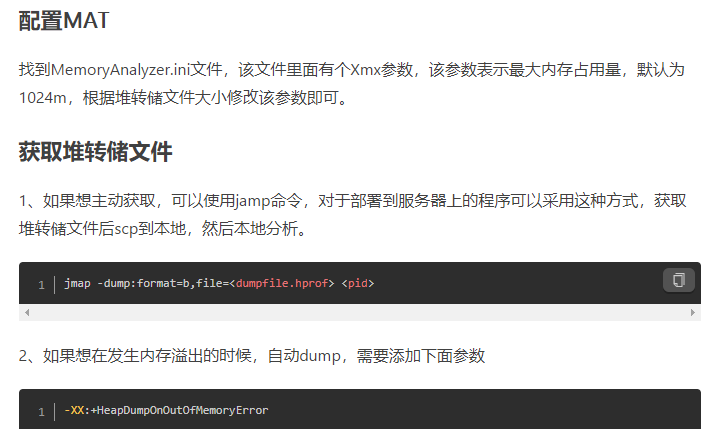
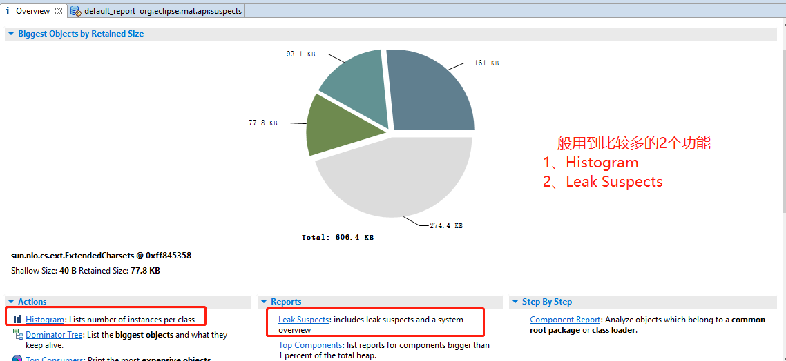
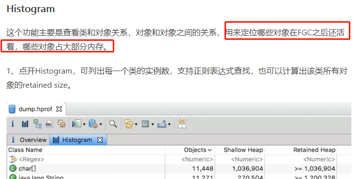
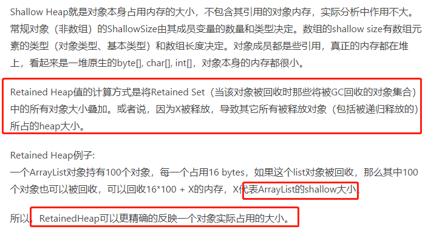
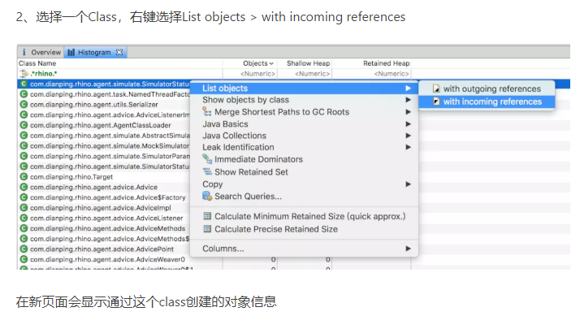
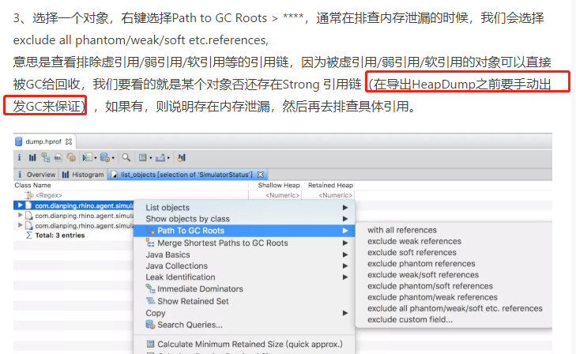
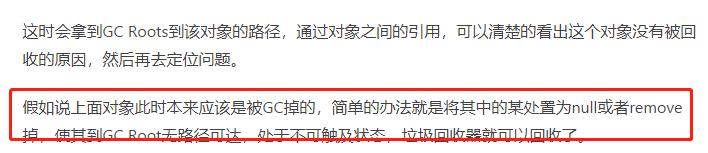
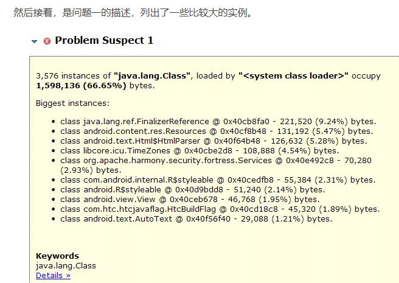
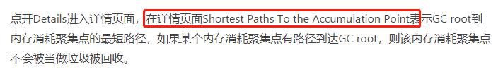
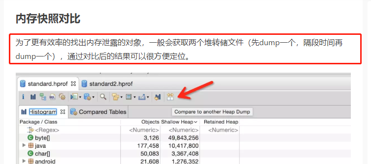

# MAT分析统计(Memory Analyzer Tool)

MAT是一个eclipse的插件。它能够快速的分析dump文件，可以直观的看到各个对象在内存占用的量大小，以及类实例的数量，对象之间的引用关系，找出对象的GC Roots相关的信息，此外还能生成内存泄露报表，疑似泄露大对象的报表等等。

# 安装MAT

    可以选择单独MAT程序下载安装http://www.eclipse.org/mat/downloads.php (推荐方式)
    
    也可以选择eclipse插件的方式安装http://download.eclipse.org/mat/1.8.1/update-site/

# 如何使用MAT进行内存泄露分析

