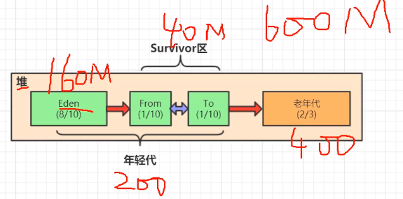
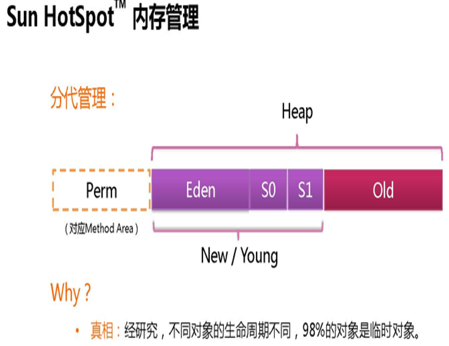
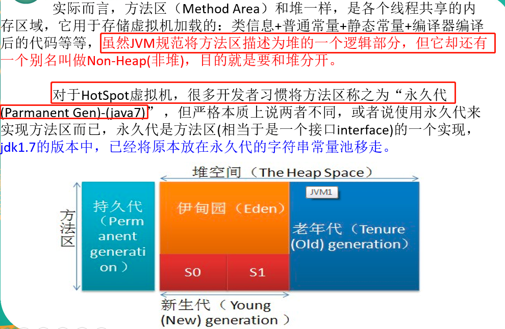
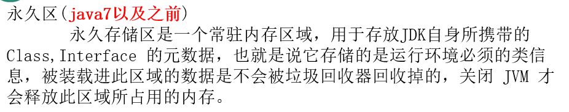
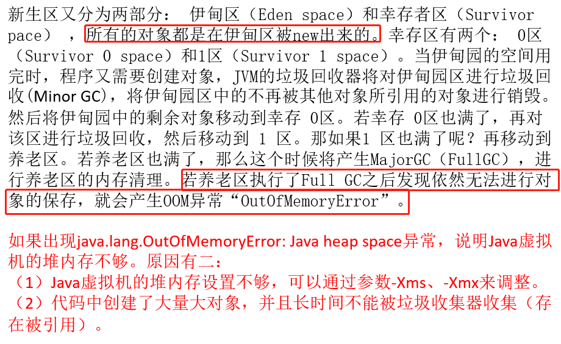
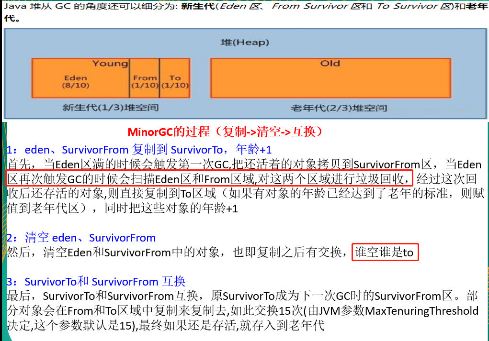
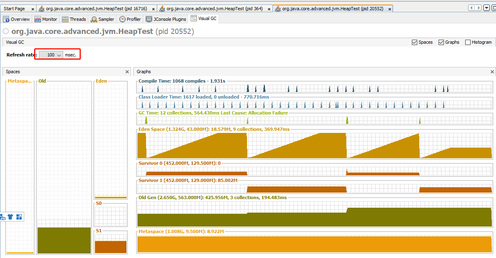
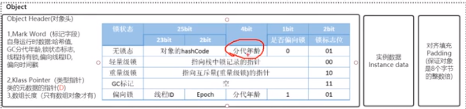

# 堆(Heap)-垃圾回收的主战场

    jvm堆区是是用来存放对象实例的，堆是垃圾收集器管理的主要区域。收集器采用分代垃圾回收

# 堆的逻辑组成

- Young Generation Space  新生区  Young/New
- Tenure generation space  养老区 Old/Tenure
- Permanent Space          永久区  Perm

# MinorGC和FullGC的过程

    young generation分为：
        
    - Eden区(伊甸园区) 默认占用8/10
    - From Survivor 默认占用1/10
    - To Survivor 默认占用1/10
    
    谁空谁是to区.
    

    比如给堆初始分配600M，默认情况下如果你不改默认参数，老年代会分配到2/3,年轻代为1/3
    
    我们new出来的对象会放到Eden区(伊甸园，新生儿区)，当Eden空间不够的时候，会触发minor GC(YGC)
    

>spring中，通@Service，@Controller这些注解生成的bean会放到Ioc容器里面，这些bean最终就会被放到老年代。还有比如mysql的线程池等最终也会被放到老年代。

老年代总有一天也会被放满，就会触发Full GC(FGC),触发full gc会stop the world，java web应用程序，前端正常业务的线程全部被停止，程序会卡住。执行引擎会专门执行full gc进行垃圾收集。它会对整个堆里面无效的对象做了一个清理。

# full gc速度慢的原因

    老年代空间比新生代多.

# 对象的分代年龄

    分代年龄是存放在对象头中

    java8对象的年龄不能超过15岁,java8给定死了.