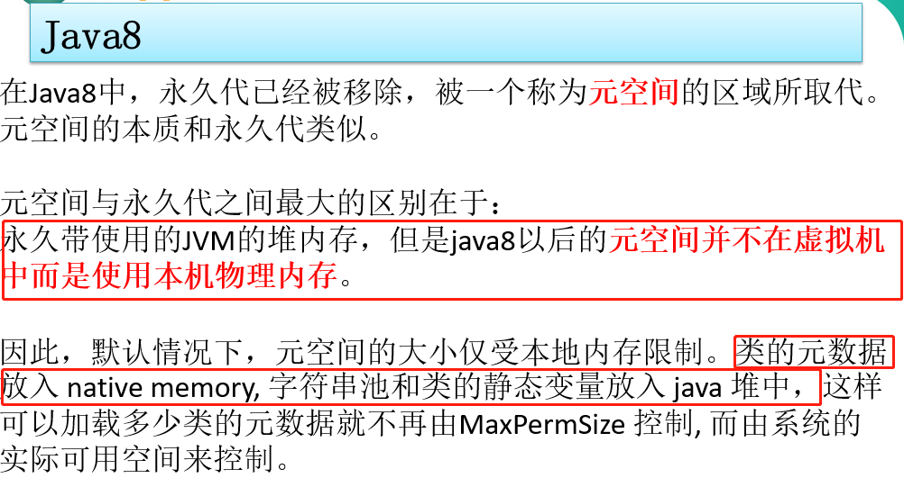
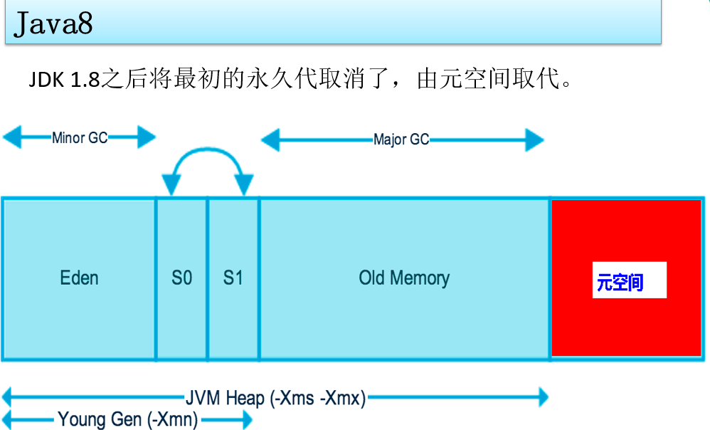

# 方法区(Method Area)

    类加载器(ClassLoader)读取了类文件后，会把类的结构信息放到方法中,(不要被名字迷惑,不是存放方法的地方)
    
    方法区还可以存放: 
        1. 运行时常量池（Runtime Constant Pool）
        2. 构造函数/属性/普通方法等类元信息-jvm加载的类信息
        3. 静态变量
    
    方法区在虚拟机启动的时候被创建.对这块区域进行垃圾回收的主要目的是对类的卸载.

# 方法区和永久代以及元空间的关系

永久代和元空间都是方法区的具体实现,永久代是java7,元空间是java8
    
     《Java虚拟机规范》只是规定了有方法区这么个概念和它的作用，并没有规定如何去实现它。
     那么，在不同的 JVM 虚拟机中方法区的实现是不同的
     
     方法区和永久代的关系很像Java中接口和类的关系,java7中,hotspot虚拟机提供了方法区的一种具体实现方式,叫永久代.
     java8中hotspot的方法去具体实现叫元空间
    
     方法区在不同版本的jdk中名字不同，java7中被称为永久代(PermGen space),java8中被称为元空间(Metaspace)。

# java7-永久代(PermGen space)

    Permanent Space (别名: Permanent Generation/PermGen)    永久代

>Permanent Generation位于non-heap区

    可利用参数 -XX:PermSize和 -XX:MaxPermSize控制永久代的初始大小和最大大小
    这两个参数是java7的,这辈子基本用不到了,了解下就行

    java8中-XX:PermSize 和 -XX:MaxPermSize已经不使用了

>java7中由于加载类过多会出现OOM: `java.lang.OutOfMemoryError: PermGen`

# java8-元空间(Metaspace)

    为什么java8要把永久代改成元空间?
        oracle收购了2家公司,2家公司一开始的名字不同,收购之后名字要统一,所以就就变成了元空间.

    -XX:MetaspaceSize=N //设置Metaspace的初始大小
    -XX:MaxMetaspaceSize=N //设置Metaspace的最大大小
    
虽然元空间使用物理内存(堆外内存),但也不能无线扩展，使用 `-XX:MaxMetaspaceSize=10M`来控制最大元数据内存。这样当不停的创建类时将会占满该区域并出现 `OOM`

    示例: org.java.core.advanced.jvm.Throwable.OOMMetaspaceDemo

# 堆和方法区的关系

    java7中,方法区的具体实现"永久代"占用了堆内存,但是是属于non-heap(非堆)
    
    java8中,方法区的具体实现"元空间"不再占用堆的空间,还是属于non-heap(非堆)
    
    Java堆中会存放访问类元数据(方法区)的地址.