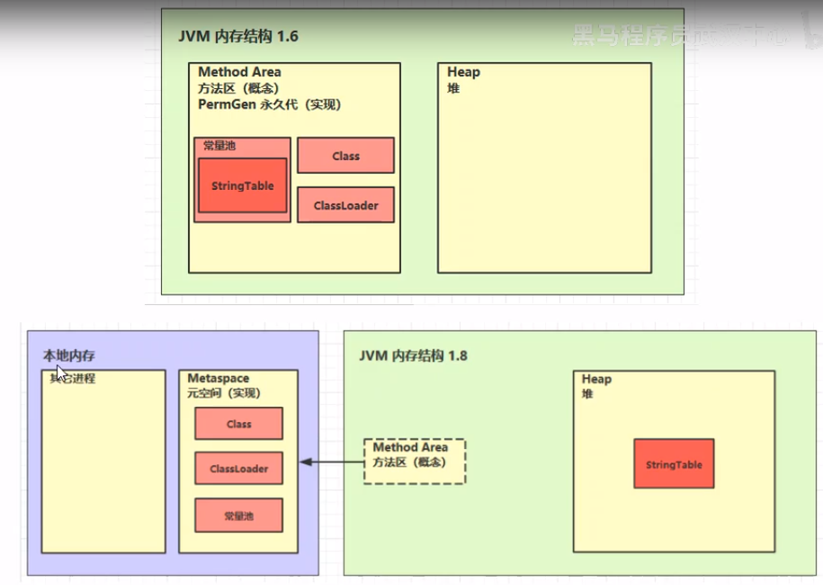

# 方法区(Method Area)

    线程共享的区域
    
    类加载器(ClassLoader)读取了类文件后，会把类的结构信息放到方法中
    (不要被方法区的名字迷惑,不是存放方法的地方)
    
    方法区可以存放: 
        1. 运行时常量池（Runtime Constant Pool）,1.7和1.8的方法区都有运行时常量池这个区域
        2. 类的类元信息: 构造函数/成员变量/成员方法等,包括ClassLoader也是在这里存着.
    
    方法区在虚拟机启动的时候被创建.方法区在申请内存时发现内存不足了,它也会抛OOM内存溢出的错误.
    
    字节码中的常量池(Constant pool)在Class被加载后,会存放到方法区中的运行时常量池中
    字节码中的类方法定义/字段定义等类元信息会被加载到方法区中运行时常量池以外的内存中

    方法区中的常量池和字节码Class文件中的常量池是一回事么?
    答: 方法区中的常量池和字节码Class文件中的常量池根本不是一个东西,不要混淆了
    

---
    StringTable(字符串常量池)的位置?
    
    注意: 
        1.6中,StringTable(字符串常量池)是存放在方法区(永久代)中的运行时常量池中的.
        
        1.7和1.8的运行时常量池不包含StringTable(字符串常量池),这两个版本的StringTable是放在堆中的.
        
        为什么这么做呢? 
        因为永久代的内存回收效率更低,永久代在full gc的时候才会触发永久代的垃圾回收,而full gc
        是在老年代的空间不足才会触发,所以触发的时间有点晚,间接的导致StringTable的回收效率不高.
        在大量使用字符串的场景下会导致 OutOfMemoryError 错误.
        所以鉴于这个缺点,1.7以及之后,把StringTable放到了堆中,加快垃圾回收,只需要MinorGC就会触发
        StringTable的垃圾回收.这样StringTable的使用效率更高了. 

    代码验证: org.java.core.advanced.jvm.StringTable.StringTableLocationDemo        
---        

# 方法区和永久代以及元空间的关系

>方法区是规范,永久代和元空间都是方法区的具体实现,永久代是java7,元空间是java8
    
     《Java虚拟机规范》只是规定了有方法区这么个概念和它的作用，并没有规定如何去实现它。
     那么，在不同的 JVM 虚拟机中方法区的实现是不同的
     
     方法区和永久代的关系很像Java中接口和类的关系,java7中,hotspot虚拟机提供了方法区的一种具体实现方式,叫永久代.
     java8中hotspot的方法去具体实现叫元空间
    
     方法区在不同版本的jdk中名字不同，java7中被称为永久代(PermGen space),java8中被称为元空间(Metaspace)。

# java7-永久代(PermGen space)

    Permanent Space (别名: Permanent Generation/PermGen)    永久代

>Permanent Generation位于non-heap区

    可利用参数 -XX:PermSize和 -XX:MaxPermSize控制永久代的初始大小和最大大小
    这两个参数是java7的,这辈子基本用不到了,了解下就行

    java8中-XX:PermSize 和 -XX:MaxPermSize已经不使用了

>java7中由于加载类过多会出现OOM: `java.lang.OutOfMemoryError: PermGen`

# java8-元空间(Metaspace)

    为什么java8要把永久代改成元空间?
        oracle收购了2家公司,2家公司一开始的名字不同,收购之后名字要统一,所以就就变成了元空间.

    -XX:MetaspaceSize=N //设置Metaspace的初始大小
    -XX:MaxMetaspaceSize=N //设置Metaspace的最大大小
    
虽然元空间使用物理内存(堆外内存),但也不能无线扩展，使用 `-XX:MaxMetaspaceSize=10M`来控制最大元数据内存。这样当不停的创建类时将会占满该区域并出现 `OOM`

    示例: org.java.core.advanced.jvm.Throwable.OOMMetaspaceDemo

# 堆和方法区的关系

    java7中,方法区的具体实现"永久代"占用了堆内存,所以java7的方法区逻辑上是堆的组成部分
    
    java8中,方法区的具体实现"元空间"不再占用堆的空间,还是属于non-heap(非堆)
    
    可以发现,不同厂商,不同版本的jdk中的方法区的实现不同.
    
    Java堆中会存放访问类元数据(方法区)的地址.

# 方法区的异常

    java8中的错误: Caused by: java.lang.OutOfMemoryError: Metaspace
    java7以及之前是: Caused by: java.lang.OutOfMemoryError: PermGen space
    
    实际生产中,动态产生class,并且加载这些类的场景是非常非常多的(字节码的动态生成技术)
    1. spring
    2. mybatis
    这两个框架都会用到cglib,用它来生成代理类,这些场景下都有可能出现方法区的OOM
    
    补充: 
    spring: 用cglib来生成代理类,这些代理类是spring aop的核心.
    mybatis也用到了cglib,用cglib生成mapper接口的实现类.

# 运行时常量池（Runtime Constant Pool）

    参见: 字节码反编译信息详解
    
    字节码中的常量池在Class被加载后,会存放到方法区中的运行时常量池中
