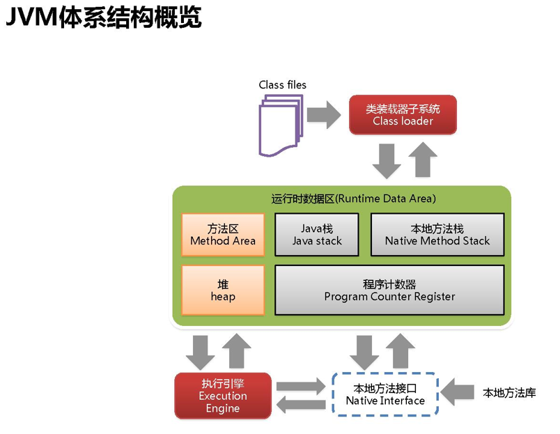

# JVM内存划分

- 虚拟机栈(VM Stack)，或称为线程栈(也就是我们平时说的栈内存)-这块区域不用垃圾回收
- 本地方法栈(Native Method Stack)-这块区域不用调优
- 程序计数器(Program counter register)
- 方法区(Method Area)/元数据区
- 堆区(Heap)-跟jvm的调优密切相关。jvm调优主要就是调优堆区。这个要深入剖析

---
    可以划分为2类，线程私有和线程共享:
    
    线程私有:虚拟机栈、本地方法栈、程序计数器。这些数据区会随着线程开始和结束而创建和销毁
    线程共享数据区:方法区、堆区。随着虚拟机启动而创建，随着虚拟机退出而销毁，并且被进程中的所有线程共享.
---
