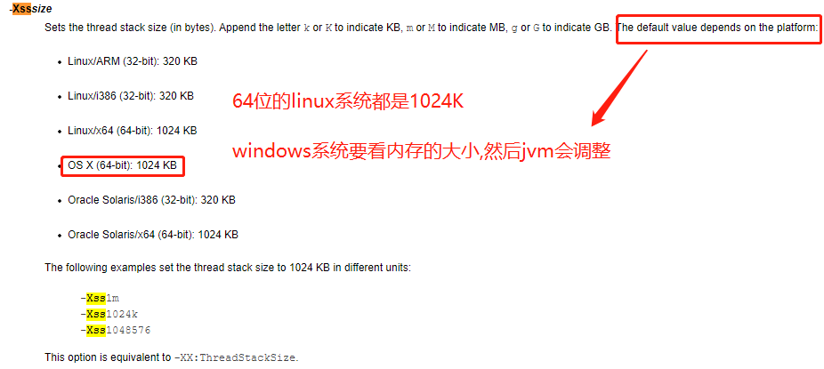

# jvm参数共分为三类

1. （-）参数: 从jdk1.0开始,到现在的jdk最新版本,所有的jvm都必须实现这些参数的功能，而且向后兼容
2. （-X）参数，默认jvm实现这些参数的功能，但是并不保证所有jvm实现都满足，且不保证向后兼容；
3. （-XX）参数,非Stable参数，此类参数各个jvm实现会有所不同，将来可能会随时取消，需要慎重使用；

>-XX要深刻掌握,面试中问的是它.

# jvm盘点家底-(查看初始默认值/修改变更值)

    第一种方式(示例: org.java.core.advanced.jvm.JVM_Params_XX):
        jps -l 获得进程号
        jinfo -flag 具体参数 进程号
        jinfo -flags 进程号 
            查看所有的相关参数,打印出的内容分为2部分,Non-default VM flags:为jvm启动默认的参数
            Command line:为用户自己指定的

    第二种方式:
        java -XX:+PrintFlagsInitial
        java -XX:+PrintFlagsFinal
        java -XX:+PrintFlagsFinal -version
        java -XX:+PrintCommandLineFlags -version 这个命令最重要的就是看默认的垃圾回收器是什么
        java -XX:+PrintFlagsFinal -XX:MetaspaceSize=512m 类的字节码文件

        系统和硬件环境不一样,比如不同机器的内存大小不一样,jvm的初始值就不一样,比如Xms,默认为物理内存的1/4
        上述命令打印出来的值有2种,一种是key=value,另一种是key:=value
        key=value是jvm没有改过的值,也就是默认值是多少就是多少,人和jvm都没有修改过
        key:=value是修改之后的参数值,比如jvm默认是多少,根据硬件的不同,jvm启动后根据硬件配置来自己修改.或
        者我们人为修改过的值(我们自己修改的VM Options,比如Xms等)

# 重要参数

    有些参数你说了,别人可能就认为你刻意去背了,过犹不及,所以记住常用的就足够了.
    
    -Xms和-Xmx属于XX参数

[有啥问题看官网](https://docs.oracle.com/javase/8/docs/index.html)
[官网的jvm资料](https://docs.oracle.com/javase/8/docs/technotes/tools/unix/java.html)

    -Xms64m: 初始堆内存的大小为64m(Xms: start),等价于XX参数: -XX:InitialHeapSize,默认为物理内存的1/64
    -Xmx128m 最大堆内存大小为128m(Xmx: max),等价于XX参数: -XX:MaxHeapSize,默认为物理内存的1/4
    
    注意: JVM可以使用超过Xmx的更大内存空间.因为Xmx和Xms只是针对堆内存.
    g或者G表示GB，m或M表示MB，k或K表示KB
    将-Xms和-Xmx设置为一样，就可以禁止自动扩展堆内存,生产环境就是要这么配置(********)

    -Xss: 设置单个线程栈的大小,一般默认为512K~1024K,等价于XX参数: -XX:ThreadStackSize
    通过jinfo -flag ThreadStackSize pid 打印出来的-XX:ThreadStackSize=0,等于0的意思就是等于jvm的默认值,这个值
    会根据环境的不同默认调整

    
    -Xmn: n的意思是new,这个参数是设置年轻代的初始大小和最大大小,基本不用调,用默认的即可一般,不要为了调而调
    可以使用-XX:NewSize来设置初始大小,用-XX:MaxNewSize来设置最大大小
    比如: -Xmn256m, -XX:NewSize=30m,-XX:MaxNewSize=40m

    java7: 永久代: -XX:PermSize20M -XX:MaxPermSize20M
    java8: 元空间: -XX:MetaspaceSize=512m
    虽然java8的元空间内存占用的是物理内存,但是还要看jvm的MetaspaceSize到底设置了多少,不是无限的

    -XX:+PrintGCDetails (很重要)
    
    -XX:SurvivorRation/-XX:NewRatio/-XX:MaxTenuringThreshold这三个参数工作中基本不用调,但是要知道意思.
    
    -XX:SurvivorRation=8: Eden与survior比率为8:1:1
    -XX:NewRatio=2: 老年代/新生代的比例,默认为2:1
    -XX:MaxTenuringThreshold=15: 进入养老区的年龄,MaxTenuringThreshold设为0的意思就是年轻代不经过幸存者区,直接进入old区
    java8中,这个值被限制在了0~15之间,如果超过这个范围,直接报错.
