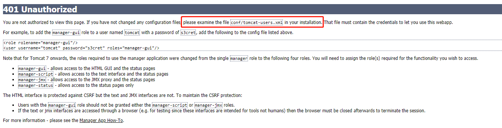
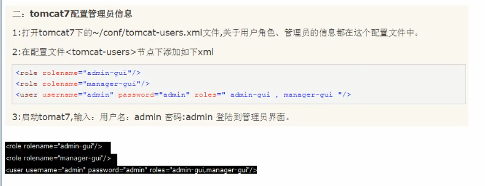
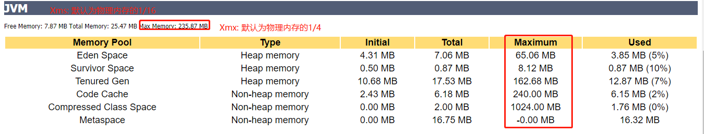
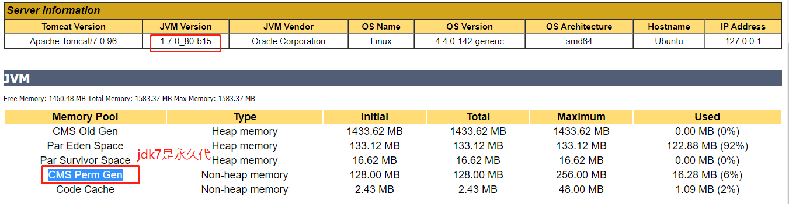
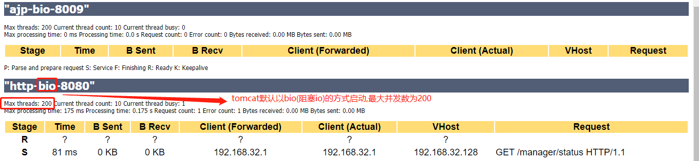
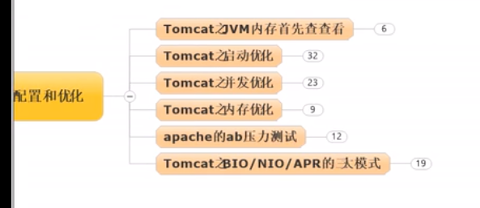

# tomcat之jvm内存信息查看

---

    tomcat6淘汰了,不要用了,至少要用tomcat7
    装软件不要装32位的,尤其是生产服务器,因为只能使用4G的内存.

    进入tomcat图形化控制器: http://192.168.32.128:8080/manager/status, 发现没有权限访问
---



    所以要修改配置文件,增加访问权限,注意: 改配置文件之前要先备份一下



```xml
<role rolename="admin-gui"/>
<role rolename="manager-gui"/>
<!--给这个用户添加了admin-gui和manager-gui这2个角色-->
<user username="admin" password="admin" roles="admin-gui, manager-gui "/>
```

    Total Memory相当于Xms
    Max Memory相当于Xmx



    java8要把PermSize改成Metaspace





# tomcat优化常问问题



---
    tomcat优化步骤:
        第一步: 纵向优化,增加tomcat能使用的内存,把一只小猫变成一只大老虎(调整tomcat的Xms和Xmx).
        第二步: 增加并发访问配置(修改conf/server.xml)

    一般你tomcat的配置你配哪些啊?
        1. conf/server.xml (配置 暴增并发访问量)
        2. bin/catalina.sh (纵向配置,暴增内存的)
        3. conf/web.xml

    一般在生产上出故障你会怎么解决?
        查看日志
            1. logs/catalina.out: 这个是总的tomcat日志输出
            2. logs/catalina.2019-12-06.log: 这个是某一天的日志输出.
---
