# tomcat之启动优化

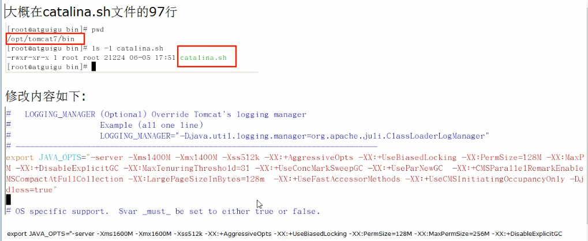

    export JAVA_OPTS="-server -Xms1600M -Xmx1600M -Xss512K -XX:+AggressiveOpts -XX:+UseBiasedLocking -XX:PermSize=128M -XX:MaxPermSize=256M -XX:+DisableExplicitGC -XX:MaxTenuringThreshold=31 -XX:+UseConcMarkSweepGC -XX:+UseParNewGC -XX:+CMSParallelRemarkEnabled -XX:+UseCMSCompactAtFullCollection -XX:LargePageSizeInBytes=128m -XX:+UseFastAccessorMethods -XX:+UseCMSInitiatingOccupancyOnly -Djava.awt.headless=true"

    注意要备份: catalina.sh

    如果tomcat没有启动起来,可以看日志${tomcat_home}/logs/catalina.out

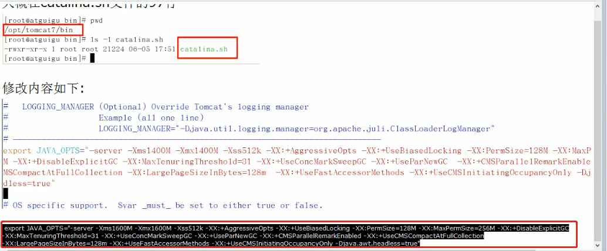

    查看是否生效: 
    获取进程号: ps -ef | grep tomcat
    
    映射java堆中的详细内容: jmap -heap 进程号(tomcat的进程号)

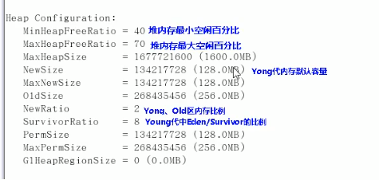    

```shell script
# 并发的使用"标记擦除算法"来进行垃圾回收(CMS)
Concurrent Mark-Sweep GC

# 堆的配置
Heap Configuration:
  # MinHeapFreeRatio和MaxHeapFreeRatio一般不要改
  # MinHeapFreeRatio defines minimum percentage of heap free after GC to avoid expansion, 
   MinHeapFreeRatio = 40 # gc之后,堆空闲的最小比例.如果空闲的比例不够,jvm堆就会增大到Xmx的最大限制
  # while MaxHeapFreeRation describes maximum percentage of heap free after GC 
   MaxHeapFreeRatio = 70 # gc之后,堆空闲的最大比例.如果空闲的比例高于70%,jvm堆就会减小到Xms的最小限制
  # 最大堆内存Xmx
   MaxHeapSize      = 1677721600 (1600.0MB)
  # 新生代有多大
   NewSize          = 174456832 (166.375MB)
  # 新生代最大有多大
   MaxNewSize       = 174456832 (166.375MB)
  # 老年代有多大
   OldSize          = 348913664 (332.75MB)
   NewRatio         = 2 # old/young的比例
  # 新生代中,伊甸园区和2个幸存者区的比例
   SurvivorRatio    = 8 # Eden/一个幸存者区=8/1
  # 永久代
   PermSize         = 134217728 (128.0MB)
  # 最大永久代
   MaxPermSize      = 268435456 (256.0MB)
   G1HeapRegionSize = 0 (0.0MB)

Heap Usage:
# 新生代实际上等于伊甸园区加上一个幸存者区
New Generation (Eden + 1 Survivor Space):
   capacity = 157024256 (149.75MB)
   used     = 107180600 (102.21538543701172MB)
   free     = 49843656 (47.53461456298828MB)
   68.25735254558379% used
# 伊甸园区
Eden Space:
   capacity = 139591680 (133.125MB)
   used     = 107180600 (102.21538543701172MB)
   free     = 32411080 (30.90961456298828MB)
   76.78151018742665% used
# From区
From Space:
   capacity = 17432576 (16.625MB)
   used     = 0 (0.0MB)
   free     = 17432576 (16.625MB)
   0.0% used
# To区
To Space:
   capacity = 17432576 (16.625MB)
   used     = 0 (0.0MB)
   free     = 17432576 (16.625MB)
   0.0% used
# 可以看出当前使用CMS算法来进行GC
courrent mark-sweep generation:
   capacity = 1503264768 (1433.625MB)
   used     = 0 (0.0MB)
   free     = 1503264768 (1433.625MB)
   0.0% used
# 永久代
Perm Generation:
   capacity = 134217728 (128.0MB)
   used     = 15386400 (14.673614501953125MB)
   free     = 118831328 (113.
```    

# tomcat之启动优化参数说明

    export JAVA_OPTS="-server -Xms1600M -Xmx1600M -Xss512K -XX:+AggressiveOpts -XX:+UseBiasedLocking -XX:PermSize=128M -XX:MaxPermSize=256M -XX:+DisableExplicitGC -XX:MaxTenuringThreshold=31 -XX:+UseConcMarkSweepGC -XX:+UseParNewGC -XX:+CMSParallelRemarkEnabled -XX:+UseCMSCompactAtFullCollection -XX:LargePageSizeInBytes=128m -XX:+UseFastAccessorMethods -XX:+UseCMSInitiatingOccupancyOnly -Djava.awt.headless=true"

    JAVA_OPTS指的是: java options

    -server: 必须配置,而且要放在第一位

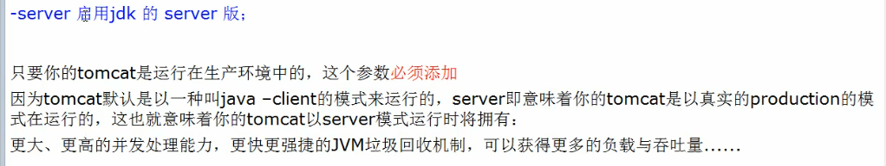

    -Xms和-Xmx生产环境要配置成一致的,避免内存的忽高忽低

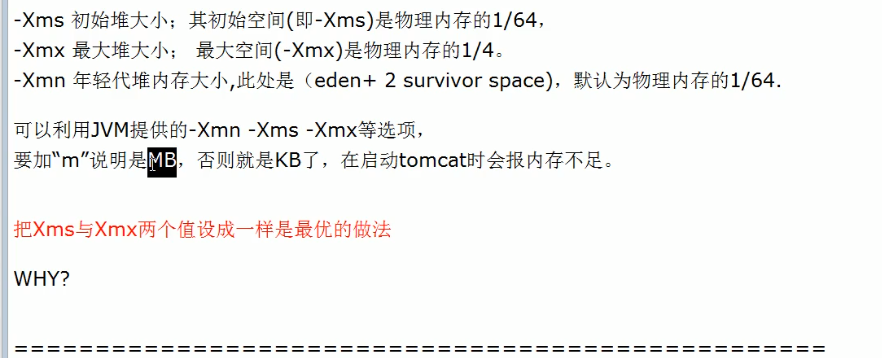

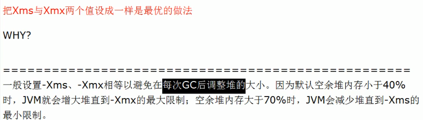

    -Xss: 一般不要超过1M,依据经验,一般配置为0.5M,也就是512K


    -XX:+AggressiveOpts 这个参数必须添加

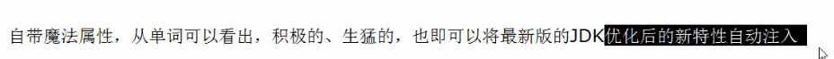

    -XX:+UseBiasedLocking 这个参数必须添加,很重要.  

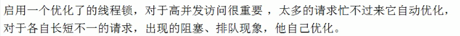

    -XX:PermSize=128M -XX:MaxPermSize=256M: java7的参数,java8中不要了
    
    -XX:MaxNewSize: 这个参数一般不要设置,交给jdk自己控制就行
    
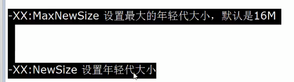

    -XX:+DisableExplicitGC: 关闭显示的gc
    
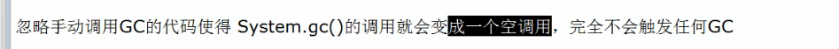
    
    System.gc(),这个方法一般不要用,为什么呢?
    因为如果程序正在运行的时候,你猛的一回收垃圾,可能会导致程序卡顿,也就是生产上会出现卡顿.
    所以要交给jdk来选择合适的时间来回收垃圾,而不要自己手动的回收垃圾.
    因为调用System.gc()之后,垃圾回收线程会等着调度,不是马上就进行GC的,相当于一个thread.start()之后
    等着调度.
    
.png)    

    -XX:MaxTenuringThreshold: 默认为15岁.

    -Djava.awt.headless=true

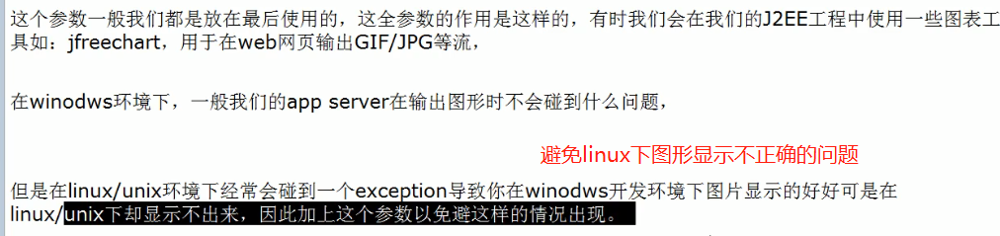    