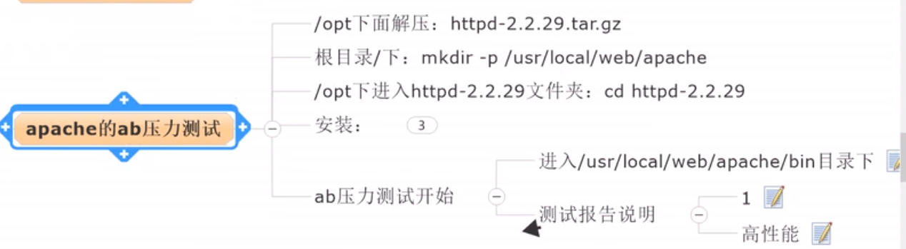
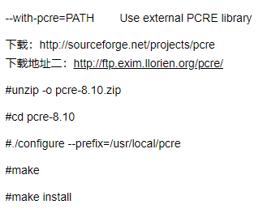
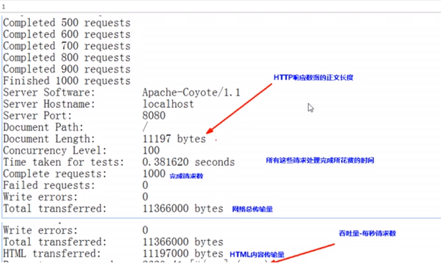
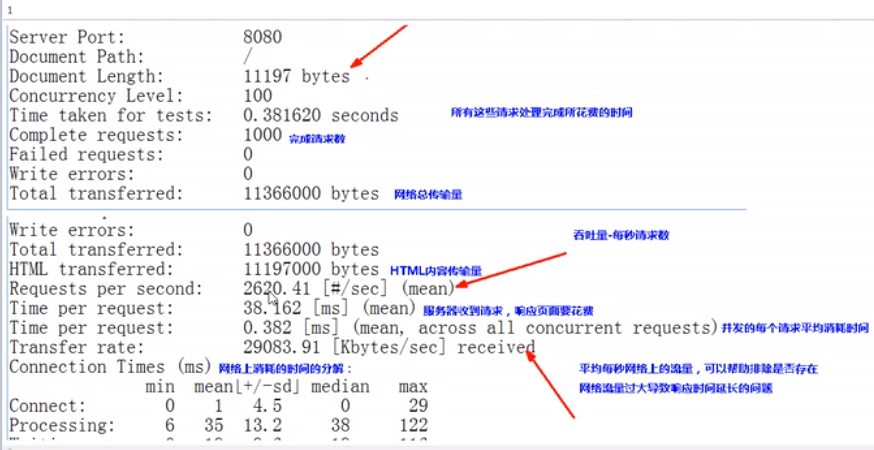
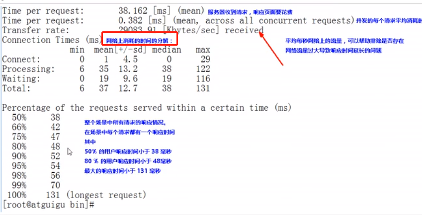

# ab压力测试工具

    ab全称为：apache bench



# 下载安装ab

```shell script
# 下载ab from: http://httpd.apache.org/
tar -zxvf httpd-2.4.41.tar.gz && cd httpd-2.4.41
mkdir -p /usr/local/web/apache

# apr和apr-util不要单独安装,否则make的时候会报: Makefile:48: recipe for target 'htpasswd' failed
# 这个错误是因为在httpd目录下的srclib目录里面没有apr和apr-util所导致的，但是./configure又不会报错，
# 到make才会报错，所以把下载下来到apr和apr-util解压到srclib目录下到apr和apr-util目录，注意目录名字要一致。
# 这就是我之前说的不用安装apr和apr-util的原因，它会自动安装，手动安装后去指定安装路径是会报错的
cd srclib
tar -zxvf apr.tar.gz -C ./ # 注意名字要改为apr
tar -zxvf apr-util.tar.gz -C ./ # 注意名字要改为apr-util

./configure --prefix=/usr/local/web/apache --enable-shared=max --enable-module=rewrite --enable-module=so --with-included-apr -with-pcre=/usr/local/pcre

# make是编译,make install是安装
make -j8 && make install -j8
```

    安装错误解决方案

    错误1: configure: error: APR-util not found.  Please read the documentation.
    
    需要把apr和apr-util解压到对应目录,然后再安装,并且指定这个: --with-included-apr


    错误2: configure: error: pcre-config for libpcre not found. 
    PCRE is required and available from http://pcre.org/
    所以要安装pcre,然后指定安装路径: -with-pcre=PATH 

    ./configure --prefix=/usr/local/pcre
    make -j8 && make install -j8


    
    安装pcre的过程如果报错: configure: error: Invalid C++ compiler or C++ compiler flags
    就需要安装C++的编译器: apt-get install g++


[安装参考](https://www.linuxidc.com/Linux/2017-08/146567.htm)

# 如何获得tomcat的体检报告

    模拟一秒钟有1000个人来访问这个网页,会不会把网站弄跨,tomcat会不会响应不了
    分别在bio/nio/apr三种模式下测试,tomcat的能耐有多大,最高并发是多少

# 使用ab进行压力测试实例

```shell script
# 关闭tomcat
./shutdown.sh
# 把原来的参数修改注释掉(改成bio和把虚拟机参数还原)
vim bin/cataline.sh
vim conf/server.xml

./startup.sh

./ab -n1000 -c100 http://192.168.32.128:8080/
# n: number,总共访问的数量
# c: concurrent,每次访问的并发
# 意思就是总共发1000个请求,并发为100,也就是分成10组.
```







```shell script
This is ApacheBench, Version 2.3 <$Revision: 1843412 $>
Copyright 1996 Adam Twiss, Zeus Technology Ltd, http://www.zeustech.net/
Licensed to The Apache Software Foundation, http://www.apache.org/

Benchmarking 192.168.32.128 (be patient)
# 发现一共访问了1000次,说明没有丢包
Completed 100 requests
Completed 200 requests
Completed 300 requests
Completed 400 requests
Completed 500 requests
Completed 600 requests
Completed 700 requests
Completed 800 requests
Completed 900 requests
Completed 1000 requests
Finished 1000 requests

# 访问的软件是Apache-Coyote
Server Software:        Apache-Coyote/1.1
# 访问的主机ip
Server Hostname:        192.168.32.128
# 访问的主机端口
Server Port:            8080

Document Path:          /
# 访问的页面的大小
Document Length:        11151 bytes
# 并发是多少 
Concurrency Level:      100
# 1000访问,总共耗时2.3秒
Time taken for tests:   2.340 seconds
# 完成的请求数是1000
Complete requests:      1000
# 失败的请求数是0
Failed requests:        0
# 总共传输的大小
Total transferred:      11297000 bytes
# html的传输的大小
HTML transferred:       11151000 bytes
# 这个网站的吞吐量,也就是每秒能响应的请求数,这里说明每秒tomcat能处理427.28个请求
Requests per second:    427.28 [#/sec] (mean)
# 服务器收到请求,响应页面要花费多长时间,这里说的是并发的100个请求的总时间
Time per request:       234.037 [ms] (mean)
# 也就是100个并发的情况下,并发的每个请求平均消耗的时间,也就是大概每次2.34毫秒你就可以看到网页了
Time per request:       2.340 [ms] (mean, across all concurrent requests)
Transfer rate:          4713.88 [Kbytes/sec] received

Connection Times (ms)
              min  mean[+/-sd] median   max
# 连接耗时
Connect:        0    2   4.1      0      14
# 处理耗时
Processing:    19  228  90.1    240     661
# 等待耗时
Waiting:        3  163  88.0    143     660
# 总时间
Total:         19  230  89.8    240     675

Percentage of the requests served within a certain time (ms)
# 有50%的用户240毫秒就可以看到页面
  50%    240
  66%    268
  75%    282
  80%    293
  90%    339
  95%    376
  98%    434
# 99%的用户475毫秒可以看到页面
  99%    475
# 所有用户中,最长看到页面的时间675
 100%    675 (longest request)
```