# tomcat的三大模式

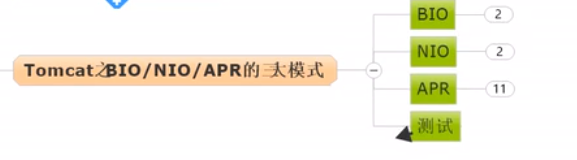

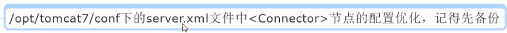

## tomcat之bio模式

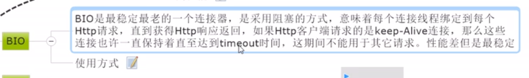

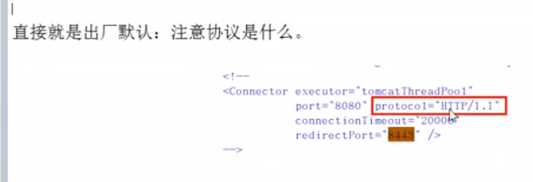

    tomcat默认是以bio的模式启动
    
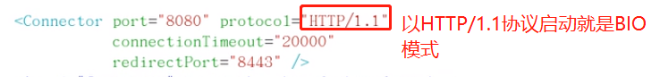    

## tomcat之nio模式

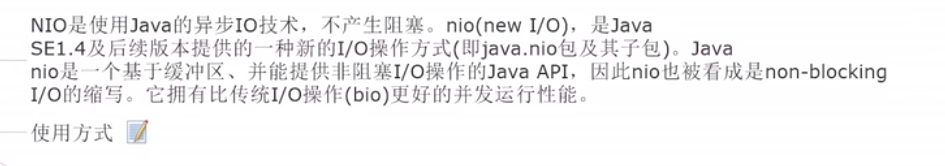

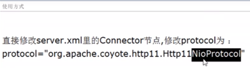

    修改为以NIO模式启动

```xml
<!-- 把并发线程数量改成600,默认是200-->
<Connector port="8080" protocol="org.apache.coyote.http11.Http11NioProtocol"
    maxThreads="600"
    minSpareThreads="100"
    maxSpareThreads="500"
    acceptCount="700"
     connectionTimeout="20000"
     redirectPort="8443" />
```

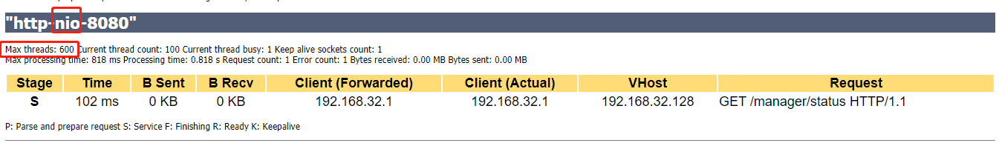

## 将tomcat的启动模式改为APR

    tomcat换成apr模式之后,tomcat就很牛逼了,想挂都难.


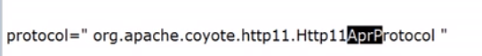

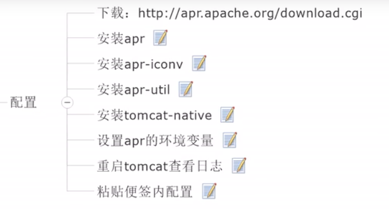

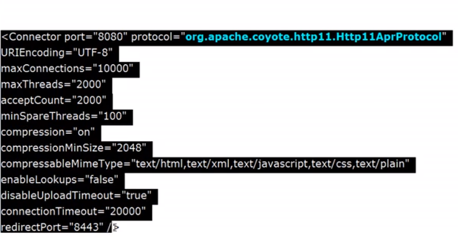

```xml
<Connector port="8080" protocol="org.apache.coyote.http11.Http11AprProtocol"
    URIEncoding="UTF-8"
    maxConnections="10000"
    maxThreads="2000"
    acceptCount="2000"
    minSpareThreads="100"
    compression="on"
    compressionMinSize="2048"
    compressableMimeType="text/html,text/xml,text/javascript,text/css,text/plain"
    enableLookups="false"
    disableUploadTimeout="true"
     connectionTimeout="20000"
     redirectPort="8443" />
```

    修改完成后,然后重新启动tomcat.
    
    如果遇到报错: ${tomcat_home}/logs/catalina.out
    [org.apache.coyote.http11.Http11AprProtocol] requires the APR/native library which is not available

    解决办法: 需要安装apr相关的库

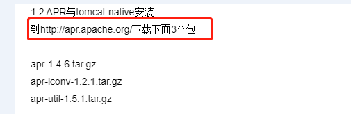
    
    第一步: 下载相关jar: http://apr.apache.org/download.cgi
    包括: apr,apr-util,apr-iconv
    
    第二步: 因为要编译源码所以要安装gcc,g++,make
    gcc: apt-get install gcc
    make: apt-get install make
    apt-get install g++
    
    第三步: 安装apr
    cd ${dir}/apr-1.5.2.tar.gz && tar -zxf apr-1.5.2.tar.gz
    cd apr-1.5.2 && ./configure --prefix=/usr/local/apr
    # 其中--prefix指定安装到哪里
    make -j8 && make install -j8
    
    安装apr-iconv
    ./configure --prefix=/usr/local/apr-iconv --with-apr=/usr/local/apr
    make -j8 && make install -j8
    
    第四步: 安装apr-util
    ./configure --prefix=/usr/local/apr-util --with-apr=/usr/local/apr --with-apr-iconv=/usr/local/apr-iconv/bin/apriconv
    make -j8 && make install -j8
    报错：xml/apr_xml.c:35:19: fatal error: expat.h: No such file or directory
    解决办法：apt-get install libexpat1-dev
    
    5: vim ~/.bashrc
    然后添加: export LD_LIBRARY_PATH=$LD_LIBRARY_PATH:/usr/local/apr/lib
    然后使变量生效: source ~/.bashrc
    
    或者: 在${tomcat_home}/bin/catalina.sh中添加如下内容:
    
    LD_LIBRARY_PATH=$LD_LIBRARY_PATH:/usr/local/apr/lib
    export LD_LIBRARY_PATH
    
    或者: 编辑/etc/ld.so.conf文件，将include /usr/local/apr/lib/添加进入
    
    7. 安装tomcat-native
    它的bin目录下面就有一个tomcat-native.tar.gz包，将其解压后进行编译安装：
    tar -zxf tomcat-native.tar.gz
    cd tomcat-native-1.2.8-src/native/
    ./configure --with-apr=/usr/local/apr/bin/apr-1-config --with-java-home=/usr/local/jdk
    make -j8 && make install -j8

    安装参考: https://blog.csdn.net/yangyangrenren/article/details/80551954