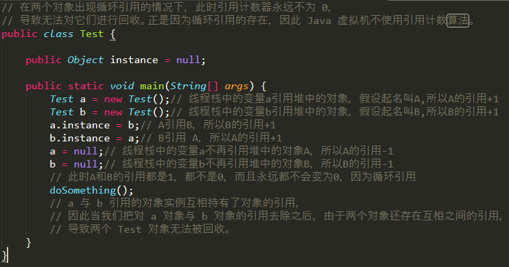
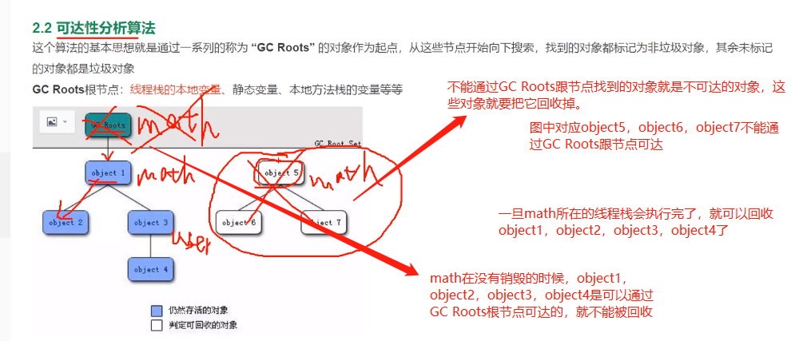
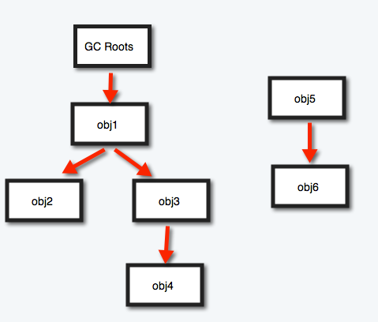
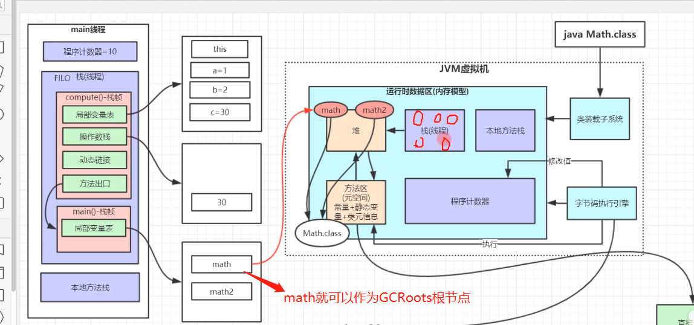
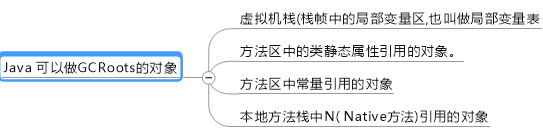

# 判断对象是否需是垃圾

垃圾收集器在对堆进行回收前，第一件事情就是要确定这些对象有哪些还“存活”着，哪些已经“死去”(即不可能再被使用的对象)

    方法包括：

    1. 引用计数法
    2. 根搜索算法

# 1. 引用计数算法

    只需要了解,几乎不用,这辈子也不会用.

    jvm对每个对象添加一个引用计数器，每当有一个地方引用它，计数器就加1；
    当引用失效，计数器就减1；引用计数器为0的对象就是不能再被使用的

---

    优点: 这个方法实现简单
    缺点: 很难解决对象之间相互循环引用的问题

    应用: 目前的虚拟机中并没有选择这个算法来判断对象是否已死的

# 2. 根搜索算法(可达性分析算法)

    Java采用根搜索算法(GC Roots Tracing)判定对象是否存活的

这个算法的基本思路就是通过一系列的名为“GC Roots”的对象作为起始点，从这些节点开始向下搜索，搜索所走过的路径称为引用链(Reference Chain)，当一个对象到GC Roots没有任何引用链相连(也就是从GC Roots到这个对象不可达)时，则证明此对象是不可用的。

    说简单点就是: 对每个对象做可达性分析,判断GC Roots到对象是否可达!

如下图所示，对象object 5、object 6虽然互相有关联，但是它们到GC Roots是不可达的，所以它们将会被判定为是可回收的对象。 

 

## 在Java中,可作为GC Roots根节点的对象有哪些?

