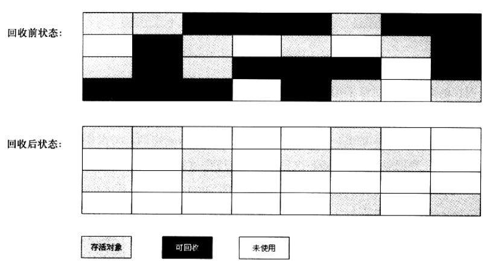

# 垃圾回收算法概括

    你去面试的时候,回答: 第一他们是什么,第二怎么用, 第三各自的优缺点

- 复制算法(新生代)
- 标记-清除算法(老年代)
- 标记-整理算法(在标记清除算法的基础上改进而来)
- 分代收集算法(不是具体的算法，而是一种思想)

---
    GC的3种算法.你用哪一种算法呢?这个题常考:

    当前的虚拟机采用“分代收集”算法，根据各个年代的特点采用最适当的收集算法.

    a. 新生代中，每次垃圾收集时都发现有大批对象死去，只有少量存活，那就选用复制算法，
    只需要付出少量存活对象的复制成本就可以完成收集(100个,就剩下2个,拷贝的效率最高)

    b. 老年代中因为对象存活率高(复制的效率会很低)、没有额外空间对它进行分配担保，
    所以使用标记清除或标记清除和标记整理算法的混合实现
---

# 复制算法(最重要的算法-90%基本都是使用这个)

    1. 是什么?
    从From到To区的拷贝.
    
    2. 怎么用?
    应用: 现在的虚拟机都采用这种收集算法来回收新生代

    3. 优缺点?
    优点: 复制算法不会产生内存碎片,实现简单,效率高
        效率高的原因新生代中的对象98%是朝生夕死的.生存的时间比较短,假如对象生存时间长的话,来回复制的效率就会大大降低.

    缺点: 浪费内存.(要准备Form和To2个区)

    为什么分配空间是8:1:1?
    
    因为新生代中的对象98%是朝生夕死的，所以不需要按照1∶1的比例来划分内存空间，

    每次新生代中可用内存空间为整个新生代容量的90%（80%+10%），只有10%的内存是会被“浪费”的。

# 标记-清除算法(Mark-Sweep)

    1. 为什么会出现这种算法?
    为了解决复制算法浪费空间的缺点

    2. 分几步?每步的作用?
    分“标记”和“清除”2个阶段,第一步: 标记哪些对象是垃圾 第二步: 清除垃圾对象

    3. 优缺点?
    优点: 解决了空间浪费的问题
    缺点: 
        a. 出现了内存碎片,分配较大对象时无法找到足够的连续内存而不得不提前触发另一次垃圾收集动作.
        b. 而且效率比较低,因为要扫描2次,耗时比较长(第一次扫描是进行标记,第二次扫描清除)
    
    适合应用在什么地方?
    用在老年代.

# 标记-整理算法(老年代使用)

    1. 为什么会出现这种算法?
    为了解决标记清除算法和复制算法的缺点而出现.
    
    2. 优缺点?
    优点: 没有内存碎片,空间也不浪费
    缺点: 什么都好,就是耗时长

    3. 应用场景: 老年代采用这种算法.
    
    4. 老年代为什么不用复制算法?
    复制收集算法在对象存活率较高时就要执行较多的复制操作，效率将会变低
     

