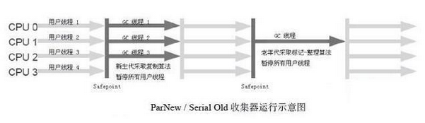
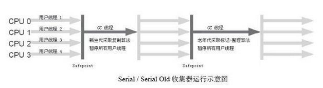

# 垃圾收集器

如果说垃圾回收算法是内存回收的方法论，垃圾回收器就是垃圾回收算法的具体实现。

垃圾收集器也是分代的:年轻代和老年代使用的垃圾收集器是不一样的,

这里讨论的收集器基于Sun HotSpot虚拟机1.7版 Update 14，这个虚拟机包含的所有收集器如图所示。

上图展示了7种作用于不同分代的收集器（包括JDK 1.6_Update14后引入的Early Access版G1收集器），如果两个收集器之间存在连线，就说明它们可以搭配使用。虚拟机所处的区域，则表示它是属于新生代收集器还是老年代收集器。

## Minor GC 和 Full GC

- 新生代GC（Minor GC）：指发生在新生代的垃圾收集动作，因为Java对象大多都具备朝生夕灭的特性，所以Minor GC非常频繁，一般回收速度也比较快。
- 老年代GC（Major GC / Full GC）：指发生在老年代的GC，出现了Major GC，经常会伴随至少一次的Minor GC（但非绝对的，在Parallel Scavenge收集器的收集策略里就有直接进行Major GC的策略选择过程）。Major GC的速度一般会比Minor GC慢10倍以上。

### 吞吐量

>吞吐量就是CPU用于运行用户代码的时间与CPU总消耗时间的比值，即吞吐量 = 运行用户代码时间 /（运行用户代码时间 + 垃圾收集时间）。

虚拟机总共运行了100分钟，其中垃圾收集花掉1分钟，那吞吐量就是99%。

# 垃圾收集器分类

- Serial收集器(新生代)
- ParNew收集器(新生代)
- Parallel Scavenge收集器(新生代)
- Serial Old收集器(老年代)
- Parallel Old收集器(老年代)
- CMS收集器(老年代)
- G1收集器(新生代和老年代)

1. 单线程与多线程：单线程指的是垃圾收集器只使用一个线程，而多线程使用多个线程；
2. 串行与并行：串行指的是垃圾收集器与用户程序交替执行，这意味着在执行垃圾收集的时候需要停顿用户程序；并行指的是垃圾收集器和用户程序同时执行。除了 CMS 和 G1 之外，其它垃圾收集器都是以串行的方式执行。

## 一、Serial收集器

Serial收集器是最基本的收集器，曾经（在JDK 1.3.1之前）是虚拟机新生代收集的唯一选择。

Serial 翻译为串行，也就是说它以串行的方式执行。

这个收集器是一个单线程的收集器，只会使用一个线程进行垃圾收集工作.它进行垃圾收集时，必须暂停其他所有的工作线程，直到它收集结束。这对很多应用来说都是难以接受的。你想想，要是你的电脑每运行一个小时就会暂停响应5分钟，你会有什么样的心情？

它是 Client 场景下的默认新生代收集器，因为在该场景下内存一般来说不会很大。它收集一两百兆垃圾的停顿时间可以控制在一百多毫秒以内，只要不是太频繁，这点停顿时间是可以接受的。

## 二、ParNew收集器

它是 Serial 收集器的多线程版本,使用多条线程进行垃圾收集.其他与Serial收集器相比并没有太多创新之处

它是 Server 场景下默认的新生代收集器，其中有一个与性能无关但很重要的原因，主要是因为除了 Serial 收集器，只有它能与 CMS 收集器配合使用。

其余行为包括Serial收集器可用的所有`控制参数,收集算法、对象分配规则、回收策略`等都与Serial收集器完全一样，实现上这两种收集器也共用了相当多的代码。ParNew收集器的工作过程如图所示:

在JDK 1.5时期，HotSpot推出了一款在强交互应用中有划时代意义的垃圾收集器—CMS收集器（Concurrent Mark Sweep），这款收集器是HotSpot虚拟机中第一款真正意义上的并发（Concurrent）收集器，它第一次实现了让垃圾收集线程与用户线程（基本上）同时工作

不幸的是，CMS它作为老年代的收集器，却无法与JDK 1.4.0中已经存在的新生代收集器Parallel Scavenge配合工作，`所以在JDK 1.5中使用CMS来收集老年代的时候，新生代只能选择ParNew或Serial收集器中的一个`。ParNew收集器也是使用`-XX: +UseConcMarkSweepGC`选项后的默认新生代收集器，也可以使用`-XX:+UseParNewGC`选项来强制指定它。

ParNew收集器在单CPU的环境中绝对不会有比Serial收集器更好的效果，甚至由于存在线程交互的开销，该收集器不能超越Serial收集器。它默认开启的收集线程数与CPU的数量相同，在CPU非常多（譬如32个，现在CPU动辄就4核加超线程，服务器超过32个逻辑CPU的情况越来越多了）的环境下，可以使用`-XX:ParallelGCThreads`参数来限制垃圾收集的线程数。

## 三 Parallel Scavenge收集器

Parallel Scavenge收集器也是一个新生代收集器，它也是使用复制算法的收集器，又是多线程收集器……看上去和ParNew都一样，那它有什么特别之处呢？

Parallel Scavenge收集器的特点是它的关注点与其他收集器不同，CMS等收集器的关注点尽可能地缩短垃圾收集时用户线程的停顿时间，`而Parallel Scavenge收集器的目标则是达到一个可控制的吞吐量（Throughput）`。所谓吞吐量就是CPU用于运行用户代码的时间与CPU总消耗时间的比值，即吞吐量 = 运行用户程序时间 /（运行用户程序时间 + 垃圾收集时间），虚拟机总共运行了100分钟，其中垃圾收集花掉1分钟，那吞吐量就是99%。

停顿时间越短就越适合需要与用户交互的程序，良好的响应速度能提升用户的体验；而高吞吐量则可以最高效率地利用CPU时间，尽快地完成程序的运算任务，主要适合在后台运算而不需要太多交互的任务。

GC停顿时间缩短是以牺牲吞吐量和新生代空间来换取的：新生代空间变小，垃圾回收变得频繁，导致吞吐量下降。

>Parallel Scavenge收集器提供了两个参数用于精确控制吞吐量，分别是控制最大垃圾收集停顿时间的-XX:MaxGCPauseMillis参数及直接设置吞吐量大小的 -XX:GCTimeRatio参数。

MaxGCPauseMillis参数允许的值是一个大于0的毫秒数，收集器将尽力保证内存回收花费的时间不超过设定值。不过大家不要异想天开地认为如果把这个参数的值设置得稍小一点就能使得系统的垃圾收集速度变得更快，GC停顿时间缩短是以牺牲吞吐量和新生代空间来换取的：系统把新生代调小一些，收集300MB新生代肯定比收集500MB快吧，这也直接导致垃圾收集发生得更频繁一些，原来10秒收集一次、每次停顿100毫秒，现在变成5秒收集一次、每次停顿70毫秒。停顿时间的确在下降，但吞吐量也降下来了。

GCTimeRatio参数的值应当是一个大于0小于100的整数，也就是垃圾收集时间占总时间的比率，相当于是吞吐量的倒数。如果把此参数设置为19，那允许的最大GC时间就占总时间的5%（即1 /（1+19）），默认值为99，就是允许最大1%（即1 /（1+99））的垃圾收集时间。

由于与吞吐量关系密切，Parallel Scavenge收集器也经常被称为“吞吐量优先”收集器。

除上述两个参数之外，Parallel Scavenge收集器还有一个参数-XX:+UseAdaptiveSizePolicy值得关注。这是一个开关参数，当这个参数打开之后，就不需要手工指定新生代的大小（-Xmn）、Eden与Survivor区的比例（-XX:SurvivorRatio）、晋升老年代对象年龄（-XX:PretenureSizeThreshold）等细节参数了，虚拟机会根据当前系统的运行情况收集性能监控信息，动态调整这些参数以提供最合适的停顿时间或最大的吞吐量，这种调节方式称为GC自适应的调节策略（GC Ergonomics）。

如果读者对于收集器运作原理不太了解，手工优化存在困难的时候，使用Parallel Scavenge收集器配合自适应调节策略，把内存管理的调优任务交给虚拟机去完成将是一个很不错的选择。只需要把基本的内存数据设置好（如-Xmx设置最大堆），然后使用MaxGCPauseMillis参数（更关注最大停顿时间）或GCTimeRatio参数（更关注吞吐量）给虚拟机设立一个优化目标，那具体细节参数的调节工作就由虚拟机完成了。自适应调节策略也是Parallel Scavenge收集器与ParNew收集器的一个重要区别。

## 四、Serial Old收集器

Serial Old是Serial收集器的老年代版本，它同样是一个单线程收集器，也是给 Client 场景下的虚拟机使用.使用“标记-整理”算法。

如果在Server模式下，它主要还有两大用途：一个是在JDK 1.5及之前的版本中与Parallel Scavenge收集器搭配使用，另外一个就是作为CMS收集器的后备预案，在并发收集发生Concurrent Mode Failure的时候使用。

Serial Old收集器的工作过程如图所示。

## 五、Parallel Old收集器

Parallel Old是Parallel Scavenge收集器的老年代版本，使用多线程和“标记－整理”算法。这个收集器是在JDK 1.6中才开始提供的.

在此之前，新生代的Parallel Scavenge收集器一直处于比较尴尬的状态。原因是，如果新生代选择了Parallel Scavenge收集器，老年代除了Serial Old（PS MarkSweep）收集器外别无选择（还记得上面说过Parallel Scavenge收集器无法与CMS收集器配合工作吗？）。

由于单线程的老年代Serial Old收集器在服务端应用性能上的“拖累”，即便使用了Parallel Scavenge收集器也未必能在整体应用上获得吞吐量最大化的效果，又因为老年代收集中无法充分利用服务器多CPU的处理能力，在老年代很大而且硬件比较高级的环境中，这种组合的吞吐量甚至还不一定有ParNew加CMS的组合“给力”。

直到Parallel Old收集器出现后，“吞吐量优先”收集器终于有了比较名副其实的应用组合，在注重吞吐量及CPU资源敏感的场合，都可以优先考虑Parallel Scavenge加Parallel Old收集器。

## 六、CMS收集器

CMS（Concurrent Mark Sweep）收集器是一种`以获取最短回收停顿时间为目标的收集器`。

使用场景: 目前很大一部分的Java应用都集中在互联网站或B/S系统的服务端上，这类应用尤其重视服务的响应速度，希望系统停顿时间最短，以给用户带来较好的体验。CMS收集器就非常符合这类应用的需求。

CMS收集器是基于“标记-清除”算法实现的，，整个运作过程分为4个步骤，包括：

1. 初始标记（CMS initial mark）:仅仅只是标记一下 GC Roots 能直接关联到的对象，速度很快，需要停顿。
2. 并发标记（CMS concurrent mark）:进行 GC Roots Tracing 的过程，它在整个回收过程中耗时最长，不需要停顿。
3. 重新标记（CMS remark）:为了修正并发标记期间因用户程序继续运作而导致标记产生变动的那一部分对象的标记记录，需要停顿。
4. 并发清除（CMS concurrent sweep）:不需要停顿。

由于整个过程中`耗时最长的并发标记和并发清除过程中`，收集器线程都可以与用户线程一起工作，不需要进行停顿。

通过图3-10可以比较清楚地看到CMS收集器的运作步骤中并发和需要停顿的时间。

### CMS优缺点

CMS是一款优秀的收集器，它的最主要优点在名字上已经体现出来了：`并发收集、低停顿`.

但是CMS还远达不到完美的程度，它有以下三个显著的缺点：

- 吞吐量低：低停顿时间是以牺牲吞吐量为代价的，导致 CPU 利用率不够高,对CPU资源敏感。
- 无法处理浮动垃圾，可能出现 Concurrent Mode Failure。浮动垃圾是指并发清除阶段由于用户线程继续运行而产生的垃圾，这部分垃圾只能到下一次 GC 时才能进行回收。由于浮动垃圾的存在，因此需要预留出一部分内存，意味着 CMS 收集不能像其它收集器那样等待老年代快满的时候再回收。如果预留的内存不够存放浮动垃圾，就会出现 Concurrent Mode Failure，这时虚拟机将临时启用 Serial Old 来替代 CMS。
- 标记 - 清除算法导致的空间碎片，往往出现老年代空间剩余，但无法找到足够大连续空间来分配当前对象，不得不提前触发一次 Full GC。

## 七 G1收集器（Garbage-First）

在JDK 1.7正式发布的时候，G1收集器称为成熟的商用版本随之发布。G1（Garbage-First），它是一款面向服务端应用的垃圾收集器，在多 CPU 和大内存的场景下有很好的性能。以极高概率满足GC停顿时间要求的同时,还具备高吞吐量性能特征.

堆被分为新生代和老年代，其它收集器进行收集的范围都是整个新生代或者老年代，而 G1 可以直接对新生代和老年代一起回收。

---

>G1与前面的CMS收集器相比有两个显著的改进：

1. 空间整合: 与CMS的“标记--清理”算法不同，G1从整体来看是基于“标记整理”算法实现的收集器；从局部上来看是基于“复制”算法实现的。不会产生空间碎片.
2. 可预测的停顿：能让使用者明确指定在一个长度为 M 毫秒的时间片段内，消耗在 GC 上的时间不得超过 N 毫秒。

G1收集器可以实现在基本不牺牲吞吐量的前提下完成低停顿的内存回收.

并行与并发：G1能充分利用CPU、多核环境下的硬件优势，使用多个CPU（CPU或者CPU核心）来缩短stop-The-World停顿时间。部分其他收集器原本需要停顿Java线程执行的GC动作，G1收集器仍然可以通过并发的方式让java程序继续执行。

---

这是由于它能够极力地避免全区域的垃圾收集，之前的收集器进行收集的范围都是整个新生代或老年代，而G1将整个Java堆（包括新生代、老年代）划分为多个大小固定的独立区域（Region），并且跟踪这些区域里面的垃圾堆积程度.

G1收集器在后台维护了一个优先列表，每次根据允许的收集时间，优先选择回收价值最大的Region(这也就是它的名字Garbage-First的由来)。这种使用Region划分内存空间以及有优先级的区域回收方式，保证了GF收集器在有限时间内可以尽可能高的收集效率（把内存化整为零）。