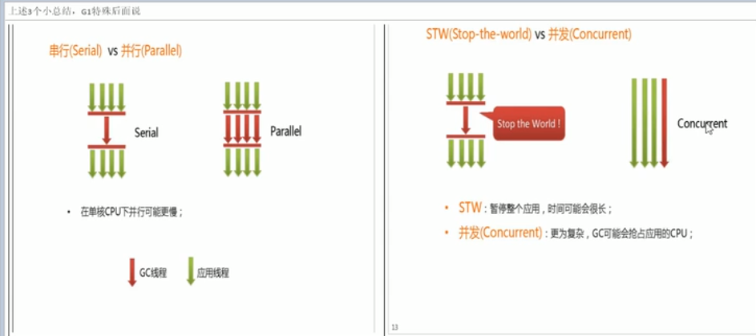

# 垃圾回收器

垃圾回收算法是内存回收的方法论，垃圾回收器是垃圾回收算法的具体实现

垃圾收集器也是分代的:年轻代和老年代使用的垃圾收集器是不一样的

# 7种具体的垃圾收集器

    新生代可以使用哪些?老年代使用哪些?这个非常重要!!

- Serial收集器(新生代)
- ParNew收集器(新生代)
- Parallel Scavenge收集器(新生代)
- Serial Old收集器(老年代)
- Parallel Old收集器(老年代)
- CMS收集器(老年代)
- G1收集器(新生代和老年代)

---
    单线程: 单线程指的是垃圾收集器只使用一个线程
    多线程: 多线程使用多个线程进行垃圾回收
---

# CMS收集器

    由于整个过程中"耗时最长的并发标记和并发清除过程中"，收集器线程都可以与用户线程一起工作，不需要进行停顿
    
    CMS缺点: 吞吐量低：低停顿时间是以牺牲吞吐量为代价的，导致 CPU 利用率不够高,对CPU资源敏感

    现在互联网公司老年代主流的就是采用CMS,G1相对比较新的技术还没有使用.

# G1收集器（Garbage-First）
    
    G1垃圾收集器经常问.
    
    java9的默认就是G1
   
    G1 可以直接对新生代和老年代一起回收

    G1与前面的CMS收集器相比有两个显著的改进
        1. 不会产生碎片: 与CMS的“标记清除”算法不同，G1从整体来看是基于“标记整理”算法实现的收集器；
        从局部上来看是基于“复制”算法实现的。不会产生空间碎片.
        2. 可预测的停顿：能让使用者明确指定在一个长度为 M 毫秒的时间片段内，消耗在 GC 上的时间不得超过 N 毫秒。

    G1收集器可以实现在基本不牺牲吞吐量的前提下完成低停顿的内存回收.

这是由于它能够极力地避免全区域的垃圾收集，之前的收集器进行收集的范围都是整个新生代或老年代，而G1将整个Java堆（包括新生代、老年代）划分为多个大小固定的独立区域（Region），每个Region来进行独立的垃圾回收.

G1收集器在后台维护了一个优先列表，每次根据允许的收集时间，优先选择回收价值最大的Region(这也就是它的名字Garbage-First的由来)。这种使用Region划分内存空间以及有优先级的区域回收方式，保证了G1收集器在有限时间内可以尽可能高的收集效率