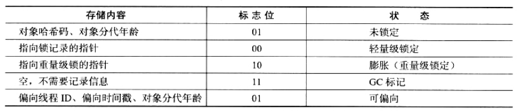

## 对象的内存布局

HotSpot(HotSpot: 热点)虚拟机中，对象在内存中存储的布局可以分为三块区域：

- 对象头（Header）
- 实例数据（Instance Data）
- 对齐填充（Padding）

### 1. 对象头

HotSpot虚拟机的对象头包括两部分信息，`第一部分`用于存储对象自身的运行时数据，如哈希码（HashCode）、GC分代年龄、锁状态标志、线程持有的锁、偏向线程ID、偏向时间戳等等，这部分数据的长度在32位和64位的虚拟机中分别为32个和64个Bits，官方 称它为“Mark Word”.

`对象头的另外一部分是类型指针`，即是对象指向它的类元数据的指针，虚拟机通过这个指针来确定这个对象是哪个类的实例。

另外，如果对象是一个Java数组，那在对象头中还必 须有一块用于记录数组长度的数据，因为虚拟机可以通过普通Java对象的元数据信息确定Java对象的大小，但是从数组对象的元数据中无法确定数组的大小。

### 2. 实例数据（Instance Data）

接下来实例数据部分是对象真正存储的有效信息，也既是我们在程序代码里面所定义的各种类型的字段内容，无论是从父类继承下来的，还是在子类中定义的都需要记录下来。这部分的存储顺序会受到虚拟机分配策略参数（FieldsAllocationStyle）和字段在Java源码中定义顺序的影响。 HotSpot虚拟机默认的分配策略为longs/doubles、ints、shorts/chars、bytes/booleans、 oops（Ordinary Object Pointers），从分配策略中可以看出，相同宽度的字段总是被分配到一起。在满足这个前提条件的情况下，在父类中定义的变量会出现在子类之前。如果 CompactFields参数值为true（默认为true），那子类之中较窄的变量也可能会插入到父类变量的空隙之中。

### 对齐填充

第三部分对齐填充并不是必然存在的，也没有特别的含义，它仅仅起着占位符的作用。由于HotSpot VM的自动内存管理系统要求对象起始地址必须是8字节的整数倍，换句话说就是对象的大小必须是8字节的整数倍。对象头部分正好似8字节的倍数（1倍或者2 倍），因此当对象实例数据部分没有对齐的话，就需要通过对齐填充来补全。 