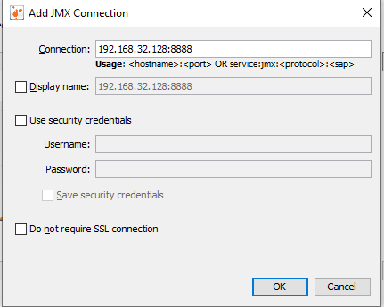
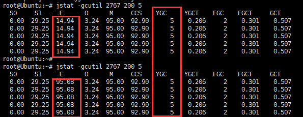

# 手动分配内存的代码

```java
@RestController
@RequestMapping("/allocate")
public class MemAllocationController {

    private static final int _1M = 1024 * 1024;

    private AtomicInteger count = new AtomicInteger();

    @GetMapping(value = "/mem")
    public String allocationMem(@RequestParam(value = "num") int num,
                                @RequestParam("size") int size) {
        for (int i = 0; i < num; i++) {
            // 想一个问题，代码中的 byteArray 对象在方法执行完之后会不会被立即回收呢？
            // 答: 并不是方法执行完毕就回收 byteArray 对象,对象都需要垃圾回收器发生 GC 时才能回收；
            // 不管这个对象是局部变量还是全局变量。执行完方法后,不一定马上就回收,只是处于可以回收的状态
            byte[] byteArray = new byte[size * _1M];
            System.out.println("第 " + count.incrementAndGet() + " 次分配内存,大小为: " + size + "M");
        }
        return "allocate success";
    }
}
```

```shell script
# 用以下的启动参数将应用启动起来,这样我就可以通过jvisiualvm 远程连接 JMX 端口 到应用观察内存、GC 情况了
java -Djava.rmi.server.hostname=192.168.32.128 \
-Djava.security.policy=jstatd.all.policy \
-Dcom.sun.management.jmxremote.authenticate=false \
-Dcom.sun.management.jmxremote.ssl=false \
-Dcom.sun.management.jmxremote.port=8888 \
-Xms1g -Xmx1g  -jar spring-boot-swagger-core-2.0.0.jar
```



    堆内存我们总共分配了1G,young区占1/3 (341M),old区占2/3 (683M)
    young区中,Eden区占8/10 (273M),S0占1/10 (34M),S1占1/10
    
    第一次: http://192.168.32.128:9090/allocate/mem?num=1&size=150
    应用启动之后,spring默认占了Eden区的一部分,这里分配100M,优先在新生代中 Eden 区分配对象,
    但有个前提就是对象不能太大,在对象不能太大的前提下,如果Eden去内存不足则会触发MinorGC,
    
    java对象朝生夕死,所以minor gc比较频繁,效率也比较高,minor gc会使用复制算法将存活的对象拷贝到
    另一个未使用的S区,如果S区的内存不足,会使用分配担保策略,将对象移动到old区.
    
    通过jps -l来查看pid
    

    
    第二次: http://192.168.32.128:9090/allocate/mem?num=1&size=300
    再次分配300M,因为对象太大,所以直接会分配到old区.(大对象则是直接分配到老年代中)
    
    第三次: http://192.168.32.128:9090/allocate/mem?num=1&size=350
    这时,old区也不够用了,会触发full gc,也就是发生在老年代的gc,会STW.效率比minor gc也慢,应该尽量避免.

# 参考

- [手动分配jvm内存,加深jvm内存分配的理解](https://crossoverjie.top/2018/12/12/java-senior/java-memary-allocation/)    