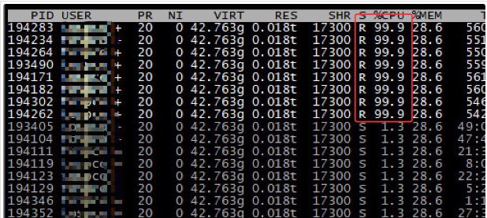
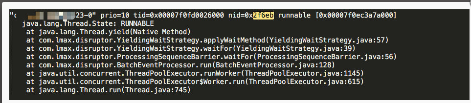
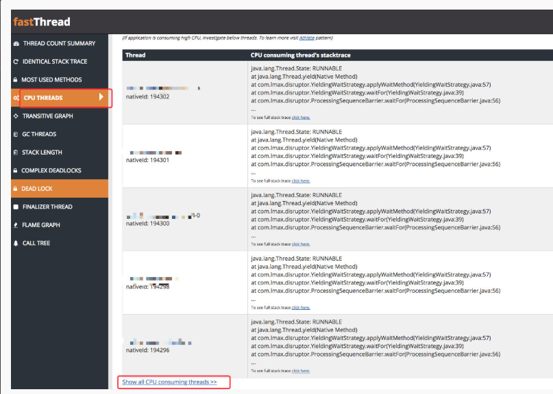

# 服务器cpu使用率非常高怎么解决?

    第一步: 首先通过top看看是不是java应用的cpu的使用率比较高.

    第二步: 如果是,可以通过java应用的进程pid,Java进程的哪些线程cpu使用率,通过top -Hp pid命令,
    将这个进程的线程显示出来。输入大写的 P 可以将线程按照 CPU 使用比例排序

    第三步: 使用jstack pid > pid.log 将线程快照保存到本地.

    在上面 100%cpu使用率的线程中随机选了一个pid=194283转换为 16 进制（2f6eb）,然后在线程快照中查询
    因为线程快照中线程 ID 都是16进制存放

    第四步: 为了更加直观的查看线程的状态信息，将快照信息上传到专门分析的平台上。

[专门分析线程快照的网站](http://fastthread.io/)

    图片的最下面有一个"Show all cpu consuming threads"可以查看所有消耗 CPU 的线程

# 本地模拟

    生产上遇到的问题,可以本地写相对应的代码来模拟线上遇到的问题.
