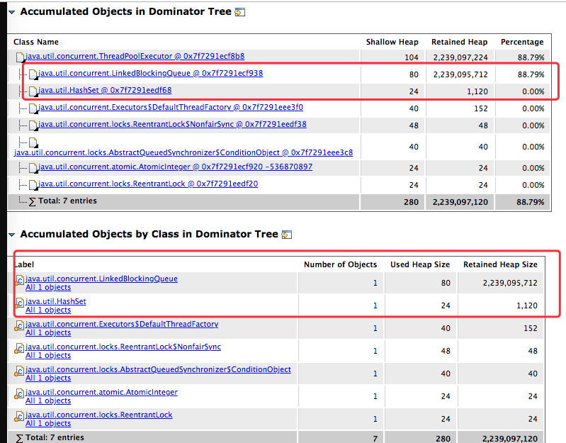

# 生产上遇到问题怎么办?

立马让运维保留现场,保留线程意思就是保留"线程快照"和"内存快照",同时重启应用.

# 内存分析(内存快照分析)

    内存快照是通过jmap -heap pid得到的.利用MAT分析了内存快照

    发现有两个比较大的对象，一个是线程池的任务队列: LinkedBlockingQueue
    还有一个是HashSet

# 线程分析(线程快照分析)

    线程快照是通过jstack pid得到

可以这里利用[这个网站](https://fastthread.io/)进行线程快照的.
