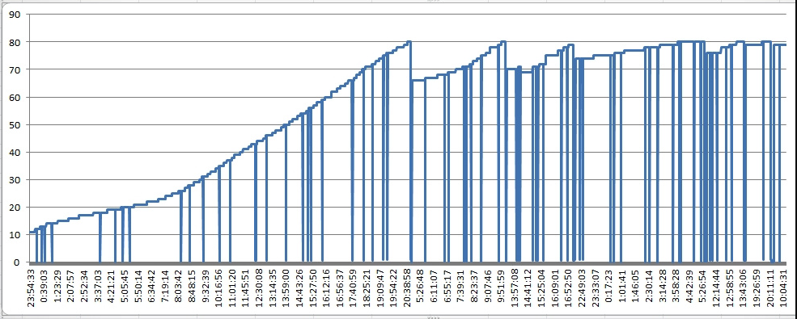
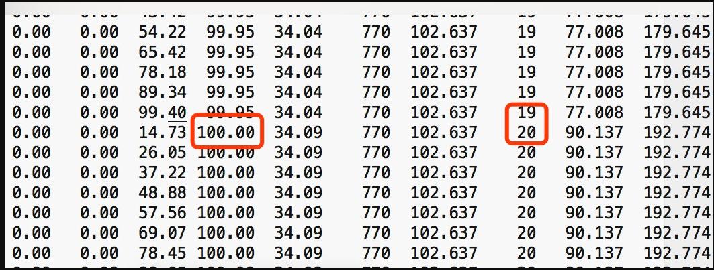
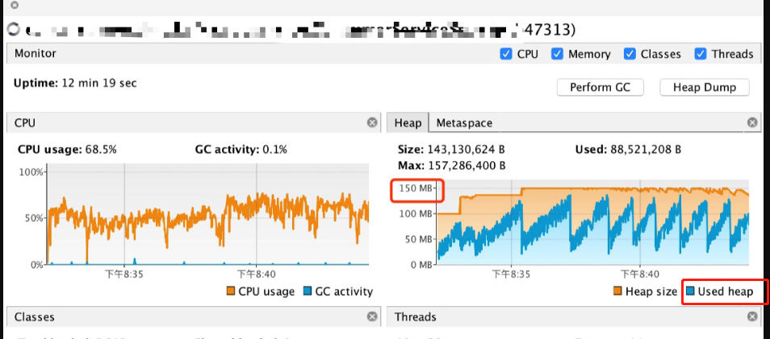
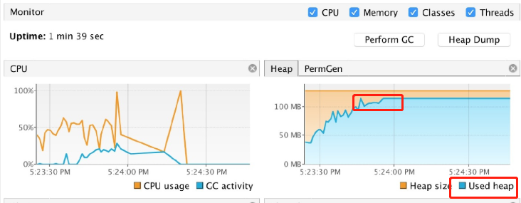
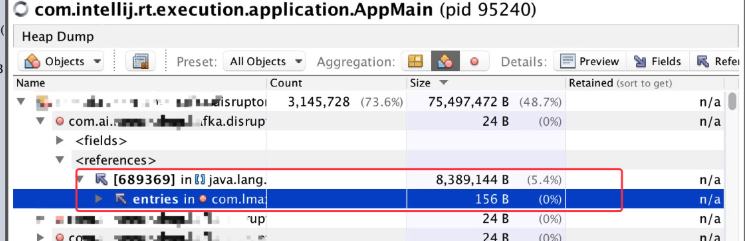
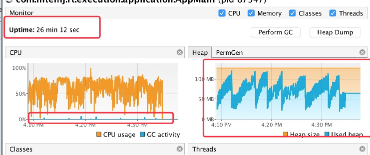

    第一步: 根据收集到的堆内存判断哪里出现问题
    
    发现老年代的内存使用就算是发生 GC 也一直居高不下，而且随着时间推移也越来越高。
    

    
    结合 jstat 的日志发现就算是发生了 FGC 老年代也已经回收不了，内存已经到顶

    

    再看看FGC的次数,如果达到了上百次，而且时间也高的可怕的话,这说明应用的内存使用肯定是有问题的，
    有许多赖皮对象始终回收不掉

    第二步: 看看哪里的问题
    
    由于生产上的内存 dump 文件非常大，达到了几十G。也是由于我们的内存设置太大有关,所以导致想使用 MAT分析需要花费大量时间。
    因此可以在本地复现，这样就要好定位的多。为了尽快的复现问题，我将本地应用最大堆内存设置为 150M。
    同时当应用启动之后利用 VisualVM 连上应用实时监控内存、GC 的使用情况。
    
    结果跑了 10 几分钟内存使用并没有什么问题。根据图中可以看出，每产生一次 GC 内存都能有效的回收，所以这样并没有复现问题

        

    第三步： 解决
    
    从目前的表现来看就是内存中有许多对象一直存在强引用关系导致得不到回收。于是便想看看到底是什么对象占用了这么多的内存，
    利用 VisualVM 的 HeapDump 功能可以立即 dump 出当前应用的内存情况。

    第四步： 最终结果
    
    每当一次 GC 都能回收大部分内存，最终呈现锯齿状，这样说明系统内存回收是正常的

    