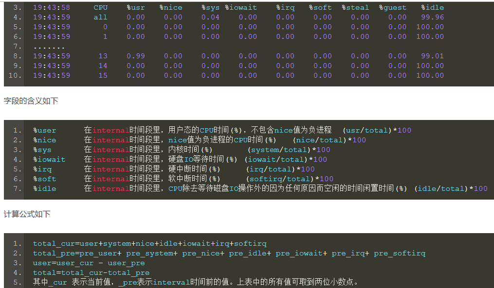
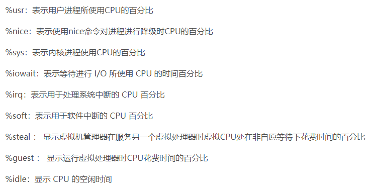
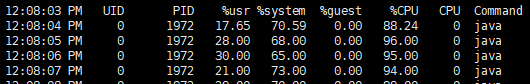

# 查看内存占用的命令

- top
- htop (需要安装下,这个对人可读性好,而且是彩色显示.yum install htop)

# vmstat

```shell script
# 通过vmstat命令查看当前操作系统每秒的上下文切换次数,其中cs那一列表示的就是上下文切换次数.cs是context switch的简写
# us代表用戶,sy代表system,id表示cpu空闲率,这个值越高越好,说明cpu越空闲
vmstat -n 2 3
# vmstat -n 2 3 每2秒采样一次,共计采样3次. 主要用于查看cpu

procs -----------memory---------- ---swap-- -----io---- -system-- ------cpu-----
 r  b   swpd   free   buff  cache   si   so    bi    bo   in   cs us sy id wa st
 4  0      0 1664580  16316 259696    0    0    85     2  981 3618  3 16 78  2  0
 2  0      0 1664556  16316 259696    0    0     0     0 9570 49627 11 74 15  0  0
 3  0      0 1664556  16324 259688    0    0     0    18 10697 31585 14 79  7  0  0
```

# mpstat

```shell script
# mpstat说明
# mpstat是Multiprocessor Statistics的缩写，是实时系统监控工具。其报告与CPU的一些统计信息，这些信息存放在/proc/stat文件中。
# 在多CPUs系统里，其不但能查看所有CPU的平均状况信息，而且能够查看特定CPU的信息。
# mpstat最大的特点是：可以查看多核心cpu中每个计算核心的统计数据
# 而类似工具vmstat只能查看系统整体cpu情况。

# 安装
# 如果你使用的是 CentOS， RedHat or Fedora，运行下列命令来安装mpstat
yum install sysstat
# 如果你使用的是 Debian， Ubuntu or 它的衍生版， 运行下列命令来安装mpstat
apt-get install sysstat

# 语法
# mpstat [-P {|ALL}] [internal [count]]
# -P {|ALL} 表示监控哪个CPU， cpu在[0,cpu个数-1]中取值, all表示监控所欲的cpu
# internal 相邻的两次采样的间隔时间、
# count 采样的次数

# 查看多核CPU核心的当前运行状况信息， 每2秒更新一次
mpstat -P ALL 2
# 第一行all代表全部的cpu信息
# 如果idle低于6成了,压力就来了
```





# pidstat

```shell script
ps -ef | grep java

# 查看进程的cpu使用情况
# 对于用户(u),每秒钟(1)采样一次,打印出pid详细情况
pidstat -u 1 -p pid
# 可以看到,针对当前这个pid的进程,用户和系统分别占用多少cpu
```



```shell script
pidstat -p pid -r 采样间隔秒数
```

# iostat

    基本上系统慢,大面上一个是cpu导致,另外一个是磁盘io导致.
    例如: mysql大表存储查询的时候,大片的数据在磁盘上io,这个时候如果长时间的io慢,将会导致系统出现很大的问题.

```shell script
# 查看进程的磁盘io(每2秒采集一次)
pidstat -d 2 -p pid

iostat -xdk 2 3
```

# ifstat

```shell script
ifstat 1
```