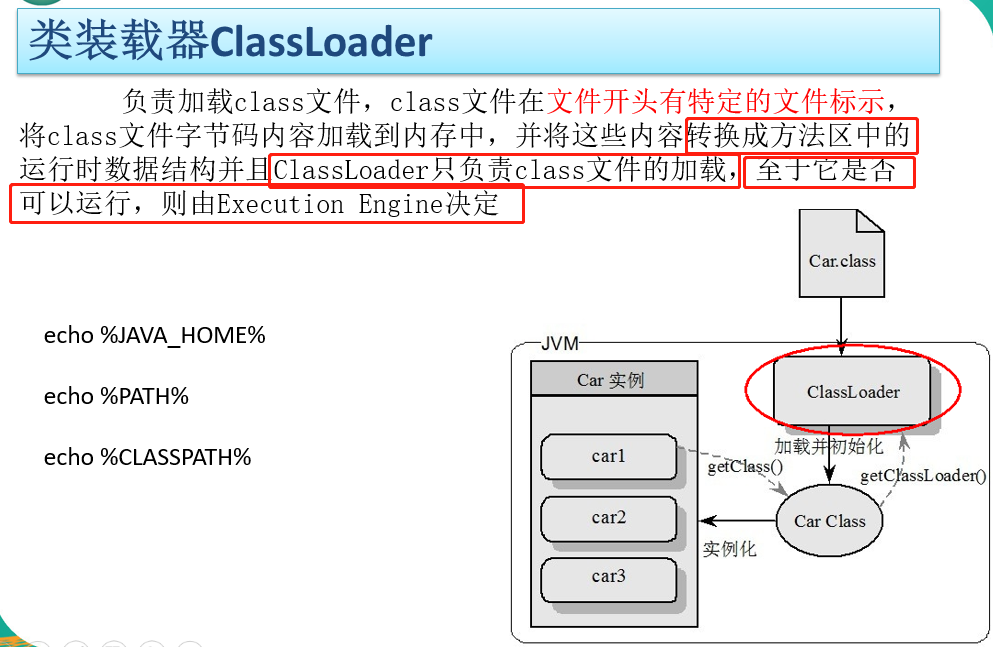
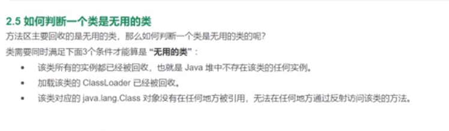

# 类加载器



JVM把.class文件加载到内存，并对数据进行校验、转换解析和初始化，这就是JVM的类加载机制。

类是在运行期间第一次使用时是动态加载的，而不是一次性加载所有类。因为如果一次性加载，那么会占用很多的内存。

# 类的生命周期

一个类从被加载到内存到卸载出内存，整个生命周期包括7 个阶段：

-  **加载（Loading）** 
-  **验证（Verification）** 
-  **准备（Preparation）** 
-  **解析（Resolution）** 
-  **初始化（Initialization）** 
- 使用（Using）
- 卸载（Unloading）

加载、验证、准备、初始化和卸载，这五个阶段的顺序是确定的，而解析不一定。某些情况下，解析可能在初始化之后再开始，这就是java动态绑定

## 必须对类立即进行初始化的5种情况

java虚拟机规范中严格规定了有且只有5种情况必须对类立即进行初始化：

* 遇到new、getstatic、putstatic或invokestatic这四个指令时，必须进行初始化。

    生成这几个指令的场景有：

    - 使用new实例化一个对象时；
    - 读取或者设置一个类的静态字段时；
    - 调用一个类的静态方法时。
* 使用reflect包的方法对类进行反射时，也触发初始化。
* 初始化一个类的时候，若父类还未初始化，则首先进行父类的初始化。
* 包含main方法的那个类，虚拟机启动时会首先初始化这个主类。
* 当使用jdk1.7的动态语言支持时，

##  接口的加载和类加载的过程的差异

1. 接口和类一样都有初始化过程，虽然`接口里面不能有static{}语句块`，但是编译器仍然会为接口生成`<clinit>()类构造器`，用于初始化接口中所定义的成员变量。
2. 当一个类初始化时，必须要求父类全部都已经初始化，但是接口在初始化时并不要求其父接口也全部初始化，只有在使用到父接口时才会初始化。

## 1. 加载

加载是类加载生命周期的一个阶段，注意不要混淆。

加载过程完成以下三件事：

- 通过类的完全限定名称获取该类的二进制字节流
- 将该字节流表示的静态存储结构转换为方法区的运行时存储结构。
- 在内存中生成一个代表该类的java.lang.Class对象，作为方法区中该类各种数据的访问入口。

其中二进制字节流可以从以下方式中获取：

1. 从 ZIP 包读取，成为 JAR、EAR、WAR 格式的基础。
2.  运行时计算生成，例如动态代理技术，在 java.lang.reflect.Proxy 使用 ProxyGenerator.generateProxyClass 的代理类的二进制字节流。

## 2. 验证

确保 Class 文件的字节流中包含的信息符合当前虚拟机的要求，并且不会危害虚拟机自身的安全。

### 3. 准备

准备阶段是给类变量分配内存并设置类变量初始值的阶段，这些变量所使用的内存都将在方法区中进行分配。

此时进行内存分配的变量仅包括类变量，而不包含实例变量，实例变量将在对象实例化时随着对象一起分配在java堆中。

这里所说的初始值是指数据类型的零值，比如：

public static int v = 123;

那v的值在准备阶段是0，而不是123。

<table>
<thead><tr>
<th>数据类型</th>
<th>零值</th>
<th>数据类型</th>
<th>零值</th>
</tr></thead>
<tbody>
<tr>
<td>int</td>
<td>0</td>
<td>boolean</td>
<td>false</td>
</tr>
<tr>
<td>long</td>
<td>0L</td>
<td>float</td>
<td>0.0f</td>
</tr>
<tr>
<td>short</td>
<td>(short)0</td>
<td>double</td>
<td>0.0d</td>
</tr>
<tr>
<td>char</td>
<td>'u0000'</td>
<td>reference</td>
<td>null</td>
</tr>
<tr>
<td>byte</td>
<td>(byte)0</td>
<td> </td>
<td> </td>
</tr>
</tbody>
</table>

如果一个变量是常量，或者final类型的，那么在准备阶段就被初始化为常量值，如：

public static final int v = 123;

此时v的值在准备阶段是123。

## 4. 解析

将常量池的符号引用替换为直接引用的过程。

其中解析过程在某些情况下可以在初始化阶段之后再开始，这是为了支持 Java 的动态绑定。

## 5. 初始化

初始化阶段才真正开始执行类中定义的 Java 程序代码。初始化过程是一个执行`类构造器<clinit>()方法的过程`。在准备阶段，类变量已经赋过一次系统要求的初始值，而在初始化阶段，根据程序员通过程序制定的主观计划去初始化类变量和其它资源。

特别注意的是，静态语句块只能访问到定义在它之前的类变量，定义在它之后的类变量只能赋值，不能访问。例如以下代码：

```java
public class Test {
    static {
        i = 0;                // 给变量赋值可以正常编译通过
        System.out.print(i);  // 这句编译器会提示“非法向前引用”
    }
    static int i = 1;
}
```

<clinit>()方法和类的构造函数不同，它不需要显示调用父类构造器，虚拟机会保证在子类的<clinit>()方法执行之前，父类的<clinit>()方法已经执行完毕。因此虚拟机第一个被执行<clinit>()方法的类肯定是java.lang.Object。

>由于父类的 &lt;clinit>() 方法先执行，也就意味着父类中定义的静态语句块的执行要优先于子类。例如以下代码：

```java
static class Parent {
    public static int A = 1;
    static {
        A = 2;
    }
}

static class Sub extends Parent {
    public static int B = A;
}

public static void main(String[] args) {
     System.out.println(Sub.B);  // 2
}
```

虚拟机会保证一个类的 &lt;clinit>() 方法在多线程环境下被正确的加锁和同步，如果多个线程同时初始化一个类，只会有一个线程执行这个类的 &lt;clinit>() 方法，其它线程都会阻塞等待，直到活动线程执行 &lt;clinit>() 方法完毕。

# 如何判断一个类是无用的类

