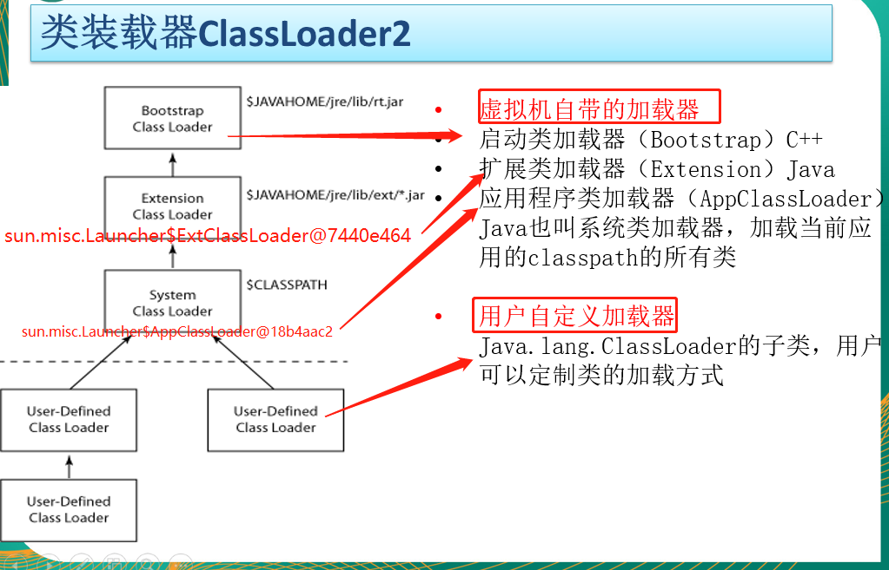
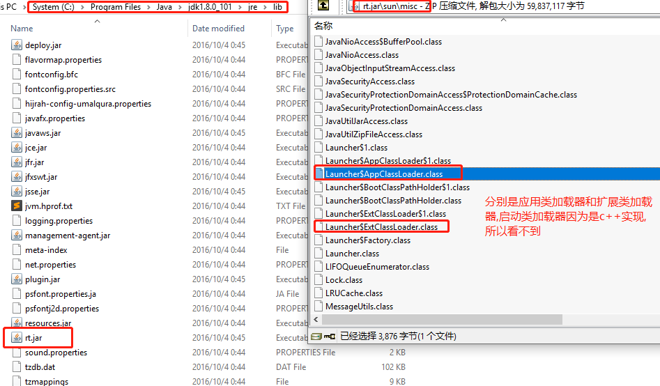
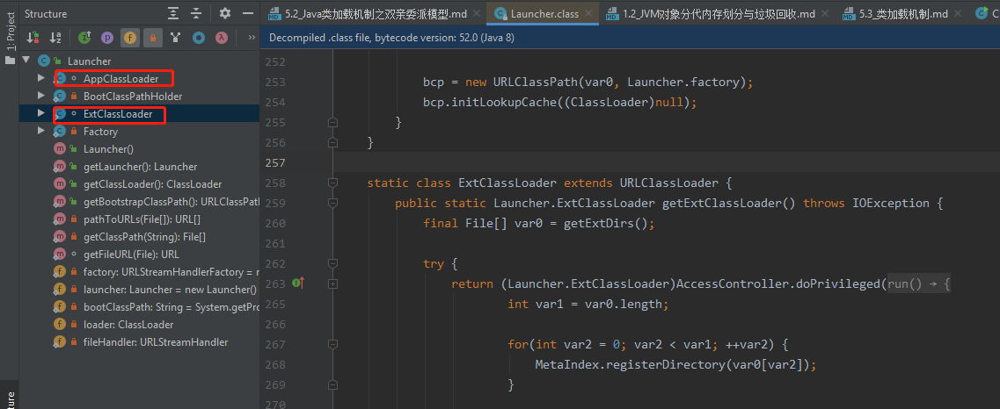
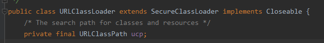
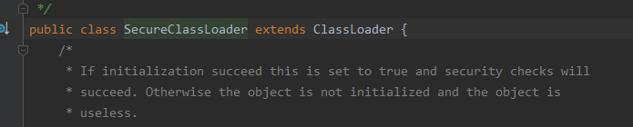
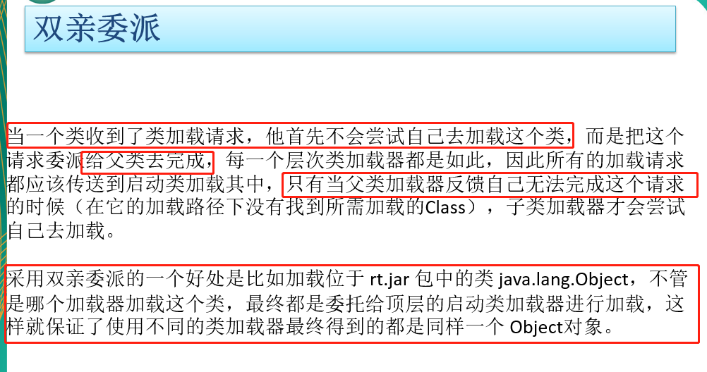

# 双亲委派机制的工作过程

一个类加载器首先将`类加载请求`转发到`父类加载器`，只有当`父类加载器`无法完成时才尝试自己加载。

# 双亲委派机制

    我爸是李刚,有事找我爹.

    双亲委派机制是Java加载类的机制.
    
    通过双亲委派模型,可以避免类的重复加载(也能避免类的混淆).

为了保证你写的源代码不污染java出厂自带的源代码,所以使用双亲委派机制,你的代码不能污染java的源代码,保证大家加载的java.lang.String都是同一个,都是java出厂的java.lang.String.先找到先使用,后面的一概不计较.

>.class文件是由类加载器加载的

- Bootstrap ClassLoader(启动类加载器,C++ 实现): 负责加载%JAVA_HOME%/jre/lib/rt.jar或-Xbootclasspath中参数指定的路径中的，并且是虚拟机识别的(仅按照文件名识别，如rt.jar，名字不符合的类库即使放在 lib 目录中也不会被加载)类库加载到JVM中，启动类加载器无法被 Java 程序直接引用
- Extension ClassLoader（扩展类加载器，使用Java实现，继承自抽象类java.lang.ClassLoader): 实现类为sun.misc.Launcher$ExtClassLoader。负责加载%JAVA_HOME%/jre/lib/ext/*.jar，或者被java.ext.dir系统变量所指定路径中的所有类库加载到内存中，开发者可以直接使用扩展类加载器
- Application ClassLoader（应用程序加载器): 实现类为sun.misc.Launcher$AppClassLoader，由于这个类加载器是 ClassLoader 中的 getSystemClassLoader() 方法的返回值。负责加载用户类路径下指定的类

应用程序是由三种类加载器互相配合从而实现类加载，除此之外还可以加入自己定义的类加载器。

该模型要求除了顶层的Bootstrap ClassLoader(启动类加载器)之外，其它的类加载器都要有自己的父类加载器。
