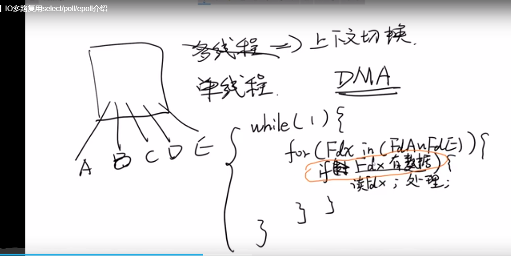
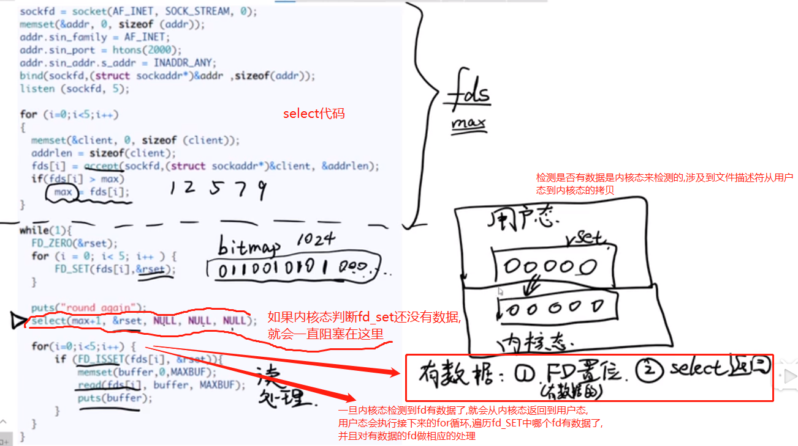
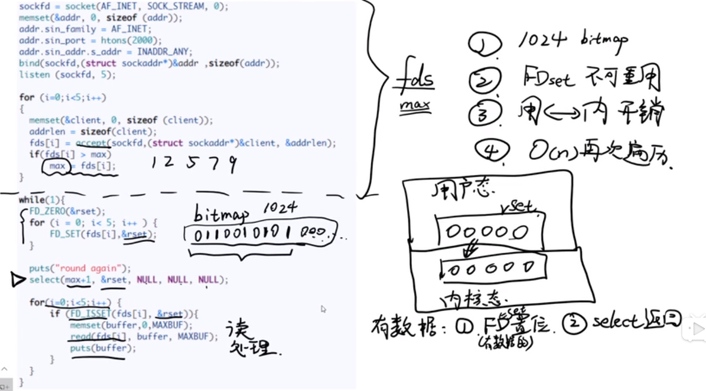
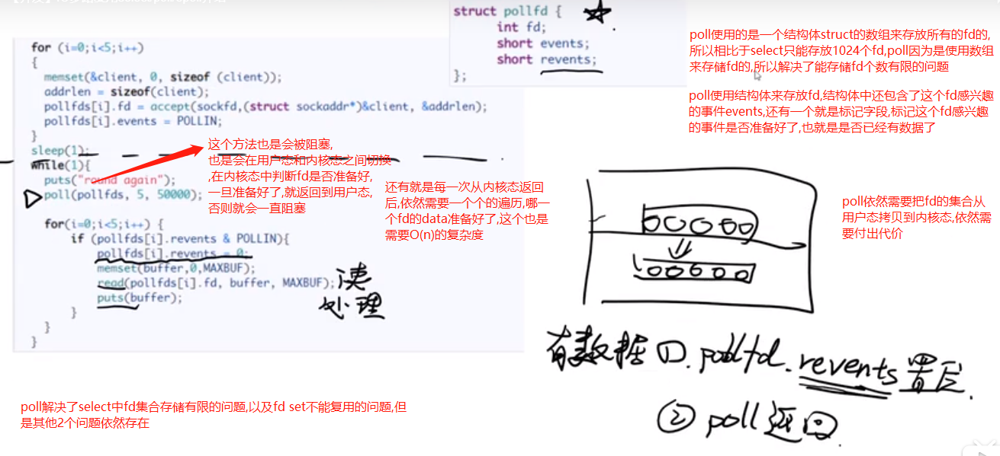
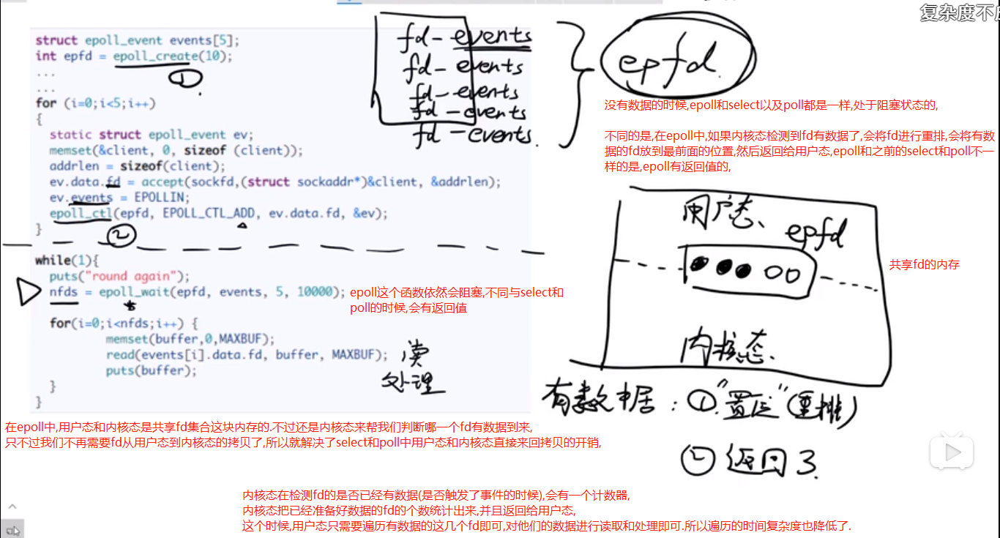

# IO多路复用
  
    select/poll/epoll 都是 I/O 多路复用的具体实现，select 出现的最早，之后是 poll，再是 epoll。
    
    redis/nginx都是用的epoll,java中的NIO在linux下,也是使用epoll来实现的.

    IO多路复用出现的场景是我们要设计一个高性能的web服务器来处理大量的web请求.

# 处理量web请求的第一个思路

    要处理多个client的连接,第一种首先想到的思路是使用多线程,每个线程处理一个用户请求,
    但是这个方案的缺点很明显,线程的上下文切换要花费的代价比较高,
    当client连接非常多的时候(几十万/上百万/甚至上千万),要代价的代价非常高.

>所以,这种思路肯定是不行的.所以我们还是要转向单线程的思路上来.

    select/poll/epoll: 都是通过单进程-单线程来处理大量web请求.

# 如何使用单线程处理客户端大量的连接呢?

    在linux中,一切都是文件,每个网络连接在内核中都是以文件描述符的形式,简称fd.fd其实是一个数子,这个数子就代表文件描述符的编号

    用单线程去写一个网络服务器可以这么写

---
    while(true) {
        // 比如现在有 A-E 5个连接,表现为文件描述符fd,所以单线程就遍历这个fd的集合
        for(Fdx in (FdA~FdE)){
            if (Fdx 有数据) {// 在select/poll/epoll中都是交给内核态来判断的fd是否有数据的.
                // 如果Fdx有数据,就读取Fdx中的数据,并且进行处理
            }
            // 如果没有数据,就不做任何的操作,就继续读下一个文件操作符.直到遍历完成.
        }
        // 当遍历一遍之后,while(true)再次触发,这个for循环就又遍历一遍.这个过程会一直循环.
    }
---

    这种方式好像简单粗暴的解决了单线程处理多个连接的问题.但是还是做的不够好

# select

    程序是运行在用户态空间的,select在判断fd是否有数据的时候,会把用户态的fd集合拷贝到内核态,内核态来判断每一个fd是否有数据.
    也就是说用户态在判断的时候,是有一个到内核态的切换.

    select直接将fd的集合全部拷贝到内核态来判断.是内核来帮我们判断哪一个有数据.
    
    select是一个阻塞函数,如果没有数据,会阻塞.当有数据来的时候,select会从内核态返回到用户态,
    内核态会把有数据的fd标注出来,插一个旗子,告诉用户态,这个fd有数据了,select返回到用户态后,
    用户态去遍历fd集合,看看哪一个fd被标注为有数据了,也就是哪一个fd被置位了.被标注的fd,我们会将它的数据读出来,然后进行响应的处理.

    简言之select干了这些事情:  将文件描述符fd收集过来, 交给内核,让内核帮我们判断哪一个fd有数据,
    当一个或者多个fd有数据的时候,select函数会返回,有数据的fd会被内核置位,这个时候程序返回,返回之后,
    用户态遍历这个fd的集合,判断一下到底哪一个fd被set了(被置位了).即被set的fd是有数据的.
    这个时候读取fd上的数据,并且进行相应的处理.
    
    提高效率的最主要的一点是,它将这个fd的集合扔到了内核态,让内核来帮我们判断哪一个fd上有数据到来.

>但是select仍然有几个缺点: 

    第一: fd set的默认大小是1024,虽然可以调整它的大小,它仍然是有上限的.
    第二个缺点是: 把fd set从用户态拷贝到内核态,这个拷贝的过程仍有一个较大的开销.
    第三个很重要的缺点是: 从内核态返回到用户态的时候,并不知道fd集合中具体是哪一个fd有数据了,需要一个个的遍历,
    这样是比较耗时间和性能的. 需要O(n)的复杂度的.

>为了解决select的缺点,后来就出现了poll

# poll

    select默认只能监听 1024 个描述符,而 poll的fd是使用结构体来存储,fd的集合是使用数组存储，没有fd数量的限制

# epoll

    在epoll中,用户态和内核态是共享fd集合这块内存的.还是内核态来帮我们判断哪一个fd有数据到来,
    只不过我们不再需要fd从用户态到内核态的拷贝了,所以就解决了select和poll中用户态和内核态直接来回拷贝的开销,

    没有数据的时候,epoll和select以及poll都是一样,处于阻塞状态的,
    
    epoll中,如果fd有数据了,会将fd进行重排,会将有数据的fd放到最前面的位置,然后返回给用户态,
    epoll和之前的select和poll不一样,是有返回值的,内核态在检测fd是否触发了事件的时候,会有一个计数器,
    最后把已经准备好数据的fd的个数返回给用户态,这个时候,用户态只需要遍历有数据的这几个fd即可,
    对他们的数据进行读取和处理即可.所以时间复杂度降低了.
