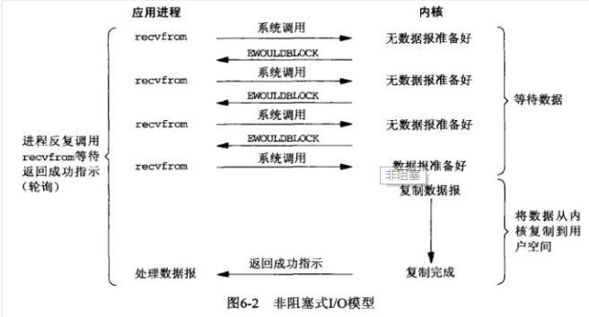
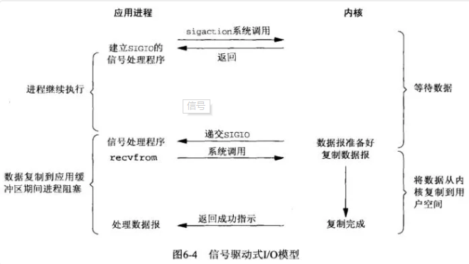
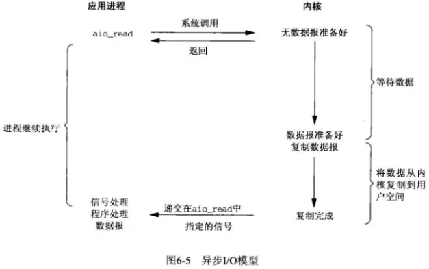

# Java中的IO模型和操作系统的IO模型

    Java中的IO模型和操作系统层面的IO模型是两个不同层面的IO模型.

    可以把Java中的BIO、NIO和AIO理解为是Java语言对操作系统的各种IO模型的封装

>比如在Linux 2.6以后，Java中NIO和AIO都是通过epoll来实现的.而在Windows上，AIO是通过IOCP来实现的

# 到底什么是IO

    在"操作系统层面"到底什么样的过程可以叫做是一次IO呢？

    拿读取磁盘文件为例，我们要读取的文件是存储在磁盘上的，我们的目的是把它读取到内存中。
    文件会先被读取到内核空间的缓存区，然后从内核空间的缓存区拷贝到用户空间。

    一个输入操作通常包括两个阶段：
        1. 等待数据准备好
        2. 从内核向用户空间复制数据

    对于一个Socket(套接字)上的输入操作，第一步通常涉及等待数据从网络中到达。当所等待数据到达时，
    它被复制到内核中的某个缓冲区。第二步就是把数据从内核缓冲区复制到用户空间缓冲区

# Linux操作系统中的5中I/O模型 

    阻塞式 I/O:blocking IO
    非阻塞式 I/O:non-blocking IO
    I/O 多路复用（select，poll，epoll）:IO multiplexing
    信号驱动式 I/O（SIGIO）:signal driven IO
    异步 I/O（POSIX的aio_系列函数）:asynchronous IO

# 阻塞IO模型

    阻塞I/O表现为用户进程或用户线程等待某个条件，如果条件不满足，则一直等下去。条件满足，则进行下一步操作。
 

    应用进程通过系统调用recvfrom 接收数据，但由于内核还未准备好数据报，应用进程被阻塞，
    直到数据从内核缓冲区复制到应用进程缓冲区中才返回，应用进程才能结束阻塞状态。

# 非阻塞IO模型

    应用进程执行系统调用之后，在数据还没有到达内核缓冲区之前，内核会返回一个错误码。
    应用进程可以继续执行，不会被阻塞,但是需要不断的执行系统调用来获知内核数据准备有没有准备好，这种方式称为轮询。
    如果某一次轮询发现数据已经准备好了，那就把数据拷贝到用户空间中。

    应用进程通过 recvfrom 调用不停的去和内核交互，直到内核准备好数据。
    如果没有准备好，内核会返回error，应用进程在得到error后，过一段时间再发送recvfrom请求。
    在两次发送请求的时间段，进程可以先做别的事情。也就是应用进程需要不时的关注内核数据是否准备好
    
    这样就延申出了我们可以信号驱动IO，也就是不用我们不断的检查，而是内核准备好后主动通知用户进程

    和阻塞IO比，进程在等待内核数据的时候，可以做些其他事情

# IO多路复用模型

    使用 select 或者 poll 系统调用等待多个注册好的IO的数据，并且可以等待多个套接字中的任何一个变为可读。
    如果所有被监听的IO需要的数据都没有准备好时，select调用进程会阻塞。
    当某一个套接字可读时,select调用就会返回，之后进程再使用 recvfrom 把数据从内核复制到进程中。

    它可以让单个进程具有处理多个 I/O 事件的能力。又被称为事件驱动 I/O。

    多个IO可以注册到同一个管道(Channel)上，这个管道会统一和内核进行交互。
    当管道中的某一个请求需要的数据准备好之后，进程再把对应的数据拷贝到用户空间中。

    如果一个 Web 服务器没有 I/O 复用，那么每一个 Socket 连接都需要创建一个线程去处理。
    如果同时有几万个连接，那么就需要创建相同数量的线程。
    相比于多进程和多线程技术，I/O 复用不需要进程线程创建和切换的开销，系统开销更小。

# 信号驱动IO模型

    应用进程在读取文件时通知内核，如果某个 socket 的某个事件发生时，请向我发一个信号。在收到信号后，信号对应的处理函数会进行后续处理。

    应用进程预先向内核注册一个信号处理函数，然后用户进程立即返回，并且不阻塞，应用进程可以继续执行,
    也就是说等待数据阶段应用进程是非阻塞的, 当内核数据准备就绪时会发送一个SIGIO信号给进程，
    应用进程收到之后,在信号处理程序中调用 recvfrom 将数据从内核复制到应用进程

>相比于非阻塞IO，再次提高了时间利用率，不用去不断的检查内核数据是否准备好了.

# 为什么以上四种都是同步的IO

    我们说阻塞IO模型、非阻塞IO模型、IO复用模型和信号驱动IO模型都是同步的IO模型。

    原因是因为: 将数据从内核缓冲区复制到应用进程缓冲区的阶段，应用进程会被阻塞，而异步 I/O：这个拷贝过程用户进程不会被阻塞

    信号驱动难道不是异步的么？ 信号驱动，内核是在数据准备好之后通知进程，然后进程再通过recvfrom操作进行数据拷贝。
    可以认为数据准备阶段是异步的，但是，数据拷贝操作是同步的。所以，整个IO过程也不能认为是异步的

>钓鱼的报警器一响，只能说明鱼儿已经咬钩了，但是还没有真正的钓上来。使用带有报警器的鱼竿钓鱼，往上拉鱼竿的过程是同步的，钓鱼等待的过程是异步的.

# 异步IO模型

    应用进程把IO请求传给内核后，完全由内核去操作文件拷贝。内核完成相关操作后，会发信号告诉应用进程本次IO已经完成。

    应用进程执行 aio_read 系统调用会立即返回，应用进程可以继续执行，不会被阻塞，
    内核会在所有操作完成之后向应用进程发送信号。这个才叫做整个过程都是异步。

>异步 I/O 与信号驱动 I/O 的区别在于，异步 I/O 的信号是通知应用进程 I/O 完成，而信号驱动 I/O 的信号是通知应用进程可以开始 I/O。

# 5种IO模型的对比

    非阻塞式 I/O 、信号驱动 I/O 和异步 I/O 在第一阶段不会阻塞

