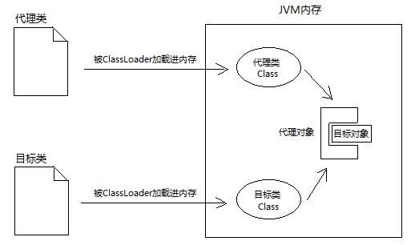
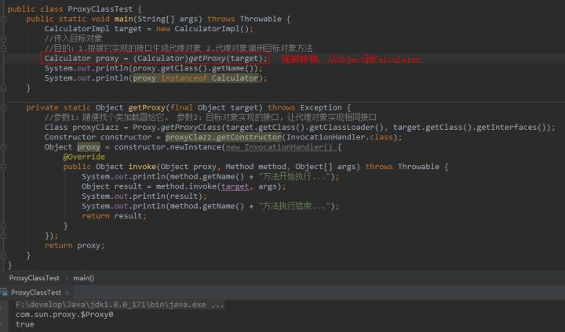
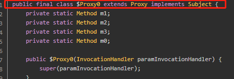

# 代理模式

    代理是一种设计模式，通过代理对象访问目标对象的相关方法。这样就可以在目标对象功能的基础上增加额外的功能操作.
    
    分为: 静态代理和动态代理

# 静态代理

    假设有一个需求：在项目所有类的方法前后打印日志。你如何在不修改已有代码的前提下(开闭原则,对扩展开放,对修改关闭)，完成这个需求？
    
    首先想到的是静态代理:

    示例: org.java.core.advanced.proxy.StaticProxy.StaticProxyTest

    静态代理的特点: 代理类Proxy的Java代码在编译阶段就确定了.代理类Proxy的字节码在编译阶段完成后就已经确定了.
    静态代理只能代理一个具体的类，如果要代理多个类的话需要定义不同的代理类

## 静态代理的缺陷

    程序员要手动为每一个目标类编写代理类。如果当前系统已经有成百上千个类，工作量太大了。

>静态代理可以在不修改目标对象的前提下，对目标对象进行功能的扩展和拦截.符合开闭原则。对扩展开放，对修改关闭.

# 动态代理

    动态代理是在JVM运行过程中,动态创建目标类的代理类，并实例化代理类。
    因为实际的代理类是在运行时创建的,所以称为动态代理.

    动态代理和反射的关系: 动态代理生成动态代理类,然后通过反射来创建代理类的实例.

## 动态代理的应用场景

    久负盛名的RPC框架，在客户端都会利用动态代理生成一个服务端接口的代理类来代理接口的调用执行。
    Spring中的AOP就是一个动态代理的典型应用.

## 通过接口的Class对象,获取代理类的Class对象

    要创建代理类的实例,最关键的就是得到代理类的Class字节码对象,能否不写代理类，而直接得到代理Class对象，然后根据反射创建代理实例?

---
    Class对象包含了一个类的所有信息，比如构造器、方法、字段等。如果我们不写代理类，这些信息从哪获取呢？
    苦思冥想，突然灵光一现：代理类和目标类理应实现同一接口

    JDK的java.util.reflect.Proxy类有个静态方法：getProxyClass(ClassLoader, interfaces)，
    只要你给它传入类加载器和一组接口，它就给你返回代理类的Class对象
    由它创建的代理类都是Proxy类的子类。

    所以，一旦我们明确接口，完全可以通过接口的Class对象，创建一个代理Class对象，通过代理Class即可创建代理对象。
    
    Proxy.getProxyClass()这个方法的本质就是：用接口的Class字节码 造 代理类的Class
---

    代理Class的构造器创建对象时，需要传入InvocationHandler。通过构造器传入一个引用，那么必然有个成员变量去接收,没错，
    代理对象的内部确实有个成员变量invocationHandler,每次调用代理对象的方法，代理对象的每个方法内部都会调用InvocationHandler.invoke()

    仔细看上图右侧的动态代理，我在invocationHandler的invoke()方法中并没有写目标对象。
    因为一开始invocationHandler的invoke()里确实没有目标对象，需要我们手动new。

## 请区分两个概念：代理Class对象和代理对象

    单从名字看，代理Class和Calculator的接口确实相去甚远，但是我们却能将代理对象赋值给接口类型
    代理对象的本质就是：和目标对象实现相同接口的实例。代理Class可以叫任何名字

# java动态代理的实现有2种方式

    要么通过继承父类，并改写父类的方法，在父类方法逻辑前后增加逻辑,实现代理
    要么实现同一接口，并利用组合的方式，持有目标对象的引用，然后在代理类的方法前后增加控制逻辑实现代理

    基于JDK的动态代理: 需要用到InvocationHandler接口和Proxy类
    
    基于CGLIB的动态代理: CGLIB是一个高性能的代码生成类库，被Spring广泛应用。其底层是通过ASM字节码框架生成动态代理类的字节码,特点是继承于被代理类,这就要求被代理类不能被 final 修饰.

>示例: org.java.core.advanced.proxy.DynamicProxy.CGLibDynamicProxyDemo

# JDK动态代理 VS CGLIB 对比

    字节码创建方式：JDK动态代理通过JVM实现代理类字节码的创建，cglib通过ASM创建字节码。
    JDK动态代理强制要求目标类必须实现了某一接口，否则无法进行代理。而CGLIB则要求目标类和目标方法不能是final的，因为CGLIB通过继承的方式实现代理。
    CGLib不能对声明为final的方法进行代理，因为是通过继承父类的方式实现，如果父类是final的，那么无法继承父类。
    

    JDK生成的代理类是Proxy的子类,JDK动态生成代理类，一定要被代理类实现了某个接口，否则就无法生成代理类，
    这也就是JDK动态代理的缺陷之一,被代理类可以实现多个接口.

## 性能对比

    性能的对比，不是一个简单的答案，要区分JDK版本来区分

    JDK1.6/1.7上的对比
    
    类的创建速度：JDK快于CGLIB。
    执行速度：JDK慢于CGLIB，大概慢2倍的关系。
    
    JDK1.8上的对比
    
    类的创建速度：JDK快于CGLIB。
    执行速度：JDK快于CGLIB，经过努力，JDK1.8作了性能上的优化，速度明显比1.7提升了很多。1.8上JDK全面优于CGLIB，是不是说以后都不要用CGLIB，这还得看具体的类情况和场景，如果没有实现接口，就用CGLIB，使用的场景不同。
