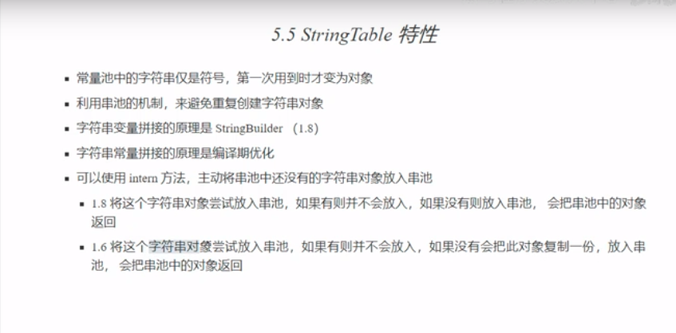

# StringTable(字符串常量池)

    StringTable: 就是我们一般说的字符串常量池,或者叫串池
    
    注意StringTable要和方法区的运行时常量池区分开,方法区的运行时常量池区在1.8的jdk中是不包含
    StringTable的,1.8中,StringTable是存放在堆中.

# StringTable特性

# StringTable的位置

    参见: JVM\jvm内存模型\1.02_线程共享区域-方法区.md
    
    在 Java7 之前，StringTable(字符串常量池)是放在永久代中
    而在 Java 7以及之后，StringTable(字符串常量池)被移到堆中

# StringTable的垃圾回收机制

    当StringTable空间不足时,StringTable中那些没有被引用的字符串常量就会被垃圾回收.这个和很多人想的不一样,
    很多人以为字符串是永久的了,不会被垃圾回收.事实证明它是可以被垃圾回收的.
    
    代码: org.java.core.advanced.jvm.StringTable.StringTableGCDemo

# StringTable的性能调优

    StringTable的结构是哈希表,哈希表的性能和大小是密切相关的,如果哈希表bucket的个数比较多,那么元素就会比较分散,
    碰到的几率就比较小,查找的速度就会比较快,反之,如果桶的个数比较少,哈希碰撞的几率就增高,链表的长度就比较长,从而
    查找的速度会降低
    
    StringTable的调优其实主要就是调整bucket的个数.
    调整: -XX:StringTableSize=桶个数
    考虑将字符串对象是否入池
    
>示例: org.java.core.advanced.jvm.StringTable.StringTableOptimization
    
    如果系统中字符串常量的个数非常多的话,建议可以把StringTable的桶的个数调大.这样可以让串池的效率有明显的提升.