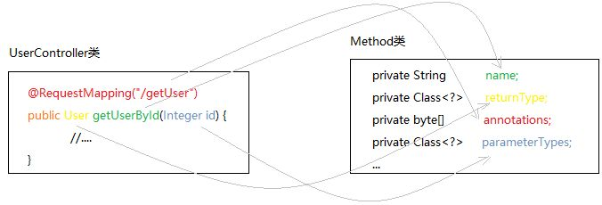
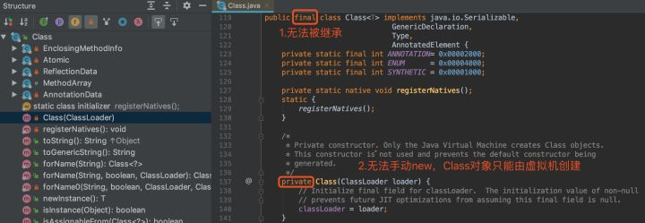
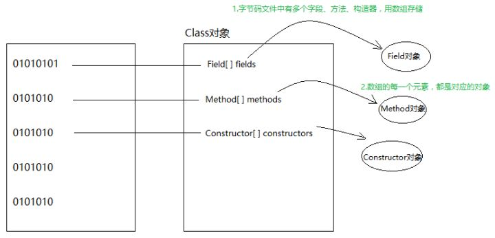
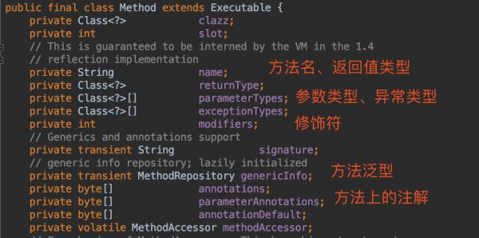
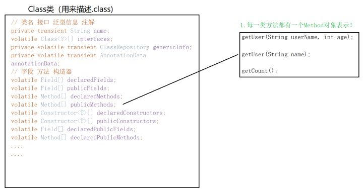

# 反射机制介绍

    这种在运行时动态获取的类的方法信息(方法名字/方法修饰符/方法参数信息/方法的返回值)
    以及字段的信息(字段的修饰符/字段名/字段类型),以及构造器的信息(构造器的名字/参数类型)
    这样的功能称为java语言的反射机制.
    
    如果不用反射,我们怎么能够打印出一个方法的名字呢?怎么打印出一个方法的参数类型呢?怎么打印出这个方法的访问修饰符呢?

# 反射的应用场景

    在我们平时的项目开发过程中，基本上很少会直接使用到反射机制，但这不能说明反射机制没有用，
    相反,框架中大量使用了反射,动态代理设计模式也采用了反射机制来创建代理对象
    
    举例：
    1. JDBC连接数据库时使用Class.forName()通过反射加载数据库的驱动程序
    2. Spring框架也用到很多反射机制，最经典的就是通过 XML 初始化Bean
    3. 使用反射机制，可以根据类的全路径名称,获得某个类的Class实例.

# JVM是如何构建一个实例的

>所谓的Class对象，是Class类的实例，而Class类是描述所有类的

.class文件是由类加载器加载的,".class"文件被类加载器加载到内存后，JVM根据.class文件创建Class对象。
这些Class对象是由java.lang.Class这个类构造的.然后通过Class对象创建出具体的对象.看看这个java.lang.class是如何描述一个类对象的:

>字段、方法、构造器对象:

>注解数据

>泛型信息

针对字段、方法、构造器，因为信息量太大了，JDK还单独写了三个类：Field、Method、Constructor。我们挑Method类看一下：

>也就是说，Class类虽然准备了很多字段用来表示一个.class文件的信息，比如类名、注解、实现的接口等，但对于字段、方法、构造器等，为了更详细地描述这些重要信息，还写了三个类，每个类里面都有很详细的对应。而Class类本身就维持这三个对象的引用（以对象数组形式维持引用！因为一个类可能有多个方法，所以Class要用Method[] methods保存）。

>原本UserController类中所有信息，都被“解构”后保存在Class类中。

## Class类的构造器

>Class类的构造器是私有的，我们无法手动new一个Class对象，只能由JVM创建。JVM在构造Class对象时，需要传入一个类加载器.

## Class.forName()方法

方法.jpg)

## newInstance()

.jpg)

newInstance()底层就是调用无参构造对象的newInstance()。如果没有空参构造对象，就无法使用clazz.newInstance()，必须要获取其他有参的构造对象然后调用构造对象的newInstance()。

很多人不知道clazz.newInstance()底层还是调用无参Contructor对象的newInstance()。所以，要想调用clazz.newInstance()，必须保证编写类的时候有个无参构造。

# 日常开发中反射用来干什么

1. 创建实例
2. 反射调用方法

# Class、Field、Method、Constructor四个对象的关系

Field、Method、Constructor对象内部有对字段、方法、构造器更详细的描述：

>根据Class对象获取Method时，需要传入方法名+参数的Class类型

