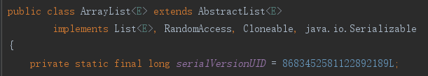
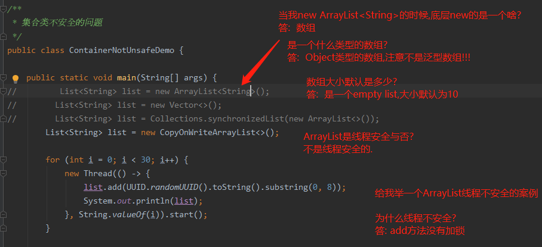
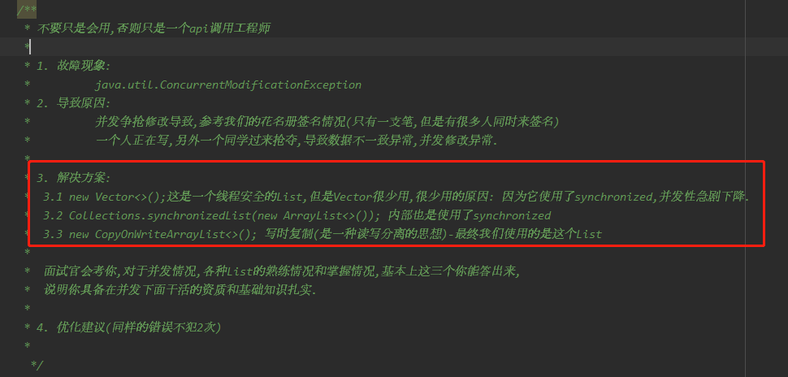
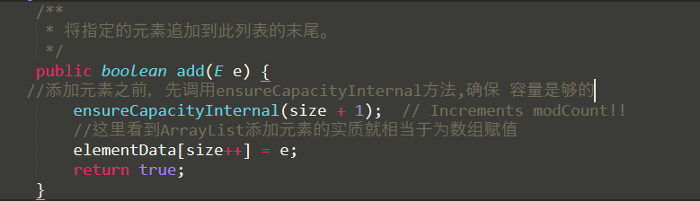
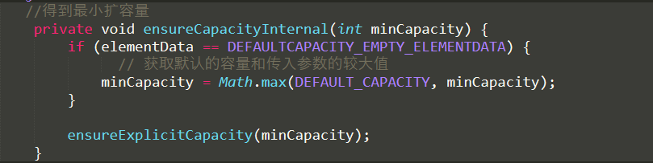
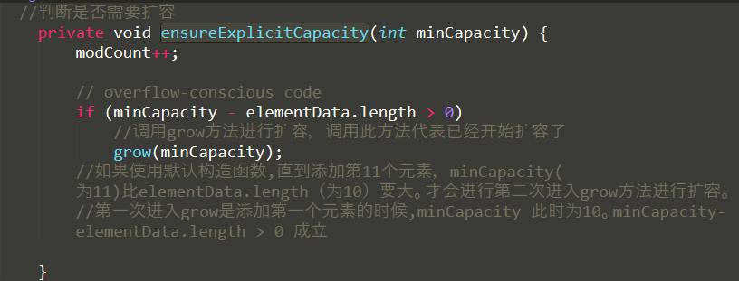
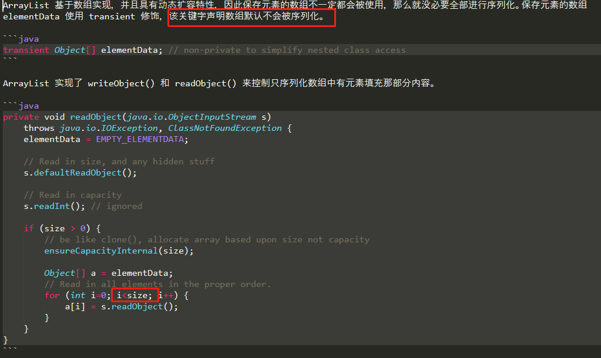
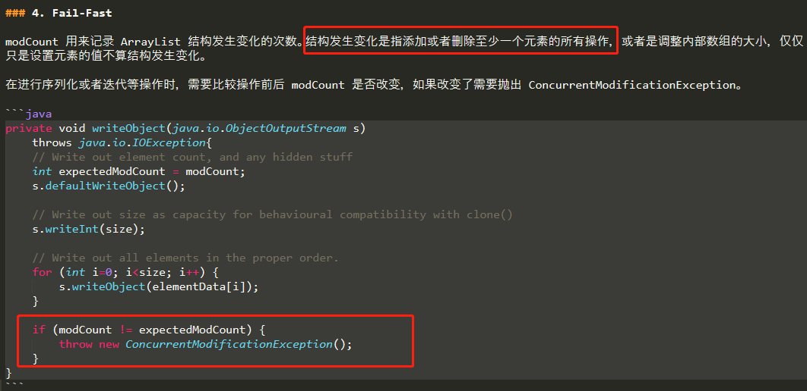

# ArrayList

    ArrayList内部基于数组完成数据的增删改查

    实现了RandomAccess接口,RandomAccess 只是一个标识接口，标识这个支持快速随机访问.
    RandomAccess 接口只是标识，并不是说 ArrayList 实现 RandomAccess 接口才具有快速随机访问功能的
    而是ArrayList的底层数据结构天然就支持随机访问,实现这个接口只起到标识作用
    
    在 ArrayList 中，我们即可以通过元素的索引快速获取元素对象，这就是快速随机访问

>ArrayList 实现了**Cloneable 接口**，覆盖了Object类的clone()函数，**所以能被克隆**

# ArrayList面试题

# ArrayList特点

     几乎与Vector类似(vector很少用了,了解即可)，只是它不是线程安全的，
     建议在单线程中才使用 ArrayList，而在多线程中可以选择 Vector(性能差) 或者  CopyOnWriteArrayList.
     可以包含重复值，它还允许“null”值
     对象按顺序添加,提供对其元素的随机访问(通过索引检索对象)
     默认容量定义为10.但是使用时最好是指定大小，尽量减少扩容的性能损耗,因为要复制数组.
     
     ArrayList的主要性能消耗是数组扩容以及在指定位置添加数据和删除数据(都涉及数组的拷贝)，
     所以要减少在指定位置插入数据的操作,以及在某个位置删除数据,以及尽可能少的扩容.

**这里补充一点比较重要，但是容易被忽视掉的知识点：**

- java 中的 `length `属性是针对数组说的
- java 中的 `length()` 方法是针对字符串说的
- java 中的 `size()` 方法是针对集合的

# 构造器

    无参数构造方法创建 ArrayList 时，内部是一个空Object数组: 
    Object[] DEFAULTCAPACITY_EMPTY_ELEMENTDATA = {}
    当向List中add第一个元素的时候，才真正分配空间
    默认容量定义为10

# add

    添加元素时使用 ensureCapacityInternal() 方法来保证容量足够，如果不够时，需要使用 grow() 方法进行扩容，新容量的大小为 `oldCapacity + (oldCapacity >> 1)`，也就是旧容量的 1.5 倍。

    扩容操作需要调用 `Arrays.copyOf()` 把原数组整个复制到新数组中，这个操作代价很高，因此最好在创建 ArrayList 对象时就指定大概的容量大小，减少扩容操作的次数。

# remove

    grow和remove都用到了数组的拷贝的相关函数,注意差别.

# ArrayList的序列化

    ArrayList只序列化有元素的部分

- ArrayList 实现**java.io.Serializable 接口**，这意味着ArrayList**支持序列化**，**能通过序列化去传输**。
- ArrayList 自定义了序列化与反序列化方法(writeObject和readObject),当对象中自定义了 writeObject 和 readObject 方法时，JVM 会调用这两个自定义方法来实现序列化与反序列化。从实现中可以看出 ArrayList 只序列化了被使用的数据

# 并发修改异常

# ArrayList替代方案

    一共三种: 
    Vector/Collections.synchronizedList(new ArrayList<>())/CopyOnWriteArrayList

