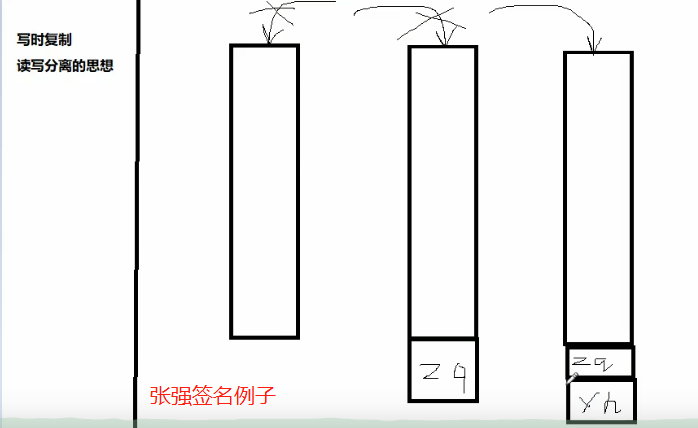
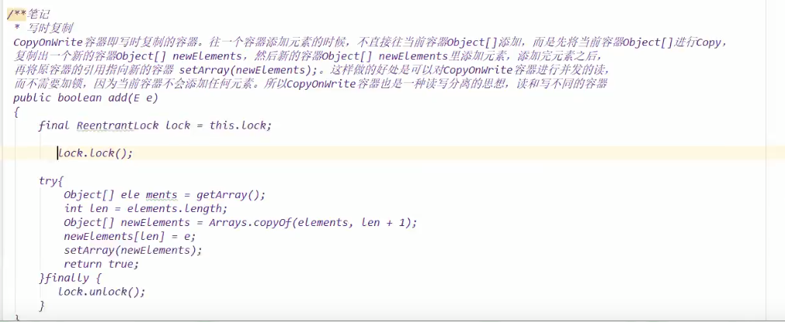
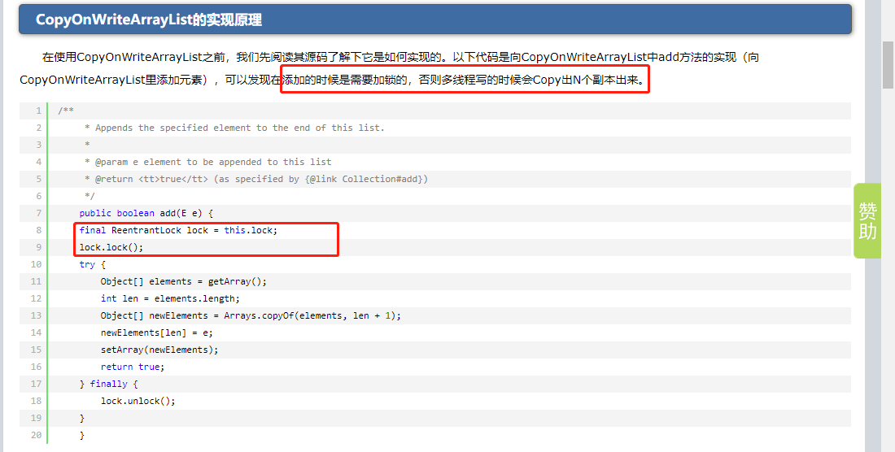
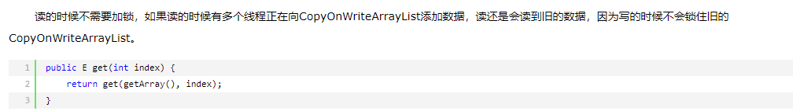
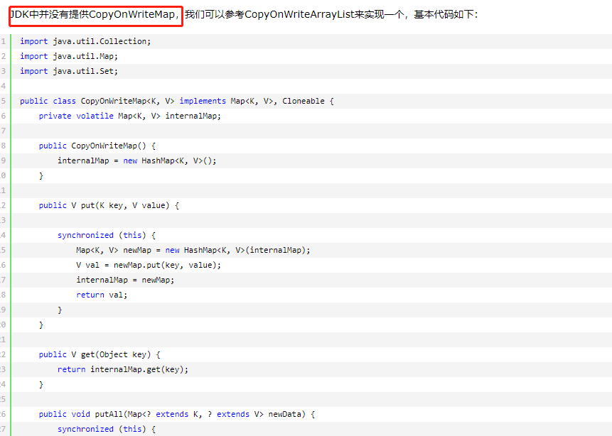
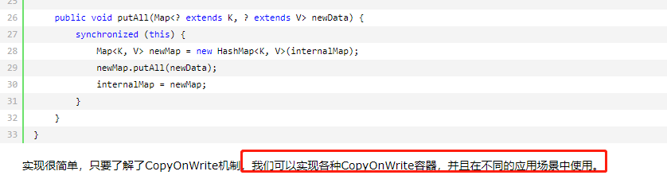
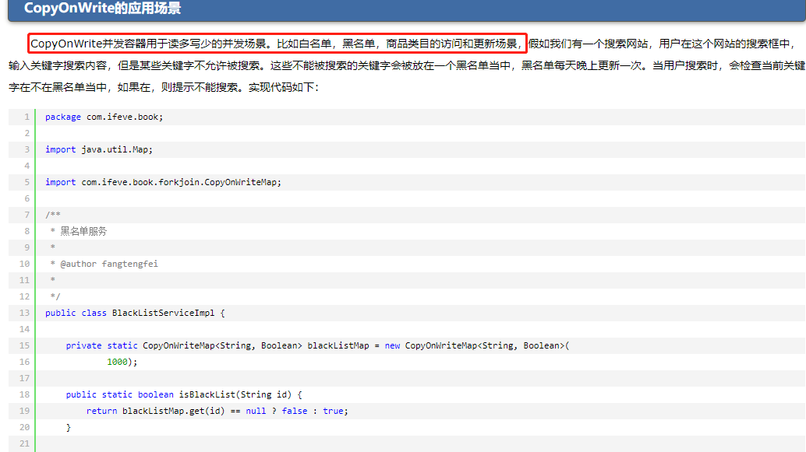
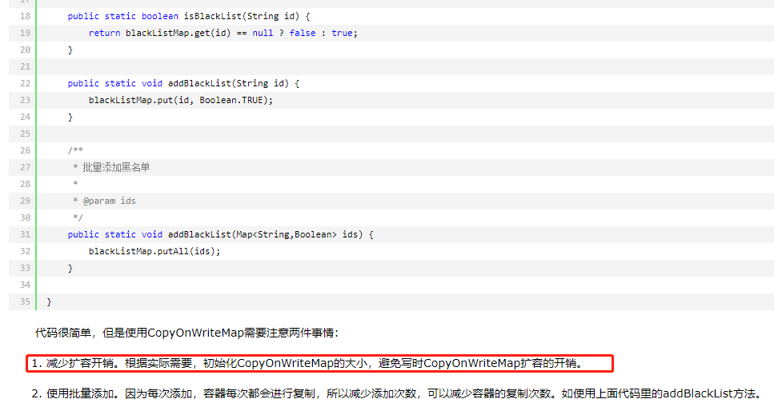
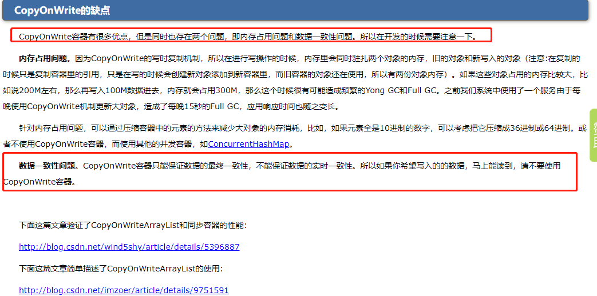
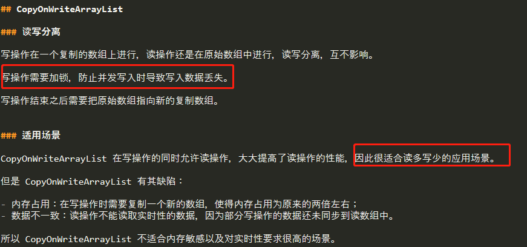

# CopyOnWrite核心原理

    当我们往一个容器添加元素的时候，不直接往当前容器添加，而是先将当前容器进行Copy，复制出一个新的容器，
    然后新的容器里添加元素，添加完元素之后，再将原容器的引用指向新的容器。
    也就是CopyOnWrite-在写操作的时候去复制当前容器.这样不影响读操作,也就是读写分离的思想.

# 使用场景

    读操作远多于修改操作

# 缺陷

    CopyOnWrite容器只能保证数据的最终一致性，不能保证数据的实时一致性。
    所以如果你希望写入的的数据，马上能读到，请不要使用CopyOnWrite容器。
 
# 详解

# 来源

[https://www.cnblogs.com/dolphin0520/p/3938914.html](https://www.cnblogs.com/dolphin0520/p/3938914.html)