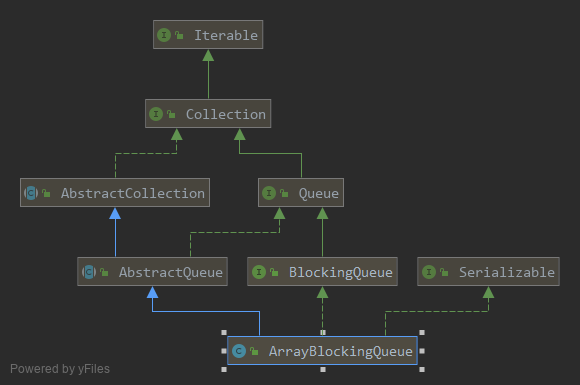

# ArrayBlockingQueue(多线程安全)

    ArrayBlockingQueue的所有构造器都是需要传入容量大小的.初始化的时候必须要指定队列长度，且指定长度之后不允许进行修改
    
    ArrayBlockingQueue内部使用ReentrantLock进行并发控制,ArrayBlockingQueue只有1把锁，添加数据和删除数据的时候只能有1个被执行，不允许并行执行

    