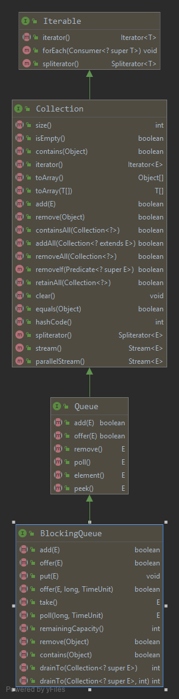
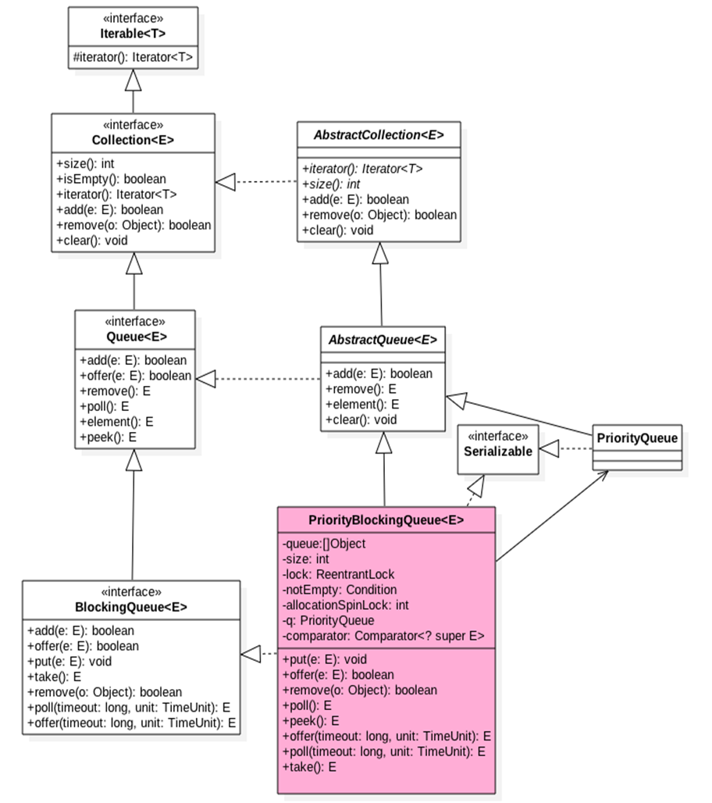
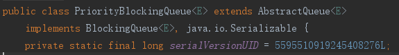
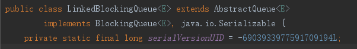
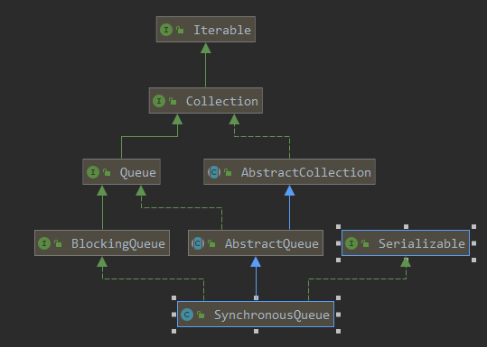

# 阻塞队列的定义

    实现BlockingQueue接口的队列就是阻塞队列，其余是非阻塞队列
    
    阻塞队列直到它完成它的工作或超时，但非阻塞队列不会阻塞，会直接返回结果.

    阻塞队列的应用情况(阻塞队列有没有好的一面,你如何管理): 
    
    第1种: 火锅店: 欢迎阻塞
    第2种: 银行排队: 不得不阻塞

# 实现类

    LinkedBlockingQueue,ArrayBlockingQueue,PriorityBlockingQueue,SynchronousQueue

    LinkedBlockingQueue类吞吐量通常要高于ArrayBlockingQueue

    SynchronousQueue: 一个只存储一个元素的阻塞队列，每个插入操作必须等待另一个线程做移除操作,
    否则插入操作一直处于阻塞状态

# 有界(Bounded)/无界(Unbounded)

    有界队列: 有容量限制的队列,例如ArrayBlockingQueue
    
    无界队列: 没有容量限制的队列,例如PriorityQueue.

---

    ArrayBlockingQueue为什么是有界的? 
    Array在初始化的时候必须分配大小,否则会报错.(有例外: ArrayList也是用Array实现,默认是10,所以不用添初始值.)

    LinkedBlockingQueue是有界还是无界?
    LinkedBlockingQueue确实是有界的,但是这个有界比较坑爹,默认值为Integer的最大值,你虽然有界,但是界太大了,
    这个跟无界有什么区别呢?所以使用要小心.

    SynchronousQueue: 生产一个,消费一个,你不消费,我就不生产,也就是存储单个元素队列.

# 阻塞队列的具体应用

    消息中间件的底层核心原理就是阻塞队列-BlockingQueue.
    
    线程池底层使用的就是ArrayBlockingQueue/LinkedBlockingQueue/SynchronousQueue
    这三个是重点
    
    生产消费模式