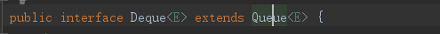
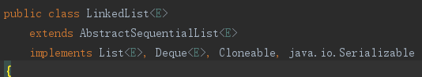
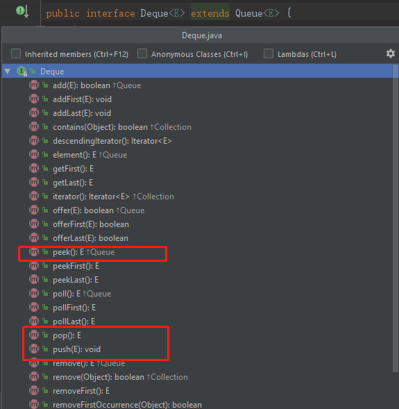

## Deque

通过看java.util.Queue的方法可以得出结论: Queue在Java中的语义就是一个单向队列.也就是只能从一头入队,另一头出队.即只能从队尾入队,队头出队.(注意,严格意义上,没有单端队列这个词,因为涉及到队列就是队头和队尾,也就是队列天生就是双端的.)

而java.util.Deque在Java中的语义是双向队列(也就是支持元素在队头和队尾两端进行插入和删除操作.)

>虽然Deque的英文意思是队列/顺序/排队的意思,英文意思没有体现出双端队列,所以英文意思和它的java语义不太一样

## 重要的实现类

- LinkedList：基于双向链表实现的双端队列.
- ArrayDeque: 底层使用循环数组实现双向队列

## ArrayDeque特点

Deque双向队列接口同时也实现了Stack接口，可以把Deque当成Stack使用，它的速度比java.util.Stack要快，因为Stack底层操作数据会加锁，而Deque不会加锁.

ArrayDeque不是一个线程安全的类

